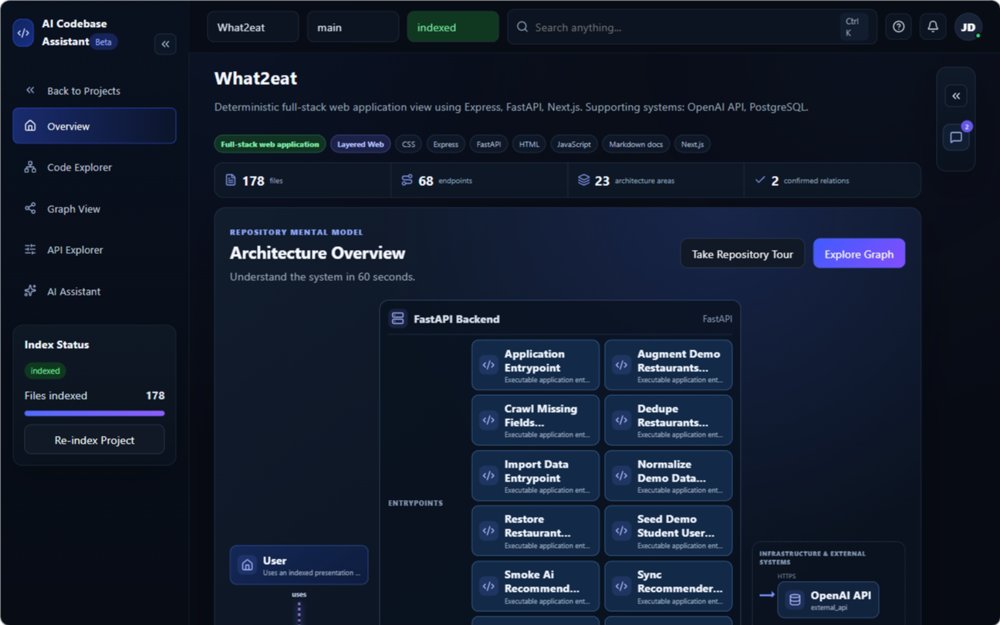
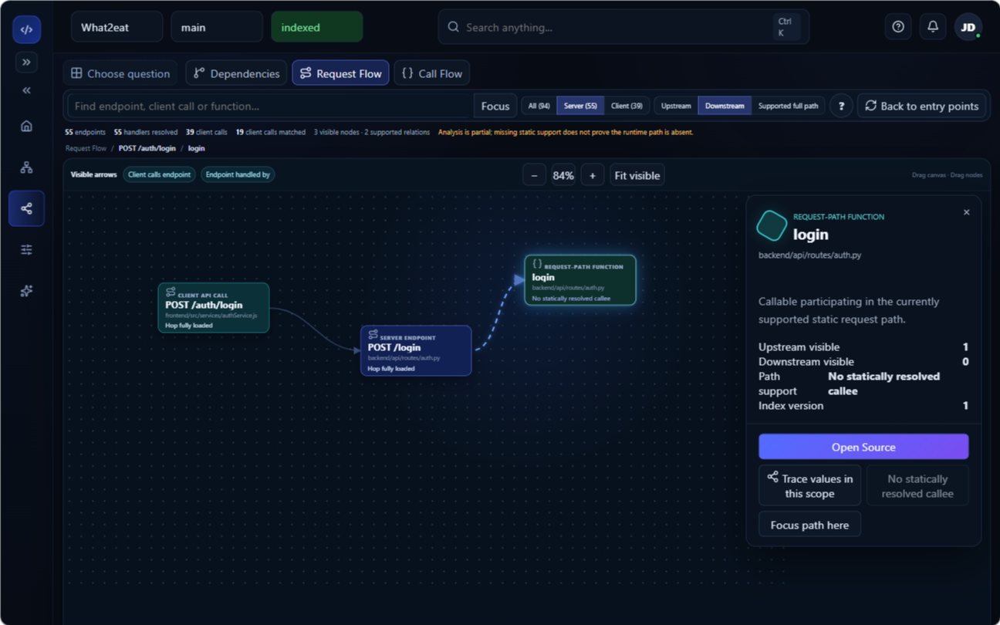

# AI Codebase Assistant

Understand an unfamiliar codebase without trusting unsupported AI answers.

AI Codebase Assistant safely imports a source repository, builds a deterministic and versioned code index, and lets developers explore files, symbols, endpoints, dependencies, and execution flows. Assistant answers are grounded in validated source evidence and link back to exact file and line ranges.

The core exploration workflow remains available without an LLM. A local Ollama provider can generate more natural answers, but provider output is accepted only when its citations match the selected evidence; otherwise the application falls back to a deterministic response.

<p align="center">
  
</p>

<p align="center">
  <em>Build a navigable architecture model from an untrusted source repository.</em>
</p>

## Why this project

General-purpose code chat can produce convincing explanations without proving that they match the current repository. This project treats static repository facts as the source of truth and uses AI only as an optional presentation layer.

- **Evidence before generation:** retrieval selects current, repository-owned source spans before an answer is created.
- **Inspectable citations:** answers link to stable file and line ranges that can be opened in Code Explorer.
- **Deterministic fallback:** repository exploration and grounded responses remain available when Ollama is disabled, unavailable, or invalid.
- **Safe repository handling:** imported code is untrusted data and is never executed during indexing or question answering.
- **Version-aware results:** searches, graphs, evidence, and conversations are tied to an explicit index version so stale data can be detected.

## What it provides

- Import a public GitHub repository, local folder, or ZIP archive through quota- and path-aware validation.
- Preview supported languages, file counts, ignored paths, warnings, and estimated indexing work.
- Index supported source into files, symbols, endpoints, chunks, graph relations, and evidence records.
- Browse source with reloadable file, line, symbol, endpoint, conversation, and evidence links.
- Explore bounded dependency graphs, architecture views, API endpoints, and value traces.
- Search indexed source and open the exact evidence behind a result.
- Ask repository-scoped questions with validated citations and bounded conversation history.
- Use deterministic sparse retrieval, with optional version-compatible local dense retrieval and Ollama-generated answers.

## See it in action

The representative workflow is:

1. Import and preview a repository without executing its code.
2. Build and activate a versioned index.
3. Explore a symbol, endpoint, dependency path, or architecture view.
4. Ask a focused question such as `How does the login flow work?`.
5. Open a returned citation at its exact source range.

<p align="center">
  <a href="https://youtu.be/0fIJhcjqKmw">
    
  </a>
</p>

<p align="center">
  <a href="https://youtu.be/0fIJhcjqKmw">▶ Watch the full demo on YouTube</a>
</p>

The demo covers repository import and indexing, architecture discovery, request-flow exploration, source navigation, and evidence-backed assistant answers.

## How it works

```mermaid
flowchart LR
    User[Developer] --> Web[React web application]
    Web --> API[FastAPI API]

    subgraph Indexing[Deterministic indexing pipeline]
        Import[Safe import and preview]
        Parse[Parse files and build code facts]
        Validate[Validate candidate index]
        Activate[Activate index version]
        Import --> Parse --> Validate --> Activate
    end

    API --> Import
    Activate --> Metadata[(Versioned metadata)]
    Activate --> Artifacts[(Index artifacts)]

    Metadata --> Explore[Code, API, graph and impact views]
    Artifacts --> Explore
    Metadata --> Retrieve[Typed retrieval and ranking]
    Artifacts --> Retrieve

    API --> Explore
    API --> Retrieve
    Retrieve --> Evidence[Validate and select evidence]
    Evidence --> Sufficient{Enough evidence?}
    Sufficient -->|No| Refuse[Insufficient-evidence response]
    Sufficient -->|Yes| Deterministic[Deterministic answer]
    Sufficient -. optional .-> Ollama[Local Ollama provider]
    Ollama --> Citations[Validate answer citations]
    Citations -->|Valid| Generated[Grounded generated answer]
    Citations -->|Invalid or unavailable| Deterministic
    Refuse --> Web
    Deterministic --> Web
    Generated --> Web

    classDef primary fill:#2563eb,color:#ffffff,stroke:#1d4ed8;
    classDef safety fill:#f59e0b,color:#111827,stroke:#d97706;
    classDef storage fill:#ecfeff,color:#164e63,stroke:#0891b2;
    class API,Retrieve,Evidence primary;
    class Validate,Sufficient,Citations safety;
    class Metadata,Artifacts storage;
```



The diagram shows the product flow rather than every internal adapter. See the [architecture overview](docs/02-system-architecture/architecture-at-a-glance.md) for runtime components, ownership rules, failure handling, and the production target.

## Technical highlights

### Evidence-bound assistant

The assistant does not treat conversation history or provider output as repository evidence. It selects current source spans within a bounded context budget, checks question-specific evidence sufficiency, and validates cited evidence identities before accepting an answer.

### Safe, versioned indexing

ZIP, folder, and public Git imports share normalized path and quota controls. Index candidates are validated before publication, while version and checksum identities make stale or incompatible artifacts detectable.

### Bounded graph exploration

Graph projections apply server-side filters and explicit node and edge limits. Responses disclose coverage and truncation instead of silently hiding results, and the frontend provides an accessible relation-list alternative.

### Optional local AI

The default application does not require a cloud model. Ollama access is restricted to a validated loopback origin, and provider failure does not disable deterministic search, exploration, or fallback answers.

## Technology and runtime profiles

| Area | Technology |
| --- | --- |
| Frontend | React, TypeScript, Vite, TanStack Query, React Router |
| Backend | Python 3.11, FastAPI, Pydantic |
| Local persistence | SQLite and local index artifacts |
| Production profile | PostgreSQL, Alembic, Redis, Dramatiq, dedicated indexing worker |
| Retrieval | Deterministic sparse retrieval with optional local dense retrieval |
| Optional provider | Ollama on a validated loopback address |
| Verification | Pytest, Vitest, Playwright, accessibility checks, GitHub Actions |

The local profile is the easiest way to evaluate the project. The production profile implements important persistence, migration, queue, worker, and access-control foundations, but the repository does **not** currently claim production readiness.

## Evaluation and verification

The repository includes automated backend, frontend, AI regression, browser E2E, and accessibility jobs in [GitHub Actions](.github/workflows/ci.yml). Retrieval evaluation uses a frozen, content-addressed dataset so sparse, dense, and hybrid methods receive the same inputs.

A three-run local Ollama embedding benchmark recorded the following results at `k=3`:

| Metric | Sparse | Dense | Sparse + dense hybrid |
| --- | ---: | ---: | ---: |
| Recall | 0.6667 | 1.0000 | 1.0000 |
| Reciprocal rank | 0.8000 | 0.9000 | 0.9000 |
| nDCG | 0.6939 | 0.9262 | 0.9262 |
| Precision | 0.3333 | 0.6667 | 0.5333 |

Observed query latency p95 was `334.48 ms`, and observed model memory was approximately `649 MiB`. These measurements qualify the local prototype only; they are not production-scale load or universal answer-quality claims. See the [benchmark report](docs/18-production-evidence/ollama-dense-embedding-benchmark-report.md) for frozen identities, method, limitations, and checksums.

## Run locally

### Requirements

- Python `>=3.11,<3.12`
- [`uv`](https://docs.astral.sh/uv/) `0.11.28`
- Node.js `>=24,<25`
- npm `>=11,<12`
- Git, for public GitHub imports
- Optional: [Ollama](https://ollama.com/) and a locally installed chat model

The verified commands below use Windows PowerShell. See the [development setup guide](docs/17-runbooks/development-setup.md) for integration profiles and additional verification details.

### 1. Install and start the backend

From the repository root:

```powershell
uv venv backend\.venv --python 3.11
uv pip sync --python backend\.venv\Scripts\python.exe backend\requirements-lock.txt
backend\.venv\Scripts\python.exe -m uvicorn app.main:app --app-dir backend --reload
```

The API listens on `http://localhost:8000`. Check `http://localhost:8000/health` or open the development API documentation at `http://localhost:8000/docs`.

### 2. Install and start the frontend

In a second terminal:

```powershell
Set-Location frontend
npm.cmd ci
npm.cmd run dev
```

Open `http://localhost:5173`.

### 3. Try the sample workflow

1. Open **New Project**.
2. Enter a project name and select **Local folder**.
3. Select `tests/fixtures/fastapi_react_sample` from a working copy outside the canonical fixture if you intend to modify it.
4. Choose **Prepare Preview**, inspect the result, and choose **Start Indexing**.
5. Open the workspace after indexing reaches a terminal successful state.
6. Explore Overview, Code Explorer, API Explorer, Graph, and Assistant.
7. Ask `How does the login flow work?` and open one of the returned citations.

For best results, ask about a concrete file, symbol, endpoint, or flow that exists in the indexed repository.

## Optional Ollama configuration

The application works with deterministic answers when Ollama is not configured. To enable local provider-generated answers, configure the backend environment with values appropriate to your machine:

```env
LLM_PROVIDER=ollama
LLM_MODEL=<installed-ollama-model>
OLLAMA_BASE_URL=http://127.0.0.1:11434
OLLAMA_TIMEOUT_SECONDS=180
ASSISTANT_RETRIEVAL_TIMEOUT_SECONDS=90
```

The retrieval timeout bounds evidence collection before any optional model call; the Ollama timeout applies only to generation after sufficient evidence has been selected. The model must already be installed in the local Ollama service. Readiness checks never pull or mutate models. The UI reports the server-declared provider and retrieval outcome for each answer.

## Verify the project

Run the backend suite from the repository root:

```powershell
backend\.venv\Scripts\python.exe -m pytest tests -q
```

Run frontend checks from `frontend/`:

```powershell
npm.cmd test -- --run
npm.cmd run lint
npx.cmd tsc -b --pretty false
npm.cmd run build
```

PostgreSQL, Redis, migration, worker, and release-oriented commands are documented in the [development runbook](docs/17-runbooks/development-setup.md). Imported repository code must not be executed as part of indexing or analysis.

## Current scope and limitations

This repository is under active development. It provides a repeatable local evaluation path and includes production-oriented foundations, but it is not yet declared production-ready.

- SQLite and in-process indexing remain the default local application profile.
- The production worker and full indexing/manifest pipeline are not yet completely composed end to end.
- Cross-file dynamic resolution, CFG/DFG, and equivalent depth across every supported language are not claimed.
- Current retrieval measurements use a small controlled dataset; production-scale load and broad answer-quality qualification remain open.
- Frontend login UX, observability, backup/restore, deployment/TLS, and operational release evidence remain incomplete.

See [Project Status](docs/project-status.md) for the verified implementation position and blocking gaps. The [documentation hub](docs/README.md) separates accepted contracts, current implementation baselines, delivery plans, tasks, and production evidence.

## Documentation

| Topic | Documentation |
| --- | --- |
| Product model | [Product overview](docs/01-product/README.md) |
| Architecture | [Architecture at a glance](docs/02-system-architecture/architecture-at-a-glance.md) |
| API and integrations | [API documentation](docs/06-api-and-integrations/README.md) |
| Security model | [Security documentation](docs/07-security/README.md) |
| Retrieval, RAG, and evaluation | [AI and evaluation documentation](docs/10-ai-rag-and-evaluation/README.md) |
| Development and operations | [Runbooks](docs/17-runbooks/README.md) |
| Verified evidence | [Production evidence index](docs/18-production-evidence/README.md) |
