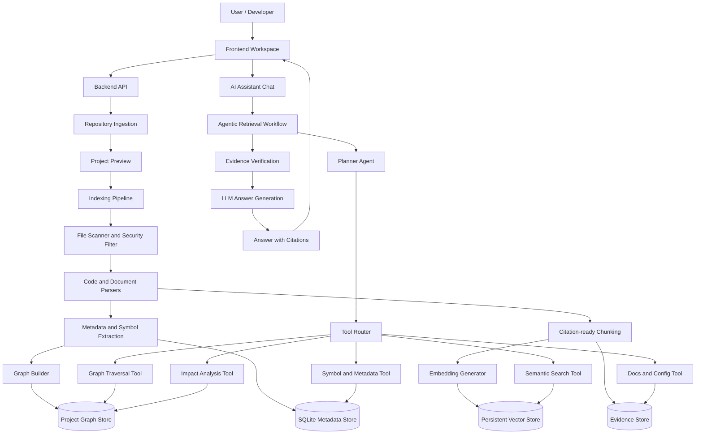
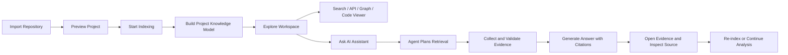
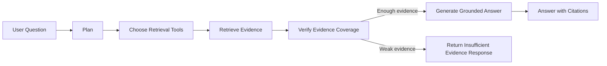

# Project Proposal: AI Codebase Assistant

## 1. Project Overview

AI Codebase Assistant is a local-first developer workspace designed to help users understand, explore, search, and ask questions about an existing software repository. The system ingests a software project, analyzes its source code, builds a persistent project knowledge model, and answers questions with verifiable evidence from files, symbols, line ranges, API endpoints, configuration files, documentation, and dependency relationships.

The product is not intended to be a generic chatbot over source code. It is designed as a codebase analysis system that combines code parsing, metadata extraction, graph reasoning, retrieval-augmented generation, citation validation, and agentic AI workflows. The assistant should help developers understand how a project is structured, where important logic is located, how APIs and modules interact, and what may be affected when code changes.

## 2. Problem Statement

Modern software projects often contain many files, modules, APIs, configuration files, database models, frontend components, tests, and documentation. When a developer joins an unfamiliar project, they usually need to manually inspect the folder structure, search for functions, trace imports, follow API routes, read configuration files, and understand dependencies before they can confidently modify or explain the codebase.

Traditional keyword search can locate text, but it does not understand software structure. A simple RAG chatbot over code can answer some questions, but it often retrieves isolated text chunks and may miss important relationships such as definitions, imports, function calls, API routes, frontend API calls, database models, or test dependencies. This can lead to incomplete answers, weak evidence, or hallucinated explanations.

This project addresses that problem by building an AI-powered assistant that understands a repository as a structured project model rather than only as a collection of text chunks.

## 3. Project Objectives

The main objective of this project is to build an AI Codebase Assistant that helps developers understand unfamiliar codebases faster and more reliably.

The system aims to:

- Import a repository from uploaded zip files or uploaded folders, with GitHub import planned for later milestones.
- Analyze source code and extract important project entities such as files, functions, classes, methods, API endpoints, frontend API calls, database models, configuration variables, tests, and documentation sections.
- Build a persistent project knowledge model using metadata, vector retrieval, and graph relationships.
- Provide a developer workspace for exploring project overview, file tree, code viewer, API explorer, graph view, search, impact analysis, evidence viewer, evaluation, and settings.
- Answer questions about architecture, API flow, debugging, onboarding, database usage, configuration, and impact analysis.
- Ground every technical answer in citations that point to exact files, symbols, line ranges, and source snippets.
- Refuse or limit answers when the system does not have enough evidence.
- Evaluate the proposed adaptive agentic retrieval workflow against keyword search and naive RAG.

## 4. Proposed Solution

The proposed solution combines a code intelligence layer and an AI agent layer.

The code intelligence layer parses the repository, extracts structured metadata, builds graph relationships, stores citation-ready chunks, and creates a project mental model. This layer is responsible for understanding the codebase through deterministic and inspectable signals such as imports, definitions, calls, routes, models, configuration files, and documentation.

The AI agent layer uses an agentic workflow to answer user questions. Instead of directly asking an LLM to answer from raw code chunks, the assistant first classifies the question, plans which tools to use, retrieves evidence from multiple sources, validates whether the evidence is sufficient, and then asks the LLM to generate a grounded answer.

This design makes the system more reliable than naive top-k code RAG because the assistant can combine semantic retrieval, symbol lookup, graph traversal, documentation retrieval, configuration lookup, and citation validation before generating an answer.

## 4.1 Target Development Tech Stack

This project targets a production-oriented AI engineering stack. The stack below is not limited to the current MVP implementation; it defines the recommended development direction for a portfolio-quality product and may require adjusting the implementation plan to match the architecture described in the docs.

### Backend and API

- **Python 3.11+** as the main backend language.
- **FastAPI** for the HTTP API, OpenAPI documentation, upload endpoints, settings endpoints, and repository-scoped workspace APIs.
- **Pydantic v2** for request/response DTOs, parser output schemas, agent state, evidence objects, and structured LLM outputs.
- **SQLAlchemy 2.0** for metadata persistence.
- **Alembic** for schema migrations.
- **Uvicorn** for local backend runtime.
- **SQLite** for local-first demo mode, with schema discipline for later **PostgreSQL** migration.

### Frontend Workspace

- **React** and **TypeScript** for the developer workspace.
- **Vite** for frontend development and build.
- **TanStack Query** for API fetching, caching, polling indexing jobs, and managing stale workspace data.
- **React Router** for deep links such as project overview, code explorer, graph focus, evidence detail, and chat conversations.
- **Zustand** or a lightweight state store for selected repository, selected file, current evidence, and workspace UI state.
- **Monaco Editor** for code viewing with line numbers and citation highlighting.
- **React Flow** or **Cytoscape.js** for dependency graph, API flow, and impact graph visualization.
- **lucide-react** for consistent developer-tool icons.

### Parsing and Code Intelligence

- **Python AST** as the deterministic baseline for Python parsing.
- **Tree-sitter** as the preferred long-term parser for JavaScript, TypeScript, TSX, JSX, and eventually Python when deeper structural parsing is needed.
- **Markdown, YAML, TOML, JSON, Dockerfile, and docker-compose parsers** for docs, config, deployment, and setup intelligence.
- **Normalized parser output schemas** for files, imports, symbols, endpoints, API calls, config variables, document sections, tests, relations, and parser errors.

### Retrieval, Vector Search, and Evidence

- **Hybrid retrieval** combining keyword search, vector search, metadata lookup, symbol lookup, endpoint lookup, graph traversal, documentation retrieval, config retrieval, and test lookup.
- **ChromaDB** for local vector search in the portfolio/demo version.
- **Qdrant** or **pgvector** as production-oriented vector store options.
- **OpenAI embeddings** for cloud embedding mode and **sentence-transformers / BGE embeddings** for local embedding mode.
- **Reranking** with Cohere Rerank or BGE reranker as an optional quality improvement.
- **Evidence-first citation records** stored with file path, line range, source type, index version, retrieval source, and confidence.

### Agentic AI Layer

- **OpenAI API** or **Azure OpenAI** for LLM generation.
- **LangGraph** as the preferred orchestration layer for planner, tool router, evidence merger, verifier, answer generator, retry, and fallback nodes.
- A testable internal workflow should exist under LangGraph so the domain logic is not hidden inside prompts.
- **Structured outputs with Pydantic** for question classification, retrieval plans, evidence sufficiency decisions, and answer validation.
- **Agent traces** for debugging and demonstration, without exposing raw chain-of-thought or secrets.

### Graph and Impact Analysis

- **NetworkX** for local graph algorithms, graph traversal, centrality signals, and impact analysis prototypes.
- **Neo4j** as an optional advanced graph store if the project scope expands toward production graph querying.
- Graph entities should include files, folders, modules, symbols, endpoints, API calls, models, schemas, configs, tests, documents, chunks, and evidence.
- Graph relations should include contains, defines, imports, calls, exposes endpoint, calls API, uses model, uses schema, reads config, tested by, documented by, and related to.

### Evaluation and Quality

- **pytest**, **pytest-asyncio**, and **pytest-cov** for backend testing.
- **ESLint**, **TypeScript build**, and frontend component tests for UI quality.
- **RAGAS**, **DeepEval**, or a custom benchmark runner for citation accuracy, groundedness, retrieval precision/recall, hallucination rate, insufficient-evidence handling, and latency.
- **Docker** and **Docker Compose** for reproducible local demos.
- **GitHub Actions** for CI checks across backend tests, frontend lint/build, and evaluation smoke tests.

### Recommended Portfolio Stack Summary

For a strong CV and credible implementation path, the primary target stack should be:

- FastAPI, Python, Pydantic, SQLAlchemy, Alembic.
- React, TypeScript, Vite, TanStack Query, React Router, Monaco Editor, React Flow.
- OpenAI or Azure OpenAI, LangGraph, structured Pydantic outputs.
- ChromaDB for local vector search, with Qdrant or pgvector as production-ready options.
- Tree-sitter, Python AST, NetworkX, optional Neo4j.
- Docker, GitHub Actions, pytest, evaluation metrics, and evidence-grounded RAG testing.

## 5. High-Level Architecture

The system is organized into frontend, backend API, indexing pipeline, project knowledge storage, retrieval tools, agentic workflow, and LLM generation components.

## 6. Main Workflow

The expected end-to-end workflow of the system is:

This workflow ensures that the assistant does not answer from unsupported assumptions. The user can always inspect the evidence behind the answer.

## 7. Core Product Capabilities

### 7.1 Repository Ingestion

The system supports importing repositories through uploaded zip files and uploaded folders. GitHub public and private repository import can be added in later milestones. During ingestion, the system normalizes repository sources into managed storage and blocks unsafe files such as path traversal archives, nested unsafe archives, dependency folders, build outputs, cache folders, binary files, and real secret files.

### 7.2 Project Preview

Before indexing, the system can show a project preview so the user understands what will be analyzed. The preview should include detected project name, source type, estimated file count, repository size, detected languages and frameworks, ignored folders, skipped files, possible security warnings, duplicate project warnings, and estimated indexing time.

The goal of preview is not to show the source code, but to let the user confirm that the system is analyzing the correct project safely.

### 7.3 Indexing Pipeline

The indexing pipeline scans supported files, detects language and file type, computes hashes, parses source code, extracts metadata, creates citation-ready chunks, generates embeddings, and builds graph relationships.

The system should support parsing Python, JavaScript, TypeScript, Markdown, JSON, YAML, TOML, Dockerfile, docker-compose files, and environment example files. It should extract imports, exports, functions, classes, methods, React components, FastAPI endpoints, frontend API calls, SQLAlchemy models, Pydantic schemas, config variables, tests, and Markdown sections.

### 7.4 Project Knowledge Model

The system builds a persistent project knowledge model that includes:

- File metadata.
- Symbols such as functions, classes, methods, and components.
- API endpoints and handlers.
- Imports, calls, and dependency relationships.
- Frontend API calls.
- Database models and schemas.
- Configuration variables.
- Documentation sections.
- Tests and related files.
- Important files, entry points, modules, flows, and risk areas.

This model allows the assistant to answer from structured project knowledge instead of isolated text chunks.

### 7.5 Search and Evidence

The workspace supports searching by text, file path, function, class, endpoint, symbol, documentation, and dependency relationships. Search results should include file path, result type, line range when available, snippet, and relevance score or reason.

Evidence is a first-class object in the system. Every answer generated by the assistant should be traceable to evidence that the user can open and inspect.

### 7.6 Agentic AI Assistant

The AI assistant uses an agentic retrieval workflow. It classifies the user question, plans the retrieval strategy, selects appropriate tools, gathers evidence, validates evidence coverage, and only then asks the LLM to generate the final answer.

Example question types include:

- Architecture questions.
- API flow questions.
- Debugging questions.
- Onboarding questions.
- Database and model questions.
- Configuration questions.
- Dependency questions.
- Impact analysis questions.
- Suggested reading path questions.

The assistant must clearly state when evidence is insufficient instead of guessing.

### 7.7 API Explorer and Runtime Flow

For backend projects, the system can extract API endpoints and show method, route, handler, file, line range, related service functions, models, schemas, and dependencies when available. It can help users understand how a request flows through the codebase.

### 7.8 Dependency Graph and Impact Analysis

The graph view helps users inspect relationships such as file imports, symbol definitions, function calls, API endpoints, models, tests, and documentation links. Impact analysis uses this graph to estimate what may be affected when a file, function, class, model, or endpoint changes.

The system should separate evidence-based impact from inferred impact. It should not pretend that a trace is complete when the graph does not have enough information.

### 7.9 Evaluation

The project includes an evaluation component to compare keyword search, naive RAG, and the proposed adaptive agentic retrieval workflow. The evaluation can measure citation accuracy, groundedness, retrieval precision, insufficient-evidence handling, and hallucination rate.

## 8. AI Differentiator

The main AI contribution of this project is not simply using an LLM to chat with source code. The key differentiator is the combination of:

- Code structure extraction through AST parsing and metadata analysis.
- Project graph construction for imports, calls, endpoints, models, tests, and documentation relationships.
- Adaptive retrieval from vector search, metadata lookup, graph traversal, documentation, and configuration.
- Agentic planning to decide which tools are needed for each question.
- Evidence verification before answer generation.
- Citation-grounded answers with insufficient-evidence fallback.

In other words, the system follows this pattern:

This makes the project more advanced than a basic RAG chatbot because it demonstrates tool-using AI, evidence-aware generation, graph-enhanced retrieval, and agentic reasoning.

## 9. Frontend Workspace

The frontend workspace should include:

- Project dashboard.
- New project/import wizard.
- Project preview page.
- Indexing status page.
- Workspace overview.
- Code explorer.
- Search page.
- API explorer.
- Graph view.
- Impact analysis page.
- AI assistant chat.
- Evidence/citation viewer.
- Evaluation page.
- Settings page.

The UI should follow the reference images in `docs/ui_ux_assets_v2/` and the detailed UI specification in `docs/08_frontend_workspace_ux.md`.

## 10. Product Quality Requirements

The system should satisfy the following quality requirements:

- Evidence-first: every technical answer must include citations unless it explicitly says evidence is insufficient.
- Secure by default: the system must not read real `.env` files, private keys, credentials files, dependency folders, build outputs, cache folders, or binary files.
- Maintainable architecture: API routes should be thin, business logic should live in services, providers should be abstracted, parsers should be isolated, and tests should cover core behavior.
- Reproducible local demo: a user should be able to run the backend and frontend, import a fixture or real repository, index it, and ask questions without manual database setup.
- Clear failure states: indexing, retrieval, LLM, embedding, storage, parser, and upload failures must be visible in both API and UI.
- Extensible design: adding a new language parser, embedding provider, LLM provider, graph relation, or UI page should not require rewriting the entire application.

## 11. Expected Outcome

When completed, the system should allow a user to import and index a medium-sized FastAPI and React repository, explore its project structure, search important code entities, ask questions with citation-grounded answers, inspect evidence, trace API flows, analyze dependencies, estimate impact, and evaluate answer quality.

The final product should help:

- New developers understand unfamiliar repositories faster.
- Maintainers trace dependencies and potential impact before changing code.
- Reviewers inspect architecture and documentation gaps.
- Evaluators verify that the assistant is more reliable than naive code chunk retrieval.
- Students demonstrate a capstone-quality AI engineering project involving RAG, AST parsing, graph reasoning, LangGraph-style agentic workflows, and evidence-based answer generation.

## 12. Success Criteria

The project is considered successful when:

- It can import and index a medium-sized FastAPI + React repository.
- It can answer architecture, login/API flow, debugging, onboarding, database, and impact questions with citations.
- It can show the same evidence through chat, search, graph, API explorer, and code explorer.
- It refuses to answer when evidence is missing.
- It can run a small benchmark and produce measurable citation accuracy, groundedness, retrieval precision, and hallucination rate.
- It passes automated backend tests, frontend lint/build, and at least one end-to-end demo workflow.

## 13. Suggested Capability Groups

These groups describe a practical way to reason about the full product scope. They are not a required implementation order; the development team may choose which capability to build first based on current goals.

### Group 1 - Local Codebase Understanding

Implement repository upload, project preview, indexing pipeline, metadata extraction, workspace overview, search, chat with citations, evidence viewer, re-index, and delete project.

### Group 2 - Code Intelligence Layer

Add API explorer, file detail, symbol detail, suggested reading path, dependency graph, indexing history, parser warnings, skipped files, and stale index detection.

### Group 3 - Agentic AI Layer

Add LangGraph-style workflow orchestration, planner agent, tool routing, evidence verification, retry logic, multi-step investigation, context-aware chat, and personalized explanation modes.

### Group 4 - Evaluation and Advanced Import

Add benchmark evaluation, GitHub public/private import, provider settings, storage management, and deployment-ready configuration.
