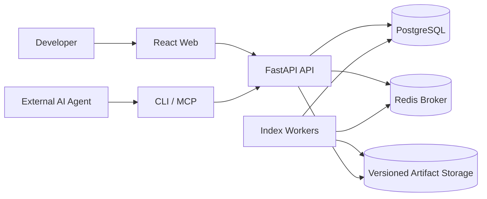
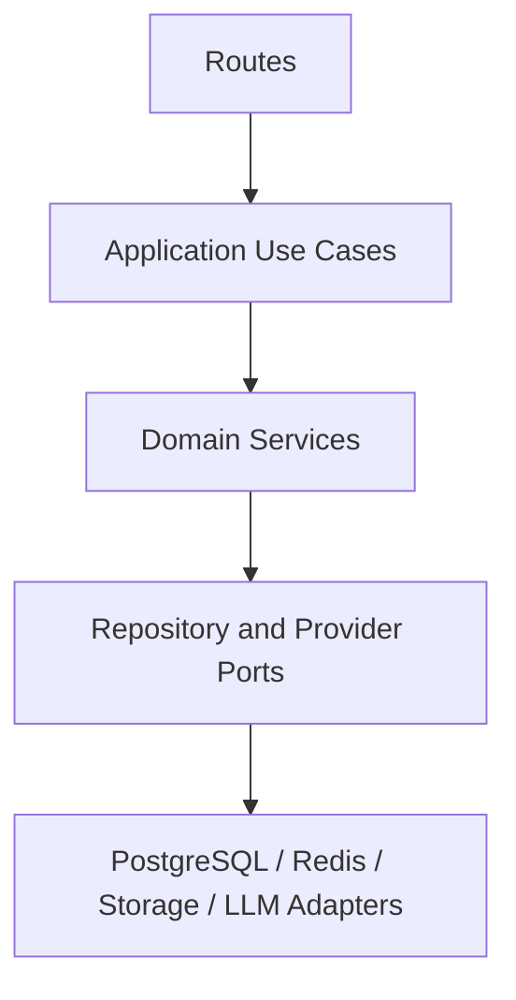

# Production System Architecture

Start with `architecture-at-a-glance.md`. It shows the verified MVP-to-production boundary, runtime ownership, invariants, and links to detail. `capability-model.md` defines when a repository feature is actually usable; `failure-model.md` defines cross-component containment and recovery.

## Context

The system serves human users through a React web application and external AI agents through CLI/MCP. Imported repositories are untrusted input.

## Production containers

- **Web:** static SPA and reverse-proxy integration.
- **API:** authentication, validation, application services, read APIs, job submission.
- **Worker:** isolated scanning, parsing, resolving, graph building, enrichment, validation, publishing.
- **PostgreSQL:** authoritative metadata, jobs, versions, evidence, conversations, evaluations.
- **Redis:** broker and short-lived coordination; never authoritative final state.
- **Artifact store:** immutable, versioned scan/parser/graph/search artifacts.
- **Observability collector:** telemetry export and correlation.

## Component boundaries

## Reliability rules

- API processes never perform CPU-heavy indexing.
- Jobs are durable, idempotent, leased, heartbeat-monitored, and recoverable.
- Index builds write to an inactive version and publish atomically after validation.
- Queries always bind to one active index version.
- Provider failures degrade optional AI features without breaking deterministic exploration.

## Detailed specification

`specifications/detailed-system-architecture.md` defines backend layers, persistence, import/indexing/parser/graph/retrieval/agent/chat/evidence/impact flows, frontend architecture, page-to-API mapping, replaceable components, constraints, and production indexing extensions.

This overview supplies the accepted production topology. If the detailed file names an older infrastructure product, the technology decision in `03-technology/` takes precedence while the domain flow remains authoritative.
