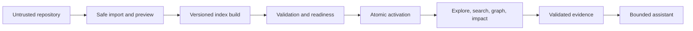
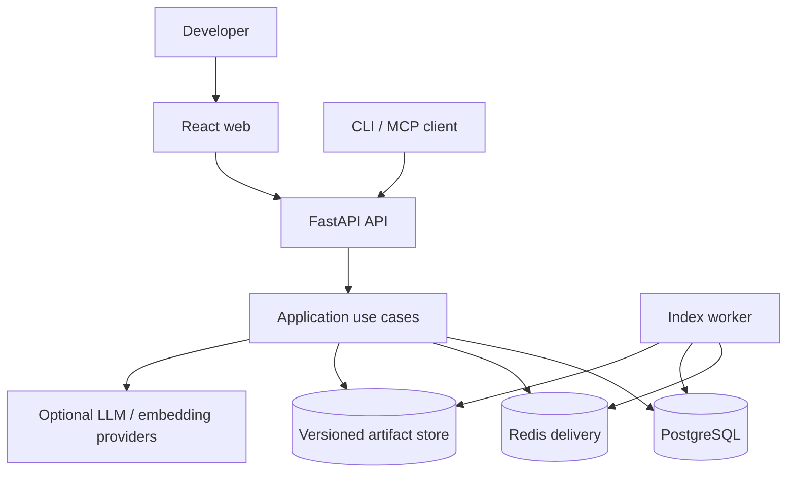

# Architecture at a Glance

Status: Accepted overview  
Authority: Navigation; detailed architecture remains in `specifications/detailed-system-architecture.md`  
Owner: Architecture owner  
Dependencies: `ADR-0001`, component and domain contracts  
Last verified: 2026-07-12

## Product model

The system converts an untrusted repository into a validated, versioned project knowledge model. Deterministic exploration and evidence remain available when optional AI providers are unavailable.

## Current and target boundary

| Concern | Verified current baseline | Production target |
| --- | --- | --- |
| API | FastAPI with concentrated route/schema modules | Thin versioned routes over application use cases |
| Jobs | Process-local daemon threads/control events | Durable leased jobs through a Redis-backed queue adapter |
| Database | SQLite `create_all` and compatibility patches | PostgreSQL with Alembic migrations; SQLite retained for local/test |
| Index state | Broad mutable aggregate and local artifacts | Inactive immutable build, validation, atomic active-version switch |
| Intelligence | Strong baseline with overlapping parser paths | Canonical adapter → IR → resolver → graph candidate pipeline |
| Retrieval | Deterministic in-memory hybrid baseline | Typed versioned retrievers, ranker, evidence selector and context budget |
| Agent | Heuristic/bounded foundations | Typed tools, bounded repair, sufficiency, persisted privacy-safe trace |
| Frontend | React workspace with broad controller state | Router + Query + feature state, deep links and explicit capability states |
| Operations | Development-oriented | Telemetry, health, Compose/TLS, backup/restore and runbooks |

The current column is descriptive, not authorization to preserve a production gap.

## Runtime components

## Ownership rules

- PostgreSQL owns repositories, jobs, versions, metadata, evidence, conversations, evaluations, and activation state.
- Artifact storage owns immutable large build outputs addressed by version and checksum.
- Redis owns delivery and short-lived coordination only; losing it must not erase authoritative job state.
- Search/vector structures are replaceable derived indexes, never the source of citation truth.
- Imported source is untrusted and is never executed as part of indexing or Q&A.
- Static parser/resolver facts are authoritative within declared capability; semantic enrichments are labeled inferred.

## Core flows

1. **Import:** acquire into isolation → enforce quotas/security → preview → confirm idempotently → publish source.
2. **Index:** claim job → scan → parse → resolve → graph/chunks/search → validate → publish atomically.
3. **Explore:** bind request to repository and active index → check capability → query bounded read model/projection → return provenance.
4. **Assist:** classify → retrieve typed candidates → select evidence → check sufficiency → optionally repair within bounds → answer → validate citations.
5. **Impact:** resolve change target/diff → traverse typed provenance edges → classify direct/inferred/unknown impact → link tests and evidence.

## Invariants

- A failed build never replaces the active index.
- Every query uses one explicit index version.
- Every evidence object resolves to an allowed source version and location.
- Missing artifacts produce limited/unavailable capability rather than a generic success state.
- Workers are idempotent under redelivery; exactly-once queue delivery is not assumed.
- Provider failure degrades optional AI capability without disabling deterministic exploration.

## Where detail lives

- Components and runtime flows: this directory.
- Data ownership and identity: `04-domain-and-data/`.
- Indexing, parsing, evidence, retrieval and assistant behavior: `05-domain-contracts/`.
- API semantics: `06-api-and-integrations/`.
- Security and failures: `07-security/` and `08-reliability-and-operations/`.
- Frontend states: `09-frontend-and-ux/`.
- Benchmarks: `10-ai-rag-and-evaluation/`.
- Current source truth: `14-implementation-baseline/`.
