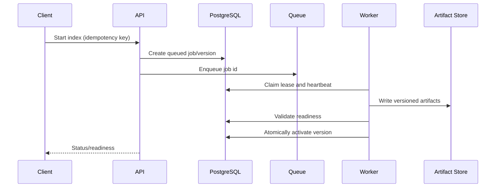
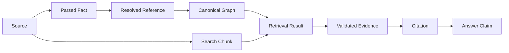

# Runtime Flows

## Indexing

```mermaid
sequenceDiagram
  participant C as Client
  participant A as API
  participant D as PostgreSQL
  participant Q as Queue
  participant W as Worker
  participant S as Artifact Store
  C->>A: Start index (idempotency key)
  A->>D: Create queued job/version
  A->>Q: Enqueue job id
  W->>D: Claim lease and heartbeat
  W->>S: Write versioned artifacts
  W->>D: Validate readiness
  W->>D: Atomically activate version
  A-->>C: Status/readiness
```

## Evidence lineage

```mermaid
flowchart LR
  Source --> Fact[Parsed Fact]
  Fact --> Ref[Resolved Reference]
  Ref --> Graph[Canonical Graph]
  Source --> Chunk[Search Chunk]
  Graph --> Result[Retrieval Result]
  Chunk --> Result
  Result --> Evidence[Validated Evidence]
  Evidence --> Citation
  Citation --> Claim[Answer Claim]
```
