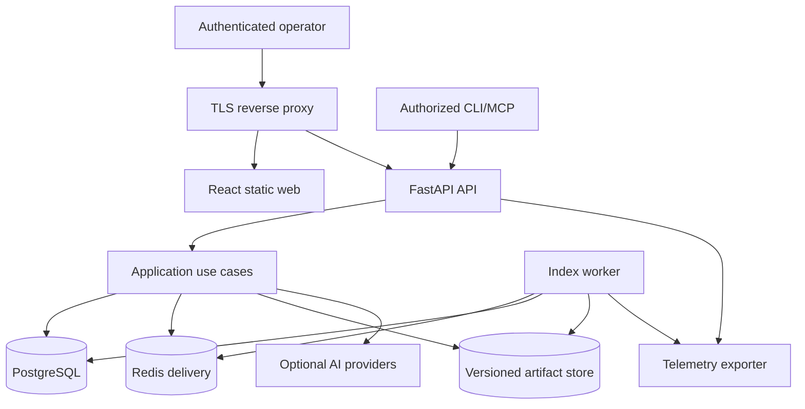

# Detailed Production System Architecture

Status: Accepted production v1 specification  
Authority: Runtime topology, component boundaries, ownership, and end-to-end flows  
Owner: Architecture owner  
Dependencies: `../architecture-at-a-glance.md`, `../component-catalog.md`, `../../13-decisions/ADR-0001-production-foundations.md`  
Related source: `../../14-implementation-baseline/source-map.md`  
Related tests: boundary, migration, worker recovery, activation, API contract, and deployment suites  
Last verified: 2026-07-12

## Scope and topology

Production v1 is a single-tenant, single-node self-hosted deployment with separately supervised Web, API, Worker, PostgreSQL, Redis, artifact storage, reverse proxy/TLS, and telemetry processes/containers. SQLite, process-local workers, and fake providers are local/test profiles only.



Redis is never authoritative. A backed-up filesystem artifact adapter is sufficient for L3 single-node when checksum, atomic write, retention, restore, and capacity evidence pass; S3-compatible storage is optional, not mandatory.

## Boundaries

| Component | Owns | Must not own |
| --- | --- | --- |
| Web | navigation, interaction, accessible rendering, local UI state | server/domain truth, credentials, parsing, evidence validation |
| API | authn/authz, validation, quotas, idempotency, use-case invocation, read models, safe errors | CPU-heavy indexing, parser/graph/retrieval business logic |
| Application | transaction/use-case orchestration through typed ports | provider-specific types, HTTP presentation, raw filesystem traversal |
| Import | isolated acquisition, quotas, preview, source snapshot publication | executing source, hooks, submodules, arbitrary network access |
| Job coordinator | durable submission, lease, heartbeat, retry, cancellation, recovery | assuming exactly-once delivery |
| Index pipeline | scan, parse, resolve, graph, retrieval artifacts, validation, publish | mutating the active version during build |
| Query services | bounded version-bound read models and projections | silently truncating or mixing versions |
| Assistant | bounded typed tools, sufficiency, answer/citation validation | creating facts, evidence IDs, canonical identities, or static relations |

## Data ownership

- PostgreSQL owns repositories/sources/import sessions, jobs/attempts/leases, index/version activation, queryable code facts, readiness, evidence, conversations/traces, evaluation metadata, and audit events.
- Artifact storage owns immutable manifests and large stage outputs addressed by repository/version/type/checksum.
- Redis owns delivery and short-lived coordination only.
- Search/vector structures and graph exports are replaceable derived indexes/caches.
- Source snapshots are immutable inputs to an index version; a mutable external/local source is never citation authority.

## Import flow

```text
receive into isolated session
→ validate normalized paths, duplicates, links, quotas, archive/Git policy
→ canonical preview scan and source fingerprint
→ user confirms with idempotency key
→ publish immutable repository-owned source snapshot
→ create repository/source and queued job transactionally or compensate
```

Folder upload and ZIP are P0. Public GitHub uses HTTPS-only allowlisted parsing, bounded shallow acquisition, disabled hooks/submodules/LFS, redirect/destination checks, and no credentials. Private/arbitrary Git is deferred.

Preview inventory/hashes are reused only when the confirmed bytes, policy/config version, snapshot fingerprint, and expiry match; otherwise rescan. Indexing performs one canonical scan and later stages may not rescan outside its inventory.

## Index flow

```text
preflight/reserve version → canonical scan → parse file-local IR
→ resolve references → optional supported CFG/DFG
→ graph candidates → normalize/validate canonical graph
→ chunks/lexical and optional semantic indexes
→ capability calculation → immutable manifest
→ atomic database activation
```

Stages consume declared versioned artifacts, write in bounded batches, checkpoint only at safe idempotent boundaries, and expose counts/timing/resource diagnostics. Worker and per-repository concurrency are capped. Failure, cancellation, corruption, provider outage, or validation error leaves the previous active version unchanged.

Full and incremental builds share the same output contracts. Incremental planning uses content/structure/public-API/dependency/component-version fingerprints; affected-set expansion is relation-bounded and falls back to full rebuild when compatibility or expansion limits fail. Equivalence is release-tested, not assumed.

## Parsing and graph

Parsers read only canonical inventory files and emit deterministic file-local facts without database writes or cross-file guesses. Resolvers map raw references to canonical entities and retain resolved, ambiguous, and unresolved diagnostics. LLMs do not resolve static relations.

Graph candidates preserve origin, producer/version, support type, evidence spans, and confidence where meaningful. Normalization derives one canonical direction; inverse relations are queried, not redundantly stored. Every query/projection enforces repository/index, node/edge types, direction, depth, node/edge budgets, coverage and truncation reason. Whole-graph JSON is diagnostic/export only, never a second authority.

## Retrieval, evidence, and assistant

Routing order is exact lookup, deterministic typed workflow, hybrid retrieval when needed, then a constrained agent only for unresolved multi-step investigation. Exact named questions do not invoke a planner or vector search.

Retrievers emit normalized versioned candidates. Ranking configuration and fusion are immutable and benchmarked; raw scores from different retrievers are not added without normalization. Evidence selection revalidates access, version, source, range, secret policy, freshness, provenance and support. Context is token-budgeted and records omitted/truncated evidence.

Assistant budgets cap tools, rounds, graph depth, evidence, time, input/output tokens, and provider cost. Provider outage preserves deterministic exploration. `INSUFFICIENT_EVIDENCE` is a successful limited product result. LangGraph remains Hold unless a measured durable-workflow need and accepted ADR authorize it.

## API and frontend

OpenAPI is the machine-readable `/api/v1` authority. APIs bind repository and opaque index-version ID explicitly, enforce auth/access/idempotency/pagination/range/projection limits, propagate request IDs, and return capability/coverage/truncation/retryability. Liveness is process-only; readiness checks schema, database, broker, artifact storage, and mandatory configuration.

React Router owns reloadable URLs; TanStack Query owns server state. Feature state never duplicates repositories, jobs, graph results, evidence, or conversations. Large trees/lists/code use server pagination/ranges and virtualization; graph uses server-bounded projections and benchmarked off-main-thread layout. Polling uses cancellation and exponential backoff with terminal stop conditions.

## Failure and operations

API failure cannot corrupt jobs; worker loss expires a lease; duplicate delivery is idempotent; broker loss pauses delivery; database loss makes authoritative components unready; artifact corruption blocks capability/publish; optional provider loss degrades only dependent capabilities. Disk-full/OOM/timeouts fail safely before activation.

Release startup validates secrets/configuration, runs one migration owner under a lock, checks database/broker/artifacts, starts API/workers unready, then enables traffic after schema/readiness smoke checks. Backups cover PostgreSQL and required artifacts at a consistent activation boundary; restore validation precedes readiness. Rollback never activates an unvalidated index.

## Capacity and adoption triggers

Small/Medium/Large limits, concurrent jobs/queries, stage time/memory, storage growth, graph projection/render, query p95, tokens and provider cost are accepted only from versioned reference-environment evidence. PostgreSQL, bounded artifacts, and the deterministic state machine remain default until measured triggers justify pgvector, an external vector/search/graph service, a workflow framework, or multi-node topology through ADR and task.
