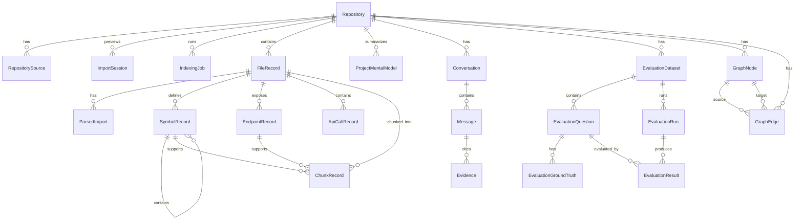

# Data Model

## Document Purpose

This document defines the persistent data model for **AI Codebase Assistant**. It describes the main entities, relationships, fields, constraints, indexes, and data lifecycle rules needed to support repository import, preview, indexing, search, graph traversal, evidence-based chat, impact analysis, evaluation, and settings.

This file should be used by backend developers and AI coding agents when implementing SQLAlchemy models, migrations, repository-layer queries, and data cleanup logic. It does not describe frontend layout or high-level product motivation; those belong to the proposal and architecture documents.

## Design Principles

- Use explicit tables for core domain entities instead of opaque JSON blobs.
- Keep all repository-scoped records tied to `repository_id`.
- Store enough metadata to recreate citations, search results, graph traversal, and evidence inspection after restart.
- Use stable string IDs for records referenced by API responses, chat evidence, graph nodes, and frontend state.
- Store raw source files on disk in managed repository storage, not as full files inside the database.
- Store chunk content in SQLite only if acceptable for local-first usage; otherwise store previews, hashes, line ranges, and read source snippets on demand.
- Never persist secrets from blocked files.
- Treat re-indexing as a versioned operation so old citations and new index data can be distinguished.
- Prefer normalized tables for queryable entities such as files, symbols, endpoints, chunks, graph edges, evidence, messages, and evaluation results.
- Use JSON fields only for flexible metadata, parser-specific details, UI summaries, and evaluation payloads.

## Entity Relationship Overview

## Entity Groups

### Repository management

- `Repository`
- `RepositorySource`
- `ImportSession`

### Indexing lifecycle

- `IndexingJob`
- `FileRecord`

### Code intelligence

- `ParsedImport`
- `SymbolRecord`
- `EndpointRecord`
- `ApiCallRecord`
- `ChunkRecord`

### Graph and impact analysis

- `GraphNode`
- `GraphEdge`

### Project understanding

- `ProjectMentalModel`

### Assistant and evidence

- `Conversation`
- `Message`
- `Evidence`

### Evaluation

- `EvaluationDataset`
- `EvaluationQuestion`
- `EvaluationGroundTruth`
- `EvaluationRun`
- `EvaluationResult`

### Configuration

- `AppSetting`

## Global Field Conventions

### ID format

Use stable string IDs with readable prefixes:

| Entity | ID format |
| --- | --- |
| Repository | `repo_<uuid>` |
| RepositorySource | `src_<uuid>` |
| ImportSession | `import_<uuid>` |
| IndexingJob | `job_<uuid>` |
| FileRecord | `file_<uuid>` or deterministic per repository/index version |
| SymbolRecord | `sym_<uuid>` |
| EndpointRecord | `endpoint_<uuid>` |
| ApiCallRecord | `apicall_<uuid>` |
| ChunkRecord | `chunk_<uuid>` |
| GraphNode | `node_<uuid>` |
| GraphEdge | `edge_<uuid>` |
| Conversation | `conv_<uuid>` |
| Message | `msg_<uuid>` |
| Evidence | `ev_<uuid>` |
| EvaluationDataset | `evalset_<uuid>` |
| EvaluationQuestion | `evalq_<uuid>` |
| EvaluationRun | `evalrun_<uuid>` |
| EvaluationResult | `evalres_<uuid>` |

### Time fields

Use UTC timestamps for all `created_at`, `updated_at`, `started_at`, `finished_at`, `indexed_at`, and `generated_at` fields.

### JSON fields

JSON fields should store structured JSON as text in SQLite. They must be parseable and documented by field purpose. Avoid storing important query fields only inside JSON if they are needed for filtering, joining, or ranking.

### Index versioning

All records created by indexing should include `index_version`. This allows the system to distinguish current index data from older citations and older chat evidence after re-indexing.

Entities that should include `index_version`:

- `IndexingJob`
- `FileRecord`
- `ParsedImport`
- `SymbolRecord`
- `EndpointRecord`
- `ApiCallRecord`
- `ChunkRecord`
- `GraphNode`
- `GraphEdge`
- `ProjectMentalModel`
- `Evidence`
- `Message` when the message depends on indexed evidence

## Status Enums

### RepositoryStatus

- `created`: repository record exists but indexing has not started.
- `previewed`: repository has been inspected in preview but not indexed yet.
- `indexing`: an indexing job is running.
- `indexed`: latest indexing job completed successfully.
- `indexed_with_warnings`: latest indexing job completed but some files were skipped or failed.
- `failed`: latest import or indexing process failed.
- `stale`: source appears newer than the latest index version.
- `deleted`: repository is soft-deleted or deletion has been requested.

### ImportSessionStatus

- `created`
- `scanning`
- `preview_ready`
- `confirmed`
- `cancelled`
- `expired`
- `failed`

### IndexingJobStatus

- `queued`
- `running`
- `completed`
- `completed_with_warnings`
- `failed`
- `cancelled`

### ParseStatus

- `pending`
- `parsed`
- `skipped`
- `failed`

### MessageRole

- `user`
- `assistant`
- `system`
- `tool`

### EvidenceSourceType

- `file`
- `symbol`
- `endpoint`
- `chunk`
- `graph_edge`
- `doc_section`
- `config`
- `test`

### RetrievalSource

- `vector`
- `keyword`
- `metadata`
- `symbol_lookup`
- `endpoint_lookup`
- `graph`
- `docs`
- `config`
- `test_lookup`

## Repository

Represents an imported codebase.

| Field | Type | Notes |
| --- | --- | --- |
| id | string | Primary key, `repo_<uuid>` |
| name | string | Display name |
| source_type | string | Primary source type: `upload_zip`, `upload_folder`, `github_url` |
| source_uri | text nullable | Original path or URL, sanitized |
| source_path | text | Managed storage source path |
| default_branch | string nullable | Git branch if known |
| current_commit | string nullable | Git commit SHA if known |
| current_index_version | integer | Latest successful or latest active index version |
| status | string | `created`, `previewed`, `indexing`, `indexed`, `indexed_with_warnings`, `failed`, `stale`, `deleted` |
| summary | text nullable | Human-readable project summary |
| created_at | datetime | Created time |
| updated_at | datetime | Updated time |
| last_indexed_at | datetime nullable | Last successful index time |
| deleted_at | datetime nullable | Soft-delete timestamp |

## RepositorySource

Stores source import history for a repository. This is useful when a repository is imported from a zip, folder, or GitHub URL and later re-indexed or synced.

| Field | Type | Notes |
| --- | --- | --- |
| id | string | Primary key, `src_<uuid>` |
| repository_id | string | FK Repository |
| source_type | string | `upload_zip`, `upload_folder`, `github_public`, `github_private`, `local_path` |
| source_uri | text nullable | Sanitized URL/path/label; never store secrets |
| source_label | string nullable | Short user-facing label for project card |
| branch | string nullable | Git branch if available |
| commit_sha | string nullable | Git commit if available |
| content_hash | string nullable | Hash of uploaded archive or root manifest when available |
| imported_at | datetime | Import time |
| metadata_json | text | Provider-specific metadata without credentials |

## ImportSession

Stores temporary preview information before the user confirms indexing. If preview is implemented as a stateless API response, this table can be skipped initially. If used, expired sessions should be cleaned up.

| Field | Type | Notes |
| --- | --- | --- |
| id | string | Primary key, `import_<uuid>` |
| repository_id | string nullable | FK Repository if draft repository already exists |
| source_type | string | Upload folder, zip, GitHub URL, etc. |
| source_label | string nullable | Short label shown to the user |
| temp_source_path | text nullable | Temporary extracted/uploaded path |
| status | string | `created`, `scanning`, `preview_ready`, `confirmed`, `cancelled`, `expired`, `failed` |
| detected_stack_json | text | Detected languages/frameworks/tools |
| file_count | integer | Candidate file count before filtering |
| indexable_file_count | integer | Files likely to be indexed |
| skipped_summary_json | text | Summary by skip reason |
| security_warnings_json | text | Secret/binary/unsafe path warnings, without secret content |
| duplicate_candidates_json | text | Possible duplicate repository matches |
| estimated_index_time_ms | integer nullable | Best-effort estimate |
| created_at | datetime | Created time |
| expires_at | datetime nullable | Cleanup deadline |
| error_code | string nullable | Failure code |
| error_message | text nullable | Failure summary |

## IndexingJob

Tracks an indexing or re-indexing run.

| Field | Type | Notes |
| --- | --- | --- |
| id | string | Primary key, `job_<uuid>` |
| repository_id | string | FK Repository |
| index_version | integer | Version produced by this job |
| job_type | string | `initial_index`, `reindex`, `sync_index`, `repair_index` |
| status | string | `queued`, `running`, `completed`, `completed_with_warnings`, `failed`, `cancelled` |
| current_step | string | `scan`, `filter`, `parse`, `chunk`, `embed`, `graph`, `mental_model`, `finalize` |
| total_files | integer | Candidate file count |
| processed_files | integer | Files processed |
| skipped_files | integer | Files skipped |
| failed_files | integer | Files failed |
| total_chunks | integer | Chunks created |
| total_embeddings | integer | Embeddings stored |
| total_graph_nodes | integer | Graph nodes |
| total_graph_edges | integer | Graph edges |
| started_at | datetime nullable | Start time |
| finished_at | datetime nullable | End time |
| logs_json | text | Array of structured log entries |
| warnings_json | text | Array of warning records |
| error_code | string nullable | Failure code |
| error_message | text nullable | Failure summary |

## FileRecord

Stores metadata for an indexed file. Raw file content is stored in managed source storage.

| Field | Type | Notes |
| --- | --- | --- |
| id | string | Primary key, `file_<uuid>` or deterministic per repo/path/version |
| repository_id | string | FK Repository |
| index_version | integer | Index version that produced this record |
| path | text | Relative repository path |
| absolute_path | text | Managed source path |
| language | string | `python`, `typescript`, `markdown`, `json`, `yaml`, `config`, etc. |
| file_type | string | `source`, `document`, `config`, `test`, `unknown` |
| size_bytes | integer | File size |
| content_hash | string | SHA-256 file hash |
| encoding | string nullable | Detected encoding |
| parse_status | string | `pending`, `parsed`, `skipped`, `failed` |
| skip_reason | string nullable | Reason if skipped |
| line_count | integer nullable | Total lines if known |
| summary | text nullable | File summary |
| created_at | datetime | Created time |

## ParsedImport

Stores import/export relationships extracted from source files.

| Field | Type | Notes |
| --- | --- | --- |
| id | string | Primary key, `imp_<uuid>` |
| repository_id | string | FK Repository |
| index_version | integer | Index version |
| file_id | string | FK FileRecord |
| module | text | Imported module path |
| name | text nullable | Imported name |
| alias | text nullable | Alias |
| import_type | string | `import`, `from_import`, `require`, `dynamic`, `export` |
| resolved_file_id | string nullable | FK FileRecord if import is resolved inside repository |
| start_line | integer | Start line |
| end_line | integer | End line |
| confidence | float | Extraction confidence |

## SymbolRecord

Stores functions, classes, methods, components, models, schemas, and other named code entities.

| Field | Type | Notes |
| --- | --- | --- |
| id | string | Primary key, `sym_<uuid>` |
| repository_id | string | FK Repository |
| index_version | integer | Index version |
| file_id | string | FK FileRecord |
| symbol_type | string | `class`, `function`, `method`, `component`, `constant`, `model`, `schema`, `hook`, `test` |
| name | string | Symbol name |
| qualified_name | text nullable | Fully qualified best-effort name |
| signature | text nullable | Signature |
| start_line | integer | Start line |
| end_line | integer | End line |
| docstring | text nullable | Docstring or leading comment |
| parent_symbol_id | string nullable | FK SymbolRecord |
| metadata_json | text | Extra parser metadata |
| confidence | float | Extraction confidence |

## EndpointRecord

Stores backend API endpoints extracted from supported frameworks.

| Field | Type | Notes |
| --- | --- | --- |
| id | string | Primary key, `endpoint_<uuid>` |
| repository_id | string | FK Repository |
| index_version | integer | Index version |
| file_id | string | FK FileRecord |
| symbol_id | string nullable | Handler symbol |
| framework | string | `fastapi`, later `flask`, `express`, etc. |
| method | string | HTTP method |
| path | text | Route path as written |
| router_prefix | text nullable | Router prefix if known |
| full_path | text | Normalized full path |
| handler | string | Handler name |
| request_model | string nullable | Request schema |
| response_model | string nullable | Response schema |
| auth_required | boolean nullable | Best-effort detection |
| start_line | integer | Start line |
| end_line | integer | End line |
| confidence | float | Extraction confidence |

## ApiCallRecord

Represents frontend or backend outbound HTTP calls.

| Field | Type | Notes |
| --- | --- | --- |
| id | string | Primary key, `apicall_<uuid>` |
| repository_id | string | FK Repository |
| index_version | integer | Index version |
| file_id | string | FK FileRecord |
| caller_symbol_id | string nullable | Caller symbol |
| method | string nullable | HTTP method |
| url | text | URL or route |
| normalized_path | text nullable | Route normalized for matching |
| client | string | `fetch`, `axios`, `httpx`, `requests`, etc. |
| matched_endpoint_id | string nullable | FK EndpointRecord if matched internally |
| start_line | integer | Start line |
| end_line | integer | End line |
| confidence | float | Extraction confidence |

## ChunkRecord

Unit of retrieval. Chunks must include citation-ready metadata.

| Field | Type | Notes |
| --- | --- | --- |
| id | string | Primary key, `chunk_<uuid>` |
| repository_id | string | FK Repository |
| index_version | integer | Index version |
| file_id | string | FK FileRecord |
| symbol_id | string nullable | FK SymbolRecord |
| endpoint_id | string nullable | FK EndpointRecord |
| chunk_type | string | `file_summary`, `function`, `class`, `endpoint`, `component`, `doc_section`, `config_section`, `test_case` |
| content | text nullable | Chunk text or preview, depending on storage policy |
| content_preview | text nullable | Short snippet for UI/evidence |
| content_hash | string | Chunk hash |
| start_line | integer | Start line |
| end_line | integer | End line |
| token_count | integer nullable | Estimated tokens |
| embedding_id | string nullable | Vector store ID |
| metadata_json | text | Retrieval/citation metadata |

## GraphNode

Stores graph nodes for files, modules, symbols, endpoints, chunks, tests, docs, and config.

| Field | Type | Notes |
| --- | --- | --- |
| id | string | Primary key, `node_<uuid>` |
| repository_id | string | FK Repository |
| index_version | integer | Index version |
| node_type | string | `file`, `module`, `symbol`, `endpoint`, `chunk`, `test`, `doc`, `config` |
| label | string | Display label |
| file_id | string nullable | FK FileRecord |
| symbol_id | string nullable | FK SymbolRecord |
| endpoint_id | string nullable | FK EndpointRecord |
| chunk_id | string nullable | FK ChunkRecord |
| metadata_json | text | Extra graph metadata |

## GraphEdge

Stores relationships between graph nodes. Edges must record evidence when possible.

| Field | Type | Notes |
| --- | --- | --- |
| id | string | Primary key, `edge_<uuid>` |
| repository_id | string | FK Repository |
| index_version | integer | Index version |
| source_node_id | string | FK GraphNode |
| target_node_id | string | FK GraphNode |
| relation_type | string | See relation types below |
| confidence | float | Extraction confidence |
| evidence_file_id | string nullable | FK FileRecord |
| evidence_start_line | integer nullable | Evidence start line |
| evidence_end_line | integer nullable | Evidence end line |
| metadata_json | text | Parser/graph-specific metadata |

Relation types:

- `contains`
- `defines`
- `imports`
- `exports`
- `calls`
- `exposes_endpoint`
- `calls_api`
- `uses_model`
- `uses_schema`
- `tested_by`
- `documented_by`
- `configured_by`
- `depends_on`
- `used_by`

## ProjectMentalModel

Stores derived high-level understanding of a repository. This is generated from indexed metadata, graph records, docs, and optionally LLM summaries.

| Field | Type | Notes |
| --- | --- | --- |
| id | string | Primary key, `pmm_<uuid>` |
| repository_id | string | FK Repository |
| index_version | integer | Index version |
| detected_stack_json | text | Languages, frameworks, libraries, tools |
| modules_json | text | Main folders/modules and inferred roles |
| entrypoints_json | text | Entry files and evidence |
| endpoint_summary_json | text | API summary |
| main_flows_json | text | Key flows such as auth, indexing, search, chat |
| important_files_json | text | High-value files with reasons |
| suggested_reading_path_json | text | Ordered files/modules to read first |
| documentation_gaps_json | text | Missing/weak docs |
| risk_areas_json | text | Complex or risky dependency areas |
| generated_at | datetime | Generation time |
| model_version | string | Version of mental model generator |

## Conversation

Stores chat sessions scoped to a repository.

| Field | Type | Notes |
| --- | --- | --- |
| id | string | Primary key, `conv_<uuid>` |
| repository_id | string | FK Repository |
| title | string | Conversation title |
| created_at | datetime | Created time |
| updated_at | datetime | Updated time |

## Message

Stores user, assistant, system, and tool messages.

| Field | Type | Notes |
| --- | --- | --- |
| id | string | Primary key, `msg_<uuid>` |
| conversation_id | string | FK Conversation |
| repository_id | string | FK Repository |
| index_version | integer nullable | Index version used for evidence-backed answers |
| role | string | `user`, `assistant`, `system`, `tool` |
| content | text | Message content |
| question_type | string nullable | `architecture`, `api`, `debugging`, `impact`, etc. |
| evidence_sufficient | boolean nullable | Whether answer had enough evidence |
| confidence_score | float nullable | Answer-level confidence |
| metadata_json | text | Agent/tool metadata |
| created_at | datetime | Created time |

## Evidence

Stores citations and retrieval evidence shown in assistant answers, search results, evaluation runs, and evidence viewer.

| Field | Type | Notes |
| --- | --- | --- |
| id | string | Primary key, `ev_<uuid>` |
| repository_id | string | FK Repository |
| index_version | integer | Index version of the evidence |
| message_id | string nullable | FK Message if attached to chat answer |
| source_type | string | `file`, `symbol`, `endpoint`, `chunk`, `graph_edge`, `doc_section`, `config`, `test` |
| file_id | string nullable | FK FileRecord |
| file_path | text | Relative file path |
| symbol_id | string nullable | FK SymbolRecord |
| symbol_name | string nullable | Symbol label |
| endpoint_id | string nullable | FK EndpointRecord |
| chunk_id | string nullable | FK ChunkRecord |
| graph_edge_id | string nullable | FK GraphEdge |
| start_line | integer nullable | Evidence start line |
| end_line | integer nullable | Evidence end line |
| content_preview | text | Source snippet preview; must not contain secrets |
| relevance_reason | text | Why this evidence was selected |
| confidence_score | float | Evidence confidence |
| retrieval_source | string | `vector`, `keyword`, `metadata`, `graph`, etc. |
| is_stale | boolean | True if current repository index version is newer |
| metadata_json | text | Extra retrieval/citation metadata |

## EvaluationDataset

Stores a benchmark dataset for one repository.

| Field | Type | Notes |
| --- | --- | --- |
| id | string | Primary key, `evalset_<uuid>` |
| name | string | Dataset name |
| repository_id | string | FK Repository |
| description | text nullable | Dataset purpose |
| created_at | datetime | Created time |

## EvaluationQuestion

Stores one benchmark question.

| Field | Type | Notes |
| --- | --- | --- |
| id | string | Primary key, `evalq_<uuid>` |
| dataset_id | string | FK EvaluationDataset |
| category | string | `architecture`, `api`, `debugging`, `impact`, `onboarding`, etc. |
| question | text | User-like question |
| tags_json | text | Tags for filtering/reporting |

## EvaluationGroundTruth

Stores expected evidence and answer summary for a benchmark question.

| Field | Type | Notes |
| --- | --- | --- |
| id | string | Primary key, `truth_<uuid>` |
| question_id | string | FK EvaluationQuestion |
| expected_answer_summary | text | Human-written expected answer summary |
| expected_files_json | text | Expected file paths |
| expected_symbols_json | text | Expected symbols |
| expected_relations_json | text | Expected graph relations |
| notes | text nullable | Human notes |

## EvaluationRun

Stores one benchmark execution.

| Field | Type | Notes |
| --- | --- | --- |
| id | string | Primary key, `evalrun_<uuid>` |
| dataset_id | string | FK EvaluationDataset |
| method | string | `keyword`, `naive_rag`, `adaptive_agentic_retrieval` |
| status | string | `queued`, `running`, `completed`, `failed` |
| started_at | datetime nullable | Start time |
| finished_at | datetime nullable | End time |
| summary_metrics_json | text | Aggregated metrics |

## EvaluationResult

Stores the result of one method on one benchmark question.

| Field | Type | Notes |
| --- | --- | --- |
| id | string | Primary key, `evalres_<uuid>` |
| run_id | string | FK EvaluationRun |
| question_id | string | FK EvaluationQuestion |
| answer | text | Generated answer |
| citations_json | text | Citations returned by the system |
| retrieved_evidence_json | text | Evidence retrieved by the system |
| retrieval_precision | float nullable | Retrieval precision score |
| answer_correctness | float nullable | Human or automatic score |
| citation_accuracy | float nullable | Citation correctness score |
| completeness | float nullable | Completeness score |
| hallucination | boolean nullable | Whether answer included unsupported claims |
| groundedness | float nullable | Groundedness score |
| latency_ms | integer nullable | End-to-end latency |

## AppSetting

Stores local application settings and provider configuration metadata. Secrets should not be stored in plaintext. API keys should be stored in environment variables, OS keychain, encrypted local storage, or not persisted depending on implementation.

| Field | Type | Notes |
| --- | --- | --- |
| id | string | Primary key, `setting_<uuid>` |
| scope | string | `global`, `repository` |
| repository_id | string nullable | FK Repository for repository-scoped setting |
| key | string | Setting key |
| value_json | text | Non-secret setting value |
| is_secret_reference | boolean | True if value refers to secret storage instead of containing secret |
| created_at | datetime | Created time |
| updated_at | datetime | Updated time |

## Data Lifecycle Rules

### Import with preview

1. Create `ImportSession` when user submits folder, zip, or URL.
2. Scan source safely and fill preview fields such as detected stack, file counts, skipped summary, duplicate candidates, and security warnings.
3. If user cancels, mark session `cancelled` and clean temporary files.
4. If user confirms, create `Repository`, `RepositorySource`, and initial `IndexingJob`.
5. Move or extract source into managed repository storage.
6. Mark `ImportSession.status = confirmed`.

### Initial indexing

1. Create `IndexingJob` with `index_version = 1`.
2. Mark `Repository.status = indexing`.
3. Create `FileRecord` for candidate files.
4. Create parser outputs: imports, symbols, endpoints, API calls, chunks.
5. Generate embeddings and store vector IDs in `ChunkRecord.embedding_id`.
6. Build `GraphNode` and `GraphEdge` records.
7. Generate `ProjectMentalModel`.
8. Mark job `completed` or `completed_with_warnings`.
9. Update `Repository.current_index_version`, `Repository.status`, and `Repository.last_indexed_at`.

### Re-index

1. Create a new `IndexingJob` with `index_version = Repository.current_index_version + 1`.
2. Mark `Repository.status = indexing`.
3. Build new records using the new `index_version`.
4. Do not mutate old evidence records attached to previous chat messages.
5. Delete or archive old current-index data according to retention policy.
6. Update vector store by deleting old vectors for the repository or marking old vectors inactive before inserting new vectors.
7. Mark old evidence as stale when its `index_version` is lower than `Repository.current_index_version`.

### Delete repository

1. Mark `Repository.status = deleted` and set `deleted_at`.
2. Delete or cascade repository-scoped rows according to local data retention policy.
3. Delete vectors associated with the repository.
4. Delete managed source storage.
5. Keep evaluation exports only if the user explicitly requested export before deletion.

## Cascade Delete and Retention Rules

Default local-first behavior should be full cleanup when a repository is deleted:

- Delete `RepositorySource`, `ImportSession`, `IndexingJob`, `FileRecord`, parser outputs, chunks, graph records, mental models, conversations, messages, evidence, evaluation datasets, runs, and results scoped to the repository.
- Delete vectors from the vector store using repository ID and index version metadata.
- Delete managed repository source files from disk.
- Never delete files outside managed storage.

For re-indexing:

- Keep conversations and messages.
- Keep old evidence attached to old messages, but mark it stale if the repository has a newer index version.
- Replace active file/symbol/endpoint/chunk/graph data with the newest index version for search and workspace views.
- Do not show old index data as current search results unless the UI explicitly supports index history.

## Uniqueness and Integrity Constraints

Recommended constraints:

- `Repository.id` unique.
- `Repository.name` not null.
- `RepositorySource.repository_id` must reference an existing repository.
- `IndexingJob(repository_id, index_version)` unique.
- `FileRecord(repository_id, path, index_version)` unique.
- `ParsedImport(repository_id, file_id, module, name, start_line, index_version)` unique where practical.
- `SymbolRecord(repository_id, file_id, qualified_name, start_line, index_version)` unique where practical.
- `EndpointRecord(repository_id, method, full_path, handler, index_version)` unique where practical.
- `ApiCallRecord(repository_id, file_id, normalized_path, start_line, index_version)` unique where practical.
- `ChunkRecord(repository_id, file_id, content_hash, index_version)` unique.
- `GraphNode(repository_id, node_type, file_id, symbol_id, endpoint_id, chunk_id, index_version)` unique where practical.
- `GraphEdge(repository_id, source_node_id, target_node_id, relation_type, evidence_start_line, index_version)` unique where practical.
- `Conversation.repository_id` must reference an existing repository.
- `Message.conversation_id` must reference an existing conversation.
- `Evidence.message_id` nullable, but if present must reference an existing message.

## Recommended Database Indexes

Repository and jobs:

- `repositories.status`
- `repositories.current_index_version`
- `repository_sources.repository_id`
- `import_sessions.status`
- `indexing_jobs.repository_id`
- `indexing_jobs.repository_id, index_version`
- `indexing_jobs.status`

Files and parser output:

- `file_records.repository_id`
- `file_records.repository_id, index_version`
- `file_records.repository_id, path, index_version`
- `file_records.repository_id, language`
- `file_records.repository_id, file_type`
- `file_records.repository_id, parse_status`
- `parsed_imports.repository_id, module`
- `parsed_imports.repository_id, resolved_file_id`
- `symbol_records.repository_id, name`
- `symbol_records.repository_id, qualified_name`
- `symbol_records.repository_id, symbol_type`
- `endpoint_records.repository_id, method, full_path`
- `api_call_records.repository_id, normalized_path`

Retrieval, graph, and evidence:

- `chunk_records.repository_id, index_version`
- `chunk_records.repository_id, chunk_type`
- `chunk_records.embedding_id`
- `graph_nodes.repository_id, index_version`
- `graph_nodes.repository_id, node_type`
- `graph_edges.repository_id, source_node_id`
- `graph_edges.repository_id, target_node_id`
- `graph_edges.repository_id, relation_type`
- `evidence.repository_id, id`
- `evidence.repository_id, message_id`
- `evidence.repository_id, index_version`

Chat and evaluation:

- `conversations.repository_id`
- `messages.conversation_id`
- `messages.repository_id, created_at`
- `evaluation_datasets.repository_id`
- `evaluation_questions.dataset_id`
- `evaluation_runs.dataset_id`
- `evaluation_results.run_id`
- `evaluation_results.question_id`

## Feature-to-Data Mapping

| Feature / Page | Main data used |
| --- | --- |
| Project Dashboard | `Repository`, latest `IndexingJob`, `ProjectMentalModel` |
| Import Wizard / Preview | `ImportSession`, `RepositorySource`, `Repository` |
| Indexing Status | `IndexingJob`, `FileRecord.parse_status`, warnings/logs JSON |
| Workspace Overview | `Repository`, `ProjectMentalModel`, `FileRecord`, `SymbolRecord`, `EndpointRecord` |
| Suggested Reading Path | `ProjectMentalModel.suggested_reading_path_json`, `FileRecord`, `GraphEdge`, evidence fields |
| Code Explorer | `FileRecord`, `SymbolRecord`, `ChunkRecord` |
| Search | `FileRecord`, `SymbolRecord`, `EndpointRecord`, `ChunkRecord`, vector store |
| API Explorer | `EndpointRecord`, `ApiCallRecord`, `SymbolRecord`, `GraphEdge` |
| Graph View | `GraphNode`, `GraphEdge` |
| Impact Analysis | `SymbolRecord`, `EndpointRecord`, `ApiCallRecord`, `GraphNode`, `GraphEdge`, `Evidence` |
| AI Assistant Chat | `Conversation`, `Message`, `Evidence`, `ChunkRecord`, graph and retrieval sources |
| Evidence Viewer | `Evidence`, `FileRecord`, `SymbolRecord`, `EndpointRecord`, `ChunkRecord`, `GraphEdge` |
| Evaluation Page | `EvaluationDataset`, `EvaluationQuestion`, `EvaluationGroundTruth`, `EvaluationRun`, `EvaluationResult` |
| Settings Page | `AppSetting` |

## Notes for AI Coding Agents

- Implement database models from this file, but keep parser-specific details inside `metadata_json` when they are not needed for filtering.
- Do not store secret file contents in any table.
- Always include `repository_id` on repository-scoped records.
- Always include `index_version` on records generated during indexing.
- Search and workspace views should default to `Repository.current_index_version`.
- Chat evidence should preserve the `index_version` used at answer time.
- Re-indexing must not create duplicate active records for the same repository/path/symbol/endpoint/chunk.
- Delete and re-index flows must also update or clean the vector store; SQLite cleanup alone is not enough.
- If a field is not yet implemented, keep the API response explicit with `null` or an `in_development` state rather than inventing data.
