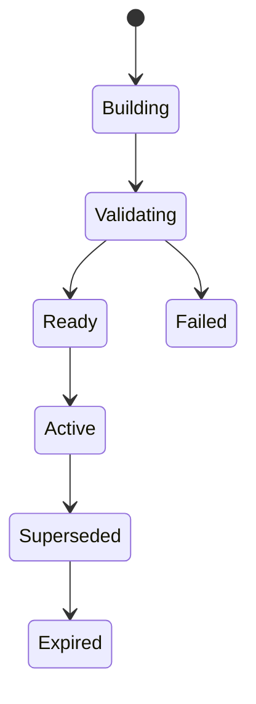

# Production Domain and Data Design

## Aggregates

- Workspace/tenant boundary (single tenant in v1, explicit for future migration).
- Repository and RepositorySource.
- ImportSession.
- IndexJob, IndexVersion, IndexArtifact, CapabilityReadiness.
- File, Symbol, Endpoint, Reference, Chunk.
- GraphNode, GraphEdge, GraphCandidate, ValidationIssue.
- Evidence, Citation, Conversation, Message, AgentTrace.
- EvaluationDataset, EvaluationRun, EvaluationResult.

## Physical storage strategy

- PostgreSQL stores authoritative transactional metadata and queryable records.
- Artifact storage holds immutable, checksum-addressed outputs too large or unsuitable for relational rows.
- Redis stores delivery/coordination state only.
- Vector storage is a replaceable retrieval index, never the authoritative evidence source.

## Mandatory conventions

- Stable prefixed IDs and canonical keys independent of line number alone.
- Every repository-scoped record includes repository/tenant boundary and index version where applicable.
- Foreign keys, uniqueness, check constraints, and indexes enforce invariants.
- Multi-table writes use explicit transactions.
- Alembic owns production schema changes; `create_all` and manual column patches are local compatibility only and must leave the production path.
- Deletes follow retention and audit policy; source/artifact cleanup is idempotent.

`identity-and-artifact-contract.md` is the canonical production v1 format for canonical keys, provenance envelopes, index manifests, artifact checksums, and activation semantics. Detailed specifications retain entity/storage depth but do not override that cross-version contract.

## Index lifecycle

Activation is atomic. A failed build never mutates or replaces the active version. Evidence remains bound to its source index and becomes stale when appropriate.

## Detailed specifications

- `specifications/detailed-data-model.md`: entity fields, enums, relationships, lifecycle, constraints, indexes, feature mapping, versions, artifacts, fingerprints, references, graph candidates, validation, readiness, and tours.
- `specifications/detailed-storage-design.md`: source/import/upload/database/vector/graph/log/evaluation paths, cleanup, retention, manifests, atomic publish, and export artifacts.
- `postgresql-physical-schema.md`: DAT-001 implementation design for exact production tables, columns, constraints, indexes, transaction boundaries, and migration order.
- `postgresql-erd.md`: aggregate ERDs and the cross-aggregate foreign-key catalog matching the physical schema.

The physical PostgreSQL schema and Alembic migrations must implement these semantics while following `database-design.md` and accepted ADRs.
