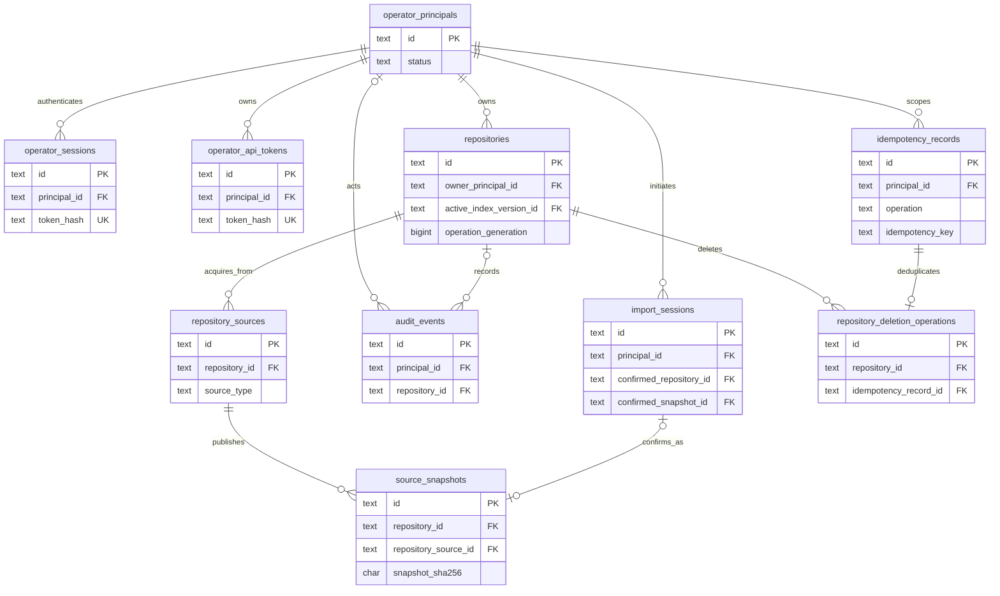
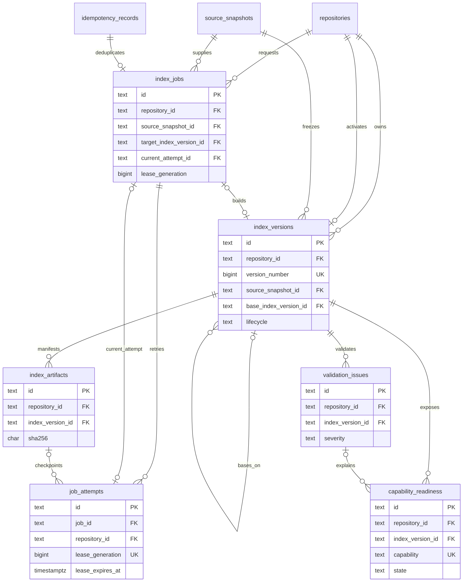
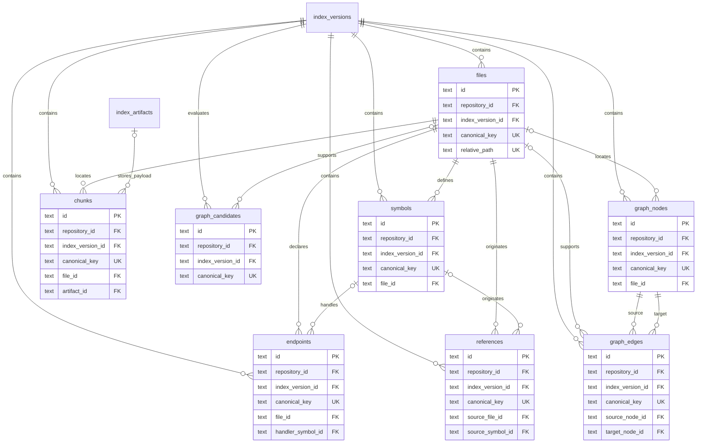
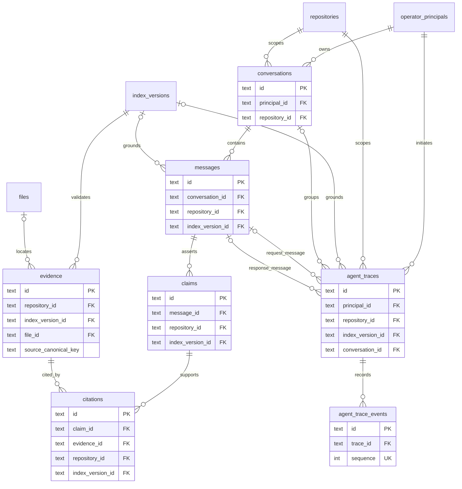
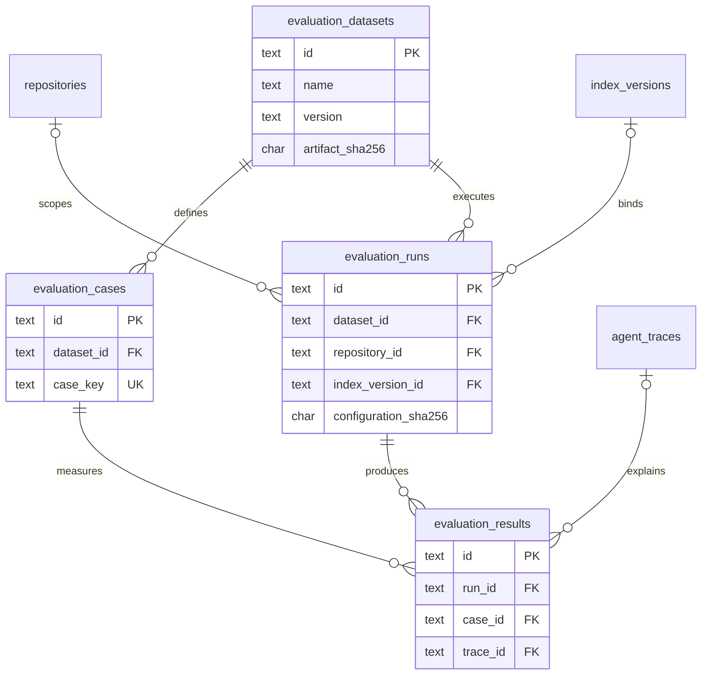

# PostgreSQL Entity-Relationship Design

Status: Accepted implementation design for DAT-002

Authority: Production v1 table relationships and aggregate ownership

Owner: Data owner

Detailed columns and constraints: `postgresql-physical-schema.md`

Last verified: 2026-07-13

The diagrams are split by aggregate so keys remain readable. Repeated boundary tables such as `repositories` and `index_versions` represent the same physical table. Composite lines labeled by the surrounding text always include repository and index-version ownership; a single ID arrow must not be implemented when the physical schema requires a composite foreign key.

## Access, repository, source, and import

`import_sessions` owns temporary acquisition state and may point to the immutable repository snapshot only after confirmation. A repository never points back to an import session. Audit relationships are nullable and use `SET NULL`; deletion operations retain the repository FK until validated cleanup completes.

## Durable job and index lifecycle

The repository-active-version and job-current-attempt relationships are intentional cycles. DAT-002 creates the base tables first and adds those FKs as deferred constraints. The active lifecycle is additionally checked by a deferred constraint trigger.

## Versioned code intelligence and graph

Every line in this diagram is repository/version scoped. In particular, graph edge source and target FKs are `(repository_id, index_version_id, node_id)`, so an edge cannot join nodes from different builds. Reverse relations are derived through `ix_graph_edges_reverse`; inverse edges are not duplicated.

## Evidence, conversations, claims, and traces

Claims and citations are distinct: a claim belongs to one assistant message, while a citation joins that claim to validated evidence in the same repository/index version. Trace events store typed, privacy-safe events; they never store hidden chain-of-thought.

## Evaluation

Frozen datasets/cases and index versions used by evaluation evidence use `RESTRICT`. Repository deletion may null a non-release evaluation repository link only under retention policy; retained index-version evidence blocks cleanup until policy permits it.

## Cross-aggregate foreign-key catalog

| Child columns | Parent columns | Delete action | Purpose |
| --- | --- | --- | --- |
| `repositories.owner_principal_id` | `operator_principals.id` | `RESTRICT` | authorization boundary |
| `source_snapshots(repository_id, repository_source_id)` | `repository_sources(repository_id, id)` | `CASCADE` | immutable source ownership |
| `index_jobs(repository_id, source_snapshot_id)` | `source_snapshots(repository_id, id)` | `RESTRICT` | exact build input |
| `index_versions(repository_id, source_snapshot_id)` | `source_snapshots(repository_id, id)` | `RESTRICT` | version/source binding |
| `repositories(id, active_index_version_id)` | `index_versions(repository_id, id)` | `RESTRICT`, deferred | atomic active pointer |
| `index_jobs(repository_id, target_index_version_id)` | `index_versions(repository_id, id)` | `RESTRICT` | job output identity |
| `index_jobs(repository_id, current_attempt_id)` | `job_attempts(repository_id, id)` | `SET NULL`, deferred | current fencing attempt |
| all observation `(repository_id, index_version_id)` | `index_versions(repository_id, id)` | `CASCADE` except retained evidence | version ownership |
| graph edge node triples | graph node triples | `CASCADE` | same-version graph integrity |
| `citations(repository_id, index_version_id, evidence_id)` | evidence triple | `RESTRICT` | validated support binding |
| `claims(repository_id, index_version_id, message_id)` | message ownership tuple | `CASCADE` | claim/answer scope |
| `evaluation_runs(repository_id, index_version_id)` | version pair | `RESTRICT` | frozen evaluation identity |

The table dictionary is authoritative when this summary omits a nullable relation or a supporting unique key.
