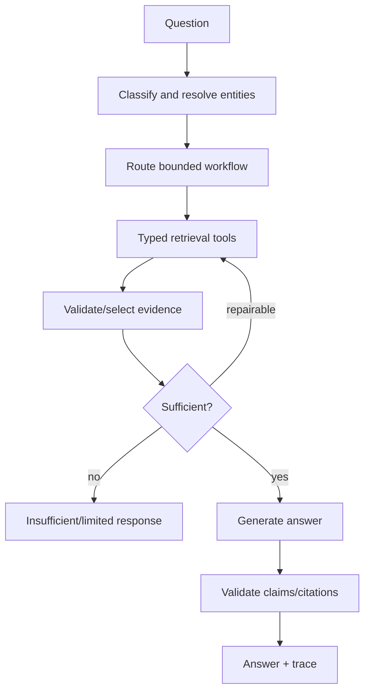

# Retrieval, Evidence, and Agentic RAG Contract

## Retrieval modes

1. Direct lookup for exact file, symbol, endpoint, config, or error code.
2. Hybrid RAG combining lexical/BM25, metadata, optional semantic vector, and bounded graph context.
3. Agentic RAG for flow, impact, debugging, architecture, and other multi-step investigations.

Retrievers emit normalized candidates with source, score, matched terms, selection reason, and index version. Ranking weights and model/index versions are configuration artifacts and benchmarked.

## Bounded agent workflow

Budgets limit tool calls, rounds, graph depth, evidence count, execution time, tokens, and provider cost. Static tools and deterministic fallback continue when LLM providers fail. Imported source is untrusted data and cannot issue instructions or request tool execution.
