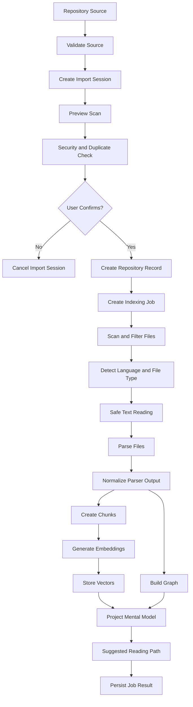

# Indexing Pipeline

## Document Purpose

This document expands the indexing architecture described in `02_system_architecture.md`. It defines the detailed indexing pipeline that turns an imported repository into searchable, citable, graph-aware, and agent-ready project knowledge.

This file should answer:

- What happens after a user uploads or imports source code?
- What does the Preview step show before indexing?
- Which files are scanned, skipped, parsed, chunked, embedded, and linked into the graph?
- How are indexing progress, warnings, parser errors, re-indexing, and stale evidence handled?

## Goal

The indexing pipeline turns a repository into searchable, citable, graph-aware knowledge. It must be safe, repeatable, observable, and robust against partial parser failures.

The pipeline should support four outcomes:

1. **Workspace understanding**: project overview, detected stack, important files, modules, endpoints, reading path.
2. **Search and retrieval**: keyword, semantic, symbol, endpoint, config, docs, and test search.
3. **Agentic AI answering**: evidence bundles for grounded LLM answers.
4. **Graph and impact analysis**: file, symbol, endpoint, import, call, API, test, and documentation relations.

## Relationship to Other Docs

- `02_system_architecture.md`: explains where the Indexing Service sits in the full system.
- `03_data_model.md`: defines the tables written by indexing.
- `04_api_contract.md`: defines import session, preview, indexing status, warnings, skipped files, and failed files APIs.
- `06_agent_workflow.md`: consumes indexed metadata, chunks, graph, and evidence for AI answers.
- `07_evidence_and_citation.md`: defines how chunks and parsed metadata become verifiable evidence.

## High-Level Pipeline

```text
repository source
-> validate source
-> create import session
-> scan preview metadata
-> detect duplicates and security warnings
-> user confirms indexing
-> create repository record
-> create indexing job
-> scan files
-> apply security filters
-> detect language and file type
-> read text safely
-> parse files
-> normalize parser output
-> build chunks
-> generate embeddings
-> store vectors
-> build graph
-> generate project mental model
-> generate suggested reading path
-> persist job result
```

## Pipeline Overview Diagram



## Indexing Stage Names

The system should use stable stage names so the frontend and API can show clear progress.

| Stage | Meaning |
| --- | --- |
| `queued` | Job has been created but not started. |
| `validating_source` | Source exists and is safe enough to inspect. |
| `preview_scanning` | Preview metadata, language, size, and warnings are being collected. |
| `waiting_for_confirmation` | Preview is ready and user must confirm indexing. |
| `copying_source` | Source is copied/extracted/cloned into managed storage. |
| `scanning_files` | File candidates are discovered. |
| `filtering_files` | Ignored, unsafe, binary, and unsupported files are skipped. |
| `detecting_language` | Language and file type are inferred. |
| `reading_files` | Text is read safely with encoding detection. |
| `parsing_files` | Parsers extract imports, symbols, endpoints, API calls, models, docs, and config. |
| `normalizing_output` | Parser output is converted into the common schema. |
| `building_chunks` | Citation-ready retrieval chunks are created. |
| `generating_embeddings` | Embedding provider creates vectors. |
| `storing_vectors` | Vector IDs are persisted and linked to chunks. |
| `building_graph` | Graph nodes and edges are created. |
| `building_project_mental_model` | High-level project understanding is generated. |
| `building_reading_path` | Suggested reading path is generated from metadata and graph signals. |
| `completed` | Job completed successfully. |
| `completed_with_warnings` | Job completed but some files were skipped or failed. |
| `failed` | Fatal error prevented useful indexing. |
| `cancelled` | User or system cancelled the job. |

## Step 0: Import Session and Preview

The import session exists before a repository becomes a fully indexed project.

### Purpose

Preview protects the user from indexing the wrong or unsafe source. It also makes the system feel transparent by showing what will be indexed and what will be skipped.

### Supported sources

- Uploaded zip.
- Uploaded folder through browser file picker.
- GitHub public URL.
- GitHub private URL with configured credentials.

### Preview should include

- Project name candidate.
- Source type.
- Estimated repository size.
- Estimated number of files.
- Detected languages and frameworks.
- Top-level folder structure.
- Files/folders to be skipped.
- Security warnings for secret-like files.
- Possible duplicate repositories.
- Estimated index time.
- Whether the project has enough supported files to continue.

### Preview output

The preview should create or return:

- `import_session_id`
- source summary
- detected stack summary
- file statistics
- skipped summary
- security warnings
- duplicate candidates
- recommended action

### Duplicate handling

If a possible duplicate is found, the UI should allow:

- Open existing project.
- Re-index existing project.
- Import as new copy.
- Cancel.

Duplicate signals may include:

- same sanitized source URI
- same GitHub URL
- same branch/commit
- same root folder name plus similar file hash summary
- same archive hash

## Step 1: Source Validation

Validation must happen before indexing and before storing any untrusted source permanently.

### Validation rules

- Source exists.
- Source is not empty.
- Source size is under configured limit.
- Archive paths do not escape target directory.
- Nested archives are rejected or handled with strict depth limits.
- GitHub URL points to an allowed host.
- Credentials are referenced indirectly and never stored in source metadata.
- Real secret files are not read for content.

### Output

- Import session or repository source record.
- Managed source folder at `storage/repositories/{repository_id}/source` after confirmation.
- Validation warnings or fatal validation error.

## Step 2: File Scan

Scanner walks the managed source folder and creates file candidates.

### Ignored folders

- `.git`
- `.svn`
- `.hg`
- `node_modules`
- `venv`
- `.venv`
- `env`
- `dist`
- `build`
- `.next`
- `.nuxt`
- `coverage`
- `.pytest_cache`
- `.mypy_cache`
- `__pycache__`
- `.cache`
- `.idea`
- `.vscode`
- `target`

### Ignored files

- `.env`
- `.env.*` except `.env.example`
- `secrets.*`
- `credentials.*`
- `*.pem`
- `*.key`
- binary files
- unsupported extensions
- files over configured size limit

### Output

Each candidate should include:

- repository_id
- index_version
- relative path
- size
- extension
- detected file type candidate
- initial skip reason if blocked

## Step 3: Language and File Type Detection

### Supported language mapping

| Pattern | Language |
| --- | --- |
| `.py` | `python` |
| `.js`, `.jsx` | `javascript` |
| `.ts`, `.tsx` | `typescript` |
| `.md`, `.mdx` | `markdown` |
| `.json`, `.yaml`, `.yml`, `.toml`, `.ini`, `.cfg`, `.env.example` | `config` |
| `Dockerfile` | `docker` |
| `docker-compose.yml`, `compose.yml` | `compose` |

### File type mapping

- `source`
- `document`
- `config`
- `test`
- `asset`
- `unknown`

### Test detection heuristics

- `tests/`
- `__tests__/`
- `test_*.py`
- `*_test.py`
- `*.test.ts`
- `*.test.tsx`
- `*.spec.ts`
- `*.spec.tsx`

## Step 4: Safe Text Reading

Read order:

1. UTF-8.
2. UTF-8 with BOM.
3. Latin-1 fallback with low confidence.

If all fail:

- mark file `parse_status=failed`
- create parser error or failed-file record
- continue indexing other files

Rules:

- Never read real `.env` files.
- Never log secret-like content.
- Limit preview content length for very large files.
- Preserve line endings only when needed for line range accuracy.

## Step 5: Content Hashing and Index Versioning

### File hash

SHA-256 over raw bytes.

### Chunk hash

SHA-256 over normalized chunk content plus file path and line range.

### Index version

Every successful or attempted indexing job should have an `index_version`.

Records created during indexing should store `index_version`, including:

- FileRecord
- SymbolRecord
- EndpointRecord
- ApiCallRecord
- ChunkRecord
- GraphNode
- GraphEdge
- ProjectMentalModel
- Evidence generated from indexed content

### Purpose

- Re-index correctness.
- Future incremental indexing.
- Evidence reproducibility.
- Stale citation detection.
- Safe cleanup of old index data.

## Step 6: Source Parsers

### Python

Use `ast` as the default parser.

Extract:

- imports
- classes
- functions
- async functions
- methods
- decorators
- docstrings
- FastAPI routes from `app.get`, `app.post`, `router.get`, `router.post`, etc.
- SQLAlchemy models
- Pydantic schemas
- basic function calls
- test functions when file type is `test`

### JavaScript and TypeScript

Preferred parser options:

- tree-sitter
- Babel
- SWC
- TypeScript compiler API

Fallback:

- controlled regex for imports, exports, functions, components, and HTTP calls

Extract:

- imports
- exports
- functions
- arrow functions assigned to constants
- React component heuristics
- fetch/axios calls
- route strings
- test blocks such as `describe`, `it`, `test`

### Markdown

Extract:

- heading hierarchy
- section chunks
- code fences
- links to files or setup commands when visible
- project setup hints
- API documentation hints

### Config

Extract:

- JSON/YAML/TOML keys
- Dockerfile instructions
- docker-compose services
- `.env.example` variable names only

Never read real `.env` files.

## Step 7: Parser Output Normalization

Every parser must return a consistent structure:

```json
{
  "file": {},
  "imports": [],
  "symbols": [],
  "endpoints": [],
  "api_calls": [],
  "models": [],
  "schemas": [],
  "tests": [],
  "relations": [],
  "parser_errors": [],
  "warnings": []
}
```

Rules:

- No parser should write directly to the database.
- The indexing service persists normalized output.
- Unsupported files should produce warnings, not fatal errors.
- Low-confidence extraction must be labeled with confidence.

## Step 8: Chunking

### Chunk types

- `file_summary`
- `function`
- `class`
- `method`
- `component`
- `endpoint`
- `api_call`
- `doc_section`
- `config_section`
- `test_case`

### Required metadata

- repository_id
- index_version
- file_id
- file_path
- language
- file_type
- chunk_type
- symbol_id nullable
- symbol_name nullable
- endpoint_id nullable
- start_line
- end_line
- content_hash

### Rules

- Prefer semantic boundaries over fixed-size chunks.
- Preserve line ranges.
- Keep chunks small enough for retrieval but large enough to understand behavior.
- Add summary chunks only after parser chunks.
- Do not chunk secret or skipped files.

## Step 9: Embedding Generation

Rules:

- Use provider abstraction.
- Batch requests.
- Retry transient failures.
- Do not embed skipped or secret files.
- If embeddings fail fully, mark job failed unless keyword-only mode is explicitly enabled.
- Store embedding provider and embedding model in job metadata.

Output:

- Vector IDs linked to chunk IDs.

## Step 10: Vector Store

Collection name:

```text
repo_{repository_id}
```

Vector metadata must include:

- chunk_id
- repository_id
- index_version
- file_path
- chunk_type
- symbol_name nullable
- start_line
- end_line
- content_hash

Re-index must delete or replace old vectors for the repository and index version according to the retention policy.

## Step 11: Graph Build

### Nodes

- repository
- module
- file
- symbol
- endpoint
- api_call
- model
- schema
- test
- document
- config
- chunk

### Edges

- `contains`
- `defines`
- `imports`
- `exports`
- `calls`
- `exposes_endpoint`
- `calls_api`
- `uses_model`
- `uses_schema`
- `tested_by`
- `documented_by`
- `configured_by`
- `chunks_into`

### Rules

- Store confidence for best-effort relations.
- Preserve evidence line range when available.
- Normalize frontend API call paths and backend endpoint paths to connect them.
- Graph relations must be derived from parser output, metadata, or explicit evidence, not from semantic similarity alone.

## Step 12: Project Mental Model

Generate:

- detected stack
- entrypoints
- module map
- endpoint list
- main flows
- important files
- suggested reading path candidates
- documentation gaps
- test gaps
- config/deployment notes
- risk areas

This model powers:

- Workspace Overview
- Suggested Reading Path
- architecture questions
- onboarding questions
- evaluation baselines

## Step 13: Suggested Reading Path

The suggested reading path recommends 3 to 7 files/modules that a new developer should read first.

### Input signals

- README/docs existence
- application entrypoints
- API routers
- config/database files
- models/schemas
- services/core logic
- high in-degree files in import graph
- high call-degree symbols
- test coverage signals

### Scoring examples

| Signal | Example | Effect |
| --- | --- | --- |
| README exists | `README.md` | strong onboarding candidate |
| Entry point | `main.py`, `app.py`, `server.ts` | high priority |
| Framework initialization | `FastAPI()`, `app.listen()` | high priority |
| Many endpoints | router file | high priority |
| Model/schema definitions | `models.py`, `schemas.py` | medium-high priority |
| Imported by many files | `database.py`, `config.py` | medium priority |
| Service layer | `services/auth_service.py` | medium priority |

### Output item

Each recommendation should include:

- rank
- file_id
- file_path
- title
- reason
- confidence
- signals
- evidence IDs when available

The system must not claim a file is definitely important without explaining the signal.

## Parser Warnings, Skipped Files, and Failed Files

The indexing job should expose detailed diagnostics separately from the main progress response.

### Skipped files

Examples:

- dependency folder
- build output
- binary file
- secret-like file
- unsupported extension
- file too large

### Parser warnings

Examples:

- low-confidence JS/TS regex extraction
- route detected without handler symbol
- graph relation inferred only partially
- markdown link points to missing file

### Failed files

Examples:

- encoding failure
- syntax parse failure
- unexpected parser exception

Rules:

- Skipped files are not failures.
- Parser failure for one file should not fail the whole job unless too many files fail or no useful files remain.
- Warnings must be safe to show to users and must not include secrets.

## Re-index Strategy

### Default complete behavior

1. Create a new indexing job.
2. Increment repository `index_version` or reserve the next index version.
3. Mark repository `indexing`.
4. Preserve conversations and old evidence records.
5. Delete or mark stale old chunks, symbols, endpoints, API calls, graph records, and vectors according to retention policy.
6. Rebuild index from current managed source.
7. Mark repository `indexed` or `indexed_with_warnings` on success.
8. Mark job and repository `failed` on fatal failure.

### Future incremental behavior

- Compare file content hashes.
- Re-parse changed files.
- Remove deleted file records.
- Update dependent graph edges and chunks.
- Recompute affected mental model sections.

## Stale Index Detection

A repository may become stale when:

- managed source files change after `last_indexed_at`
- Git commit changes after GitHub sync
- file hash summary differs from the latest index
- index job failed after partial cleanup

The UI should show a re-index recommendation rather than silently answering from stale data.

## Fatal vs Recoverable Failures

### Recoverable

- one file parse error
- unsupported file type
- encoding failure for one file
- low-confidence JS/TS relation
- missing optional docs
- missing tests

### Fatal

- source folder unavailable
- database unavailable
- vector store unavailable
- embedding provider unavailable after retries
- repository contains no indexable files
- storage path traversal detected
- archive extraction is unsafe

## Observability and API Outputs

The indexing service should support API responses for:

- current job status
- job history
- warnings
- skipped files
- failed files
- stale index status

The main status endpoint should stay compact. Large diagnostics should be paginated or fetched from dedicated endpoints.

## Notes for AI Coding Agents

- Keep scanning, parsing, chunking, embedding, graph build, and mental model generation as separate services or functions.
- Do not let parsers write directly to the database.
- Do not embed or display blocked secret files.
- Make indexing idempotent: repeated indexing should not create duplicate records.
- Preserve line ranges carefully because citations depend on them.
- Treat graph relations as evidence only when they can point back to parser output, file metadata, or line ranges.
