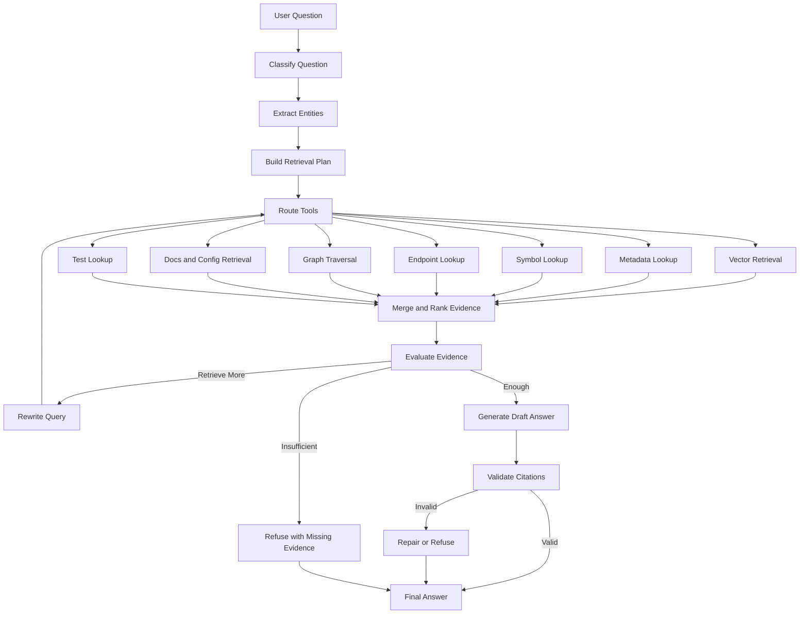

# Agent Workflow

## Document Purpose

This document expands the Agent Workflow architecture introduced in `02_system_architecture.md`. It defines how the AI layer classifies user questions, plans retrieval, selects tools, gathers evidence, validates evidence, generates grounded answers, and refuses unsupported answers.

The workflow should be implementable with LangGraph, but the domain logic must remain testable without LangGraph.

## Goal

The agent workflow prevents the system from answering directly from a single vector search. It must classify the question, plan retrieval, gather multi-source evidence, evaluate whether the evidence is sufficient, retry when needed, generate an answer, and validate citations.

The AI feature should be visible and valuable, but it must remain evidence-first. The LLM should not explore the repository by guessing. The agent should use tools over the indexed project knowledge model.

## Relationship to Other Docs

- `02_system_architecture.md`: defines where `AgentWorkflowService` sits in the system.
- `03_data_model.md`: defines conversations, messages, evidence, graph, chunks, and evaluation records.
- `04_api_contract.md`: defines chat, conversation, evidence, agent trace, and evaluation APIs.
- `05_indexing_pipeline.md`: creates the metadata, chunks, graph, and mental model consumed by the agent.
- `07_evidence_and_citation.md`: defines citation and anti-hallucination rules.

## Agentic Retrieval Principle

Naive code RAG usually follows:

```text
question -> vector search -> LLM answer
```

This project should follow:

```text
question -> classify -> plan -> choose tools -> retrieve evidence -> evaluate -> retry if needed -> generate -> validate citations -> answer or refuse
```

The agent is responsible for planning and tool orchestration. The LLM is responsible for language understanding and final explanation, but only after evidence is available.

## Question Types

- `architecture_overview`
- `flow_tracing`
- `api_question`
- `database_question`
- `debugging`
- `onboarding`
- `reading_path`
- `impact_analysis`
- `search_question`
- `configuration_question`
- `testing_question`
- `documentation_question`
- `security_question`
- `unknown`

## Agent State

```json
{
  "repository_id": "repo_123",
  "index_version": 3,
  "conversation_id": "conv_123",
  "message_id": "msg_123",
  "user_question": "How does the login flow work?",
  "question_type": "flow_tracing",
  "entities": {
    "files": [],
    "symbols": ["login"],
    "endpoints": [],
    "error_codes": [],
    "config_keys": []
  },
  "retrieval_plan": [],
  "retrieval_round": 0,
  "max_retrieval_rounds": 2,
  "tools_used": [],
  "evidence": [],
  "evidence_score": 0.0,
  "missing_evidence": [],
  "draft_answer": null,
  "final_answer": null,
  "citations": [],
  "graph_trace": [],
  "decision": null,
  "errors": []
}
```

## LangGraph-Oriented Node Design

The workflow may be implemented as a LangGraph state machine with the following logical nodes:



The same logic can be implemented without LangGraph using ordinary service functions and tests.

## Tool Catalog

The agent may call these internal tools. Each tool must return normalized evidence candidates or structured metadata.

| Tool | Purpose |
| --- | --- |
| `project_overview_tool` | Retrieve Project Mental Model, detected stack, modules, entrypoints, important files. |
| `vector_retrieval_tool` | Semantic search over chunks. |
| `keyword_search_tool` | Exact or fuzzy text search. |
| `file_lookup_tool` | Find files by path, name, or folder. |
| `symbol_lookup_tool` | Find functions, classes, methods, components, models, schemas. |
| `endpoint_lookup_tool` | Find API endpoints by method, path, handler, or framework. |
| `api_call_lookup_tool` | Find frontend/backend outbound API calls. |
| `graph_traversal_tool` | Traverse imports, calls, endpoint relations, model usage, test relations. |
| `config_retrieval_tool` | Retrieve safe config files and `.env.example` variable names. |
| `document_retrieval_tool` | Retrieve README and docs sections. |
| `test_lookup_tool` | Find test files or test cases related to code. |
| `impact_analysis_tool` | Gather direct and indirect impact candidates for a target. |
| `evidence_validator_tool` | Validate line ranges, source existence, citation IDs, and stale status. |

## Step 1: Classify Question

### Input

- user question
- recent conversation context
- repository status
- project overview
- current workspace context if available

### Output

- question type
- extracted entities
- ambiguity notes

### Heuristics

| Type | Signals |
| --- | --- |
| `architecture_overview` | architecture, overview, structure, components, modules |
| `flow_tracing` | flow, how does X work, from frontend to backend, request path |
| `api_question` | HTTP method, endpoint path, API, route |
| `database_question` | model, table, migration, query, SQLAlchemy, schema |
| `debugging` | error, exception, 401, 500, not working, bug |
| `onboarding` | new to project, where to start, explain project |
| `reading_path` | what should I read first, reading order, onboarding path |
| `impact_analysis` | if I change, affected, impact, depends on, break |
| `testing_question` | test, coverage, which tests, failing test |
| `configuration_question` | env, settings, Docker, configuration |
| `security_question` | auth, permission, token, secret, credential |

LLM classification is allowed, but a rule-based fallback must exist.

## Step 2: Extract Entities

The agent should extract possible:

- file paths
- symbol names
- endpoint paths
- HTTP methods
- model/schema names
- error codes
- config keys
- test names
- module/folder names

Entity extraction can use regex, metadata lookup, and optionally LLM parsing. Extracted entities must be validated against indexed records before being treated as facts.

## Step 3: Build Retrieval Plan

Each plan item must specify:

- source: `vector`, `keyword`, `metadata`, `symbol`, `endpoint`, `graph`, `docs`, `config`, `tests`, `files`
- query
- filters
- top_k
- reason

### Retrieval strategies by question type

| Type | Required retrieval sources |
| --- | --- |
| `architecture_overview` | project mental model, docs, modules, graph |
| `flow_tracing` | endpoints, symbols, graph traversal, vector fallback |
| `api_question` | endpoint metadata, handler code, frontend API calls |
| `database_question` | models, schemas, migrations, service calls |
| `debugging` | error keywords, related code, config, docs |
| `onboarding` | README/docs, important files, modules, reading path |
| `reading_path` | project mental model, important files, graph centrality, docs |
| `impact_analysis` | target symbol/file, graph neighbors, imports/calls, tests |
| `testing_question` | test files, source-test relations, test chunks |
| `configuration_question` | config chunks, settings files, docs |
| `security_question` | auth endpoints, token helpers, config, middleware, guards |

## Step 4: Route Tools and Retrieve Evidence

Each retriever returns normalized evidence candidates. Evidence must include enough metadata to become citations if selected.

Rules:

- Prefer exact metadata hits over semantic similarity for named files, symbols, and endpoints.
- Use graph traversal for dependency, flow, impact, and test questions.
- Use docs for architecture and onboarding questions.
- Use config retrieval for deployment, environment, and settings questions.
- Do not use evidence from skipped or secret files.

## Step 5: Merge and Rank Evidence

Rules:

- Deduplicate by file path, start line, end line, symbol, and index version.
- Boost exact endpoint and exact symbol matches.
- Boost graph evidence for flow and impact questions.
- Boost docs for architecture and onboarding.
- Keep at least two source types when available.
- Cap evidence count before LLM generation.
- Preserve evidence diversity: code, docs, config, graph, tests when useful.

## Step 6: Evaluate Evidence

Evidence sufficiency depends on question type.

### Required coverage examples

| Question type | Required evidence |
| --- | --- |
| `flow_tracing` | endpoint or symbol evidence plus at least one relation/path |
| `api_question` | endpoint record plus handler code |
| `database_question` | model/schema plus usage or relation |
| `debugging` | error/config evidence plus related code |
| `impact_analysis` | changed target plus direct neighbors |
| `architecture_overview` | module/entrypoint/docs evidence |
| `reading_path` | entrypoint/docs/important file signals |
| `testing_question` | test file or clear statement that no tests were found |

Output:

- score between 0 and 1
- missing evidence list
- decision: `answer`, `retrieve_more`, `insufficient`

## Step 7: Rewrite Query and Retry

Run when:

- evidence score is below threshold
- exact entity is missing
- graph path is missing for flow/impact
- retrieved evidence is too generic
- citation validation fails due to weak evidence

Rewrite examples:

- `login flow` -> `POST login authenticate token frontend axios`
- `401 error` -> `authentication token verify current_user unauthorized`
- `database config` -> `DATABASE_URL settings config engine session`
- `User model impact` -> `User model imports calls endpoints tests schema`

Stop when `max_retrieval_rounds` is reached.

## Step 8: Generate Answer

LLM input must include:

- user question
- question type
- repository name/summary
- selected evidence
- citation rules
- instruction to avoid unsupported claims

The LLM must not invent:

- file paths
- function names
- class names
- endpoint paths
- database tables
- tests
- graph relations
- config keys
- business rules

## Step 9: Validate Draft

Checks:

- Every technical claim has evidence.
- Every citation ID exists.
- File paths cited exist in evidence.
- Line ranges are valid.
- Citation index version is compatible with the current repository index version or marked stale.
- No unsupported relation is stated as fact.
- Insufficient evidence is returned if validation fails and cannot be repaired.

## Step 10: Persist Result

Persist:

- user message
- assistant message
- evidence records
- citations
- question type
- retrieval metadata
- evidence sufficiency
- agent trace
- index version

## Agent Trace

Agent trace makes the AI behavior inspectable for debugging and demo.

Example:

```json
{
  "message_id": "msg_456",
  "question_type": "flow_tracing",
  "plan": [
    "Find endpoint related to login",
    "Find handler symbol",
    "Traverse graph to related service and token helper",
    "Validate evidence coverage"
  ],
  "tools_used": [
    "endpoint_lookup_tool",
    "symbol_lookup_tool",
    "graph_traversal_tool",
    "vector_retrieval_tool"
  ],
  "retrieval_rounds": 2,
  "evidence_score": 0.86,
  "decision": "answer"
}
```

The frontend may show this trace in an advanced evidence/debug panel.

## Multi-Step Investigation Examples

### Authentication flow

User asks: `How does authentication work?`

Expected plan:

1. Find auth endpoints.
2. Find login handler.
3. Find token generation/verification helpers.
4. Find auth middleware/dependencies.
5. Find protected endpoint examples.
6. Generate ordered flow with citations.

### Impact analysis

User asks: `If I change User model, what may be affected?`

Expected plan:

1. Find `User` model symbol.
2. Traverse imports and calls from the model.
3. Find endpoints using related services/schemas.
4. Find related tests.
5. Separate evidence-based impact from inferred impact.
6. Generate answer with confidence and citations.

### Debugging

User asks: `Why does login return 401?`

Expected plan:

1. Search error/status code references.
2. Find login endpoint.
3. Find token verification/current user dependency.
4. Find config keys related to auth.
5. Return likely inspection path, not an unsupported root cause.

## Response Style

### Architecture answer

- short summary
- main components
- entrypoints
- important files
- citations

### Flow answer

- ordered steps
- graph trace when available
- files/symbols per step
- citations

### Debugging answer

- likely inspection order
- relevant files
- config to verify
- what evidence is missing

### Impact answer

- target summary
- direct impact
- indirect impact
- affected APIs/tests
- evidence-based vs inferred impact
- confidence

### Reading path answer

- recommended order
- reason per file
- confidence per recommendation
- citations or signals

## Insufficient Evidence Response

Return:

- concise explanation
- searched sources
- missing evidence list
- optional user suggestion

Do not answer with guessed implementation details.

Example:

```json
{
  "answer": "I do not have enough evidence to trace this flow reliably. I found the login endpoint, but could not find a related token verification function or frontend API call in the current index.",
  "evidence_sufficient": false,
  "searched_sources": ["endpoint", "symbol", "graph", "vector"],
  "missing_evidence": ["token verification function", "frontend API call"]
}
```

## Guardrails

- The agent must not claim a dependency exists from semantic similarity alone.
- The agent must not call a relation evidence-based unless it comes from graph/parser metadata.
- The agent must not answer impact questions without a validated target.
- The agent must not cite skipped or secret files.
- The agent must not hide weak evidence; it should state the limitation.
- The agent must not let LLM output override citation validation.

## Notes for AI Coding Agents

- Implement the workflow as testable service functions first.
- LangGraph should orchestrate steps, not contain hidden business logic.
- Add unit tests for each question type and evidence sufficiency decision.
- Store agent trace because it is useful for debugging and for demonstrating Agentic AI.
- Keep prompts small by passing only selected evidence, not the whole repository.
