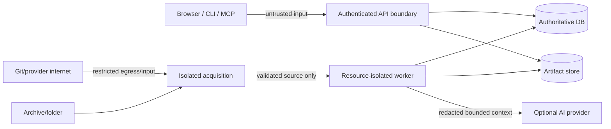

# Production v1 Threat Model

Status: Accepted control baseline; implementation evidence pending `SEC-*`  
Authority: L3 trust boundaries, threats, controls, and evidence  
Owner: Security owner  
Dependencies: scope/non-goals, system failure model, detailed risk register  
Last verified: 2026-07-12

## Protected assets

Repository source, secrets, credentials/provider references, database state, index artifacts, evidence/citations, conversations/traces, evaluation exports, audit records, service availability, and host/network boundaries.

## Trust boundaries

Imported code, comments, Markdown, AGENTS/instruction files, Git metadata, archives, generated artifacts and provider output are data—not trusted operational instructions.

## Threat and control register

| ID | Threat | Required prevention/containment | Release evidence |
| --- | --- | --- | --- |
| T-IMP-01 | Archive traversal/symlink/duplicate path | Canonical path validation, reject escape/duplicate/symlink, isolated root, idempotent cleanup | adversarial archive suite |
| T-IMP-02 | ZIP bomb/nested archive/huge tree | compressed/uncompressed ratio, entry/byte/depth/file quotas, nested archive policy, fail before expensive parse | quota/resource tests |
| T-GIT-01 | SSRF/protocol/redirect abuse | allow HTTPS GitHub host/profile only in v1, reject credentials/custom ports/IP literals, validate redirects/destination, no arbitrary schemes | Git URL/redirect tests |
| T-GIT-02 | hooks/submodules/LFS or clone resource abuse | hooks disabled, submodules/LFS disabled, shallow bounded clone, time/size/process limits, isolated destination | clone hardening tests |
| T-PARSE-01 | malformed source CPU/memory denial | worker CPU/memory/time limits, per-file timeout, parser crash isolation, bounded diagnostics | parser fault/load suite |
| T-SEC-01 | secret ingestion/exfiltration | path and content scan before parse/embed/provider/log/export, quarantine/redaction, example-file policy | seeded-secret end-to-end tests |
| T-LLM-01 | prompt injection in repository | label source as untrusted, fixed system/tool policy, typed allowlisted tools, no source execution, evidence validation | adversarial prompt suite |
| T-AUTH-01 | cross-repository access | authenticated principal boundary, ownership/authorization in every repository/evidence/artifact query, negative tests | authorization matrix |
| T-DATA-01 | stale/wrong-version evidence | explicit repository/index binding, source hash/range/freshness validation, stale disclosure | evidence regression |
| T-OPS-01 | credential/log leakage | credential references only, structured allowlisted fields, redaction at source/export, trace privacy policy | log/trace scan |
| T-DEL-01 | unsafe/incomplete deletion | repository-owned manifest, bounded idempotent deletion, audit/tombstone, restore/retention policy | deletion tests/drill |
| T-SUP-01 | compromised dependency/container | locks, license/SBOM/vulnerability scans, non-root minimal image, signed/digested release artifacts | supply-chain reports |
| T-ABUSE-01 | request/job/provider exhaustion | auth, upload/request/job/provider quotas, rate/concurrency limits, cancellation and cost budget | abuse/load tests |

## Import policy

- Folder/ZIP inputs never preserve host absolute paths or follow links outside the session root.
- Public Git production v1 accepts only repository URLs matching the accepted GitHub URL parser. Private Git credentials and arbitrary Git hosts are deferred.
- Imported source is never imported as Python, installed, built, tested, executed, or used to drive shell/tool actions.
- Worker filesystem exposes only required source/staging/artifact paths; network is disabled except explicitly required acquisition/provider stages.

## Provider disclosure

Before any external provider call, apply repository authorization, secret scan/redaction, evidence selection and token budget. Record provider/model, policy/config version, evidence IDs and byte/token counts; do not persist raw credentials. Local deterministic exploration remains available when disclosure is disabled or provider fails.

## Access model requirement

Production v1 uses one local **operator principal** with two credential surfaces:

- Browser access uses a server-side session referenced by an opaque `HttpOnly`, `Secure`, `SameSite=Strict` cookie. State-changing requests require an origin check and CSRF token. Session records are hashed/opaque, expire absolutely and by inactivity, rotate on authentication, and can be revoked.
- CLI/MCP access uses named operator API tokens shown once, stored only as salted hashes, scoped to the production v1 operator permissions, individually expirable/revocable, and sent only as Bearer tokens over TLS. Browser code never stores these tokens.

First deployment requires a one-time bootstrap credential reference supplied by the deployment secret mechanism. The bootstrap endpoint is available only while no operator credential exists, creates/rotates the operator password/session material, emits an audit event, and then disables itself. Loss recovery is an explicit local operator runbook that revokes all sessions/tokens; no unauthenticated password reset or email flow exists.

Every repository belongs to the single operator ownership boundary. API/application/repository queries still enforce `principal_id` plus `repository_id`; single tenancy is not permission bypass. Unauthorized access returns the non-disclosing resource response chosen by the API contract and emits a safe audit/security event.

Mandatory audit events cover bootstrap, login success/failure, logout, session/token create/revoke/expire, repository import/delete, index activation/recovery, settings changes, authorization denial and backup/restore administration. Audit records never contain credentials or unrestricted source.

The current optional shared token remains development compatibility only and is forbidden in production. `SEC-002` implements this contract and must define password hashing parameters, session/token lifetimes from accepted security configuration, CSRF/origin/CORS tests, bootstrap/recovery commands, audit retention, rotation and the negative authorization matrix before Internet exposure.

## Residual-risk rule

Static analysis is incomplete for dynamic behavior and secret scanners have false negatives/positives. The UI discloses coverage; operators can exclude/quarantine paths; no “safe” label implies execution safety. Every accepted residual risk names owner, expiry/review date, affected release level and compensating control.
