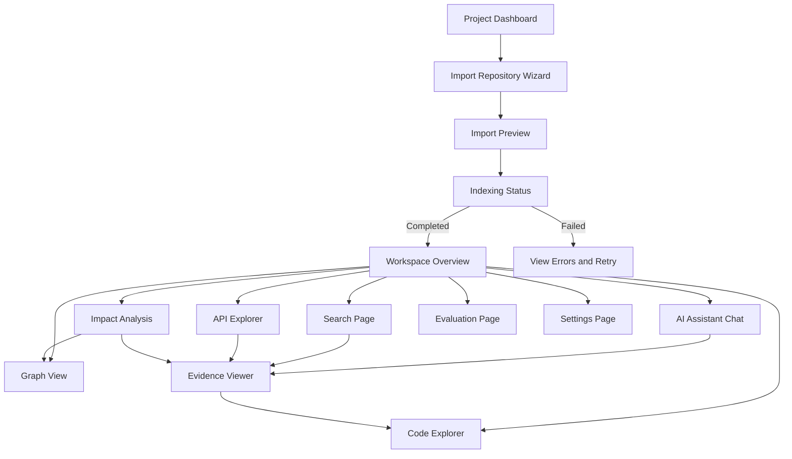

# Frontend Workspace UX Specification

## 1. Document Purpose

This document is the single source of truth for the frontend experience of AI Codebase Assistant. It combines the former frontend flow document and UI/UX specification into one unified document.

It defines:

- the frontend product goal;
- global workspace layout;
- navigation and main user flow;
- visual system and common UI states;
- page-by-page UX requirements;
- page-to-API mapping;
- responsive behavior;
- implementation rules for missing or incomplete features.

This file should be read together with:

- `00_project_brief_proposal.md` for product motivation and proposal context;
- `02_system_architecture.md` for technical architecture;
- `04_api_contract.md` for backend API details;
- `07_evidence_and_citation.md` for evidence and citation behavior.

## 2. UX Goal and Design Intent

The frontend must feel like a developer workspace for understanding a repository. It should not look like a simple chatbot with an upload button.

Every page must help the user answer at least one of these questions:

- What projects have I imported or indexed?
- What is the system doing during import or indexing?
- What does this repository contain?
- Where is this file, function, class, API endpoint, config, or dependency?
- How do files, symbols, APIs, tests, and modules depend on each other?
- What evidence supports the AI answer?
- What may be affected if I change this file, symbol, endpoint, or config?
- How reliable is the system compared with naive search or naive RAG?

The interface must support the complete flow from project import to indexing, exploration, grounded AI answers, evidence inspection, impact analysis, evaluation, and settings.

Reference screenshots are stored in:

```text
/docs/ui_ux_assets_v2/
```

The implementation should match the structure, density, and page intent of the reference screenshots. If a feature is not implemented yet, render the page shell with an `In development` state instead of hiding the page.

## 3. Global Product Layout

Workspace pages use a three-zone layout:

```text
┌─────────────────────────────────────────────────────────────────────┐
│ Top Bar                                                             │
├───────────────┬───────────────────────────────────────┬─────────────┤
│ Left Nav      │ Main Workspace                        │ Assistant / │
│               │                                       │ Evidence    │
│               │                                       │ Panel       │
└───────────────┴───────────────────────────────────────┴─────────────┘
```

### 3.1 Top Bar

The top bar should contain:

- app name;
- current repository name;
- source type and branch/commit if available;
- index status indicator;
- global search entry;
- settings shortcut;
- optional user/demo indicator if needed later.

The top bar should remain stable across workspace pages so the user always knows which repository they are viewing.

### 3.2 Left Navigation

The left navigation should include:

- Overview;
- Code Explorer;
- Graph View;
- API Explorer;
- Impact Analysis;
- AI Assistant Chat;
- Search;
- Evidence Viewer;
- Evaluation;
- Settings.

Navigation items for unfinished features must remain visible, but they should render a stable `In development` state instead of a blank page.

### 3.3 Main Workspace

The main workspace contains page-specific content. It should prioritize information that helps the user act, inspect, or verify.

Avoid showing internal implementation details unless they are useful for debugging or evaluation.

Do not show by default:

- internal storage paths;
- raw UUIDs;
- raw graph node IDs;
- raw chunk IDs;
- vector dimensions;
- raw provider secrets;
- raw API keys.

### 3.4 Right Assistant / Evidence Panel

The right panel should support:

- AI chat;
- current citations;
- evidence summary;
- selected evidence detail;
- follow-up questions;
- actions such as `Ask about this file`, `Ask about this endpoint`, or `Explain this impact path`.

The right panel should not replace the main workspace. It should support exploration and evidence verification.

## 4. Main User Flow

The complete user flow is:

1. Open Project Dashboard.
2. Select New Project.
3. Import repository from ZIP, folder upload, or future GitHub source.
4. Configure indexing profile and ignore patterns.
5. Review import preview.
6. Start indexing.
7. Watch Indexing Status.
8. Open Workspace Overview.
9. Inspect detected stack, modules, entrypoints, and suggested reading path.
10. Open Code Explorer to inspect files and symbols.
11. Open Graph View to inspect relationships.
12. Open API Explorer to inspect detected endpoints and request flows.
13. Ask AI how a flow works.
14. Click citations to open Evidence Viewer.
15. Open cited source in Code Explorer.
16. Search for a symbol, endpoint, feature, or config.
17. Run Impact Analysis for a file/symbol/endpoint/config.
18. Run Evaluation to compare retrieval methods.
19. Adjust Settings if needed.

### 4.1 Flow Diagram



### 4.2 Important Deep Links

The frontend should support these navigation links:

- Project card → Workspace Overview.
- Indexing complete → Workspace Overview.
- Citation chip → Evidence Viewer.
- Evidence Viewer → Code Explorer at file and line range.
- Search result → Code Explorer or Evidence Viewer.
- Endpoint item → API endpoint detail or Code Explorer.
- Graph node → node detail and source file.
- Impact path → Graph View focused on path.
- Chat answer → Agent trace and evidence detail.

## 5. Visual System

The visual style should feel like a professional developer tool.

### 5.1 Style Direction

Use:

- clean developer-tool layout;
- dense but readable spacing;
- neutral background;
- clear cards, tables, and panels;
- strong status labels;
- monospace for code, paths, symbols, API routes, and config keys;
- readable line-height for code preview;
- consistent icon style;
- calm interaction states.

Avoid:

- decorative marketing sections;
- oversized hero blocks inside the app workspace;
- unnecessary animation;
- hiding technical state from the user;
- showing raw internal data without context.

### 5.2 Typography Rules

Use monospace for:

- file paths;
- symbols;
- endpoints;
- config keys;
- code snippets;
- line ranges;
- commit hashes.

Use normal UI font for:

- page titles;
- descriptions;
- status labels;
- explanations;
- AI answers.

### 5.3 Status Language

Prefer user-understandable labels:

- `Indexed`
- `Indexing`
- `Failed`
- `Not indexed`
- `Indexed with warnings`
- `Evidence insufficient`
- `Citation may be stale`
- `In development`

Avoid exposing internal-only labels unless they are needed for debugging.

## 6. Common UI States

Every page must support these states where relevant:

### Loading

Show skeletons or loading indicators. Avoid blank pages.

### Empty

Explain why the page has no data and provide the next useful action.

Examples:

- No repository imported → show New Project action.
- No endpoint detected → explain that the project may not contain a supported backend framework.
- No graph data → explain that graph relations require successful indexing.

### Error

Show a user-readable error message and retry action when possible.

### Indexing

Show partial data only if clearly marked as partial. Do not present incomplete results as final.

### Failed

Show failure reason, failed step, affected files if known, and retry action.

### In Development

If a page or feature is not implemented yet:

- keep the page visible;
- show `In development`;
- list the required backend endpoint or data source;
- disable unsupported controls;
- do not crash or route to a blank page.

### Evidence Insufficient

For AI answers with weak evidence:

- show an evidence insufficiency indicator;
- show searched sources if available;
- show missing evidence list;
- avoid presenting the answer as fully reliable.

### Stale Citation

If an evidence record belongs to an older index version:

- show `Citation may be stale`;
- show current index version and evidence index version if useful;
- allow user to re-index or refresh evidence.

## 7. Page Specifications

Each page section below defines purpose, user questions, required UI, primary actions, API dependencies, states, navigation, and reference image.

---

## 7.1 Project Dashboard

Reference:

```text
ui_ux_assets_v2/01_project_dashboard.png
```

### Purpose

Manage imported repositories and let users quickly understand their indexing state.

### User Questions

- What projects have I imported?
- Which projects are indexed, indexing, failed, or not indexed?
- Which repository should I open next?
- Do I need to re-index anything?

### Required UI

- Project cards or table.
- Status tabs: All, Indexed, Indexing, Failed, Not indexed.
- Repository search.
- New Project button.
- Recent activity or indexing summary.
- Per-project actions: Open Workspace, Re-index, View Errors, Delete.

### Project Item Fields

- repository name;
- source type and safe source label;
- detected stack;
- status;
- total files;
- indexed files;
- symbols;
- endpoints;
- chunks;
- graph nodes;
- last indexed time.

Do not show long internal storage paths by default.

### Primary Actions

- Open Workspace.
- New Project.
- Re-index.
- View Errors.
- Delete.

### API Dependencies

- `GET /api/v1/repositories`
- `GET /api/v1/repositories/{repository_id}`
- `POST /api/v1/repositories/{repository_id}/index`
- `DELETE /api/v1/repositories/{repository_id}`

### States

- Empty: no repository imported.
- Loading: repository list loading.
- Error: repository list cannot be loaded.
- Indexing: show progress indicator on card.
- Failed: show error action.

### Navigation

- New Project → Import Repository Wizard.
- Open Workspace → Workspace Overview.
- View Errors → Indexing Status or job detail.

---

## 7.2 Import Repository Wizard

Reference:

```text
ui_ux_assets_v2/02_import_repository.png
```

### Purpose

Import a repository from ZIP, folder upload, or future GitHub source. The wizard must make the import safe and transparent before indexing starts.

### User Questions

- Am I importing the correct project?
- What will the system read?
- What will be ignored?
- Are there security warnings?
- Is this a duplicate of an existing project?

### Wizard Steps

1. Source.
2. Configure.
3. Preview.
4. Index.

### Source Options

- Upload ZIP.
- Upload Folder.
- GitHub URL for future milestone.

### Configuration

- Project name.
- Branch if GitHub.
- Indexing profile: Fast, Balanced, Deep.
- Ignore patterns.
- Max file size.
- Parser options only if they are understandable and safe.

Avoid showing too many parser toggles to ordinary users. Advanced options can be collapsed.

### Preview Panel

The preview should show:

- project name;
- source type;
- detected languages;
- detected framework signals;
- candidate file count;
- ignored/skipped file summary;
- estimated chunks;
- estimated indexing time;
- security warnings;
- possible duplicate repositories;
- AI readiness summary;
- Start Indexing action.

### Duplicate Handling

If possible duplicates are detected, show actions:

- Open existing project.
- Re-index existing project.
- Import as new copy.
- Cancel.

### API Dependencies

- `POST /api/v1/import-sessions/upload`
- `POST /api/v1/import-sessions/upload-folder`
- `POST /api/v1/import-sessions/github`
- `GET /api/v1/import-sessions/{session_id}/preview`
- `POST /api/v1/import-sessions/{session_id}/confirm`
- `DELETE /api/v1/import-sessions/{session_id}`

Fallback if import sessions are not implemented yet:

- `POST /api/v1/repositories/upload`
- `POST /api/v1/repositories/upload-folder`
- `POST /api/v1/repositories/import-github`
- `POST /api/v1/repositories/{repository_id}/index`

### States

- Source not selected.
- Uploading.
- Preview loading.
- Preview ready.
- Duplicate detected.
- Security warning detected.
- Import failed.

### Navigation

- Cancel → Project Dashboard.
- Start Indexing → Indexing Status.

---

## 7.3 Indexing Status

Reference:

```text
ui_ux_assets_v2/03_indexing_status.png
```

### Purpose

Make indexing transparent and observable.

### User Questions

- What is the system doing now?
- How much is complete?
- Which files were skipped or failed?
- Can I open the workspace yet?
- Can I retry if something failed?

### Required UI

- Overall progress bar.
- Current step.
- Pipeline step list with statuses.
- Processed/skipped/failed file counts.
- Chunks created.
- Embeddings generated.
- Symbols found.
- Endpoints found.
- Graph nodes and edges.
- Logs.
- Warnings.
- Failed files with reason.
- Retry button when failed.
- Open Workspace button when complete.

### Pipeline Steps

1. Validate source.
2. Scan files.
3. Apply ignore rules.
4. Detect language and file type.
5. Parse source code.
6. Parse docs and config.
7. Create chunks.
8. Generate embeddings.
9. Store vectors.
10. Build graph.
11. Generate project mental model.
12. Finalize.

### Polling

- Poll status every 1-3 seconds while running.
- Stop polling when status is completed, completed with warnings, failed, or cancelled.

### API Dependencies

- `GET /api/v1/repositories/{repository_id}/index/status`
- `GET /api/v1/repositories/{repository_id}/index/jobs`
- `GET /api/v1/repositories/{repository_id}/index/jobs/{job_id}/warnings`
- `GET /api/v1/repositories/{repository_id}/index/jobs/{job_id}/skipped-files`
- `GET /api/v1/repositories/{repository_id}/index/jobs/{job_id}/failed-files`
- `POST /api/v1/repositories/{repository_id}/index`

### States

- Queued.
- Running.
- Completed.
- Completed with warnings.
- Failed.
- Cancelled.

### Navigation

- Completed → Workspace Overview.
- Failed → stay on Indexing Status with retry and diagnostics.

---

## 7.4 Workspace Overview

Reference:

```text
ui_ux_assets_v2/04_workspace_overview.png
```

### Purpose

Show the Project Mental Model so users can understand the repository quickly.

### User Questions

- What does this repository do?
- What stack does it use?
- What are the main modules?
- Where should I start reading?
- What endpoints and flows are important?
- Where are the documentation gaps or risk areas?

### Required UI

- Summary stats.
- Detected stack.
- Architecture summary.
- Key modules.
- Entrypoints.
- Important files.
- Suggested reading path.
- Endpoint summary.
- Main flows.
- Documentation gaps.
- Risk areas.
- Suggested questions.
- Assistant panel on the right.

### Suggested Reading Path

Show 3-7 recommended files/modules to read first.

Each item should include:

- rank;
- file path;
- short title;
- reason;
- confidence;
- signals or evidence;
- action to open file detail;
- action to ask AI about this item.

### API Dependencies

- `GET /api/v1/repositories/{repository_id}/overview`
- `GET /api/v1/repositories/{repository_id}/reading-path`
- `GET /api/v1/repositories/{repository_id}/staleness`
- `POST /api/v1/repositories/{repository_id}/chat`

### States

- Not indexed.
- Indexing.
- Indexed.
- Indexed with warnings.
- Stale index.
- Overview unavailable.

### Navigation

- Important file → Code Explorer.
- Suggested question → AI Assistant Chat.
- Endpoint summary → API Explorer.
- Risk area → Impact Analysis or Chat.

---

## 7.5 Code Explorer

Reference:

```text
ui_ux_assets_v2/05_code_explorer.png
```

### Purpose

Browse source files and parser metadata.

### User Questions

- Where is this file?
- What symbols does this file define?
- What endpoints or API calls are in this file?
- What related files should I inspect?
- Can I ask AI about this file or symbol?

### Layout

- File tree on the left.
- Code viewer in the center.
- Symbol/detail panel or lower panel.
- Assistant/evidence panel on the right.

### Required UI

- File tree.
- Open file tabs.
- Code viewer with line numbers.
- Syntax highlighting if available.
- Symbol outline.
- Endpoint/API call badges.
- Related files and graph edges.
- Button to ask AI about current file.
- Button to ask AI about selected symbol.
- Button to open evidence line range.

### API Dependencies

- `GET /api/v1/repositories/{repository_id}/files/tree`
- `GET /api/v1/repositories/{repository_id}/files/content?path=...`
- `GET /api/v1/repositories/{repository_id}/files/{file_id}/symbols`
- `GET /api/v1/repositories/{repository_id}/symbols/{symbol_id}`
- `GET /api/v1/repositories/{repository_id}/symbols/{symbol_id}/references`

### States

- File tree loading.
- File not found.
- File skipped.
- File too large to preview.
- Parser metadata unavailable.
- Evidence line range selected.

### Navigation

- Symbol → Symbol detail.
- Endpoint badge → API Explorer.
- Related graph edge → Graph View.
- Citation line range → Evidence Viewer or highlighted code range.

---

## 7.6 Graph View

Reference:

```text
ui_ux_assets_v2/06_graph_view.png
```

### Purpose

Visualize code relationships.

### User Questions

- What depends on this file or symbol?
- What does this endpoint connect to?
- Which modules are related?
- What graph path supports this impact or flow answer?

### Graph Types

- Module graph.
- File graph.
- API flow graph.
- Symbol/call graph.
- Impact graph.

### Node Types

- module;
- file;
- symbol;
- endpoint;
- API call;
- model;
- schema;
- test;
- document.

### Edge Types

- contains;
- defines;
- imports;
- calls;
- exposes_endpoint;
- calls_api;
- uses_model;
- uses_schema;
- tested_by;
- documented_by;
- configured_by.

### Required Controls

- Graph type selector.
- Relation type filter.
- Node type filter.
- Search/focus node.
- Depth control.
- Zoom/fit controls.
- Legend.
- Selected node/edge detail panel.
- Open file action.
- Ask AI about selected node/path.

### API Dependencies

- `GET /api/v1/repositories/{repository_id}/graph`
- `GET /api/v1/repositories/{repository_id}/graph/nodes/{node_id}`
- `GET /api/v1/repositories/{repository_id}/graph/path`

### States

- Graph loading.
- No graph data.
- Too many nodes; ask user to focus node.
- Selected node has no source evidence.
- Graph relation has low confidence.

### Navigation

- Node → selected detail panel.
- File node → Code Explorer.
- Endpoint node → API Explorer.
- Graph path → Impact Analysis or AI Chat.

---

## 7.7 API Explorer

Reference:

```text
ui_ux_assets_v2/07_api_explorer.png
```

### Purpose

Inspect detected backend endpoints and connected frontend API calls.

### User Questions

- What endpoints does this project expose?
- Where is this route implemented?
- What handler, schema, service, model, or frontend call is related?
- How does this request flow through the codebase?

### Required UI

- Endpoint table.
- Filters by method, module, auth hint, file.
- Detail panel.
- Request flow section when graph evidence exists.
- Related frontend API calls.
- Related services/models/schemas.
- Citations.
- Open in Code Explorer.
- Ask AI about endpoint.

### Required Table Columns

- method;
- path;
- handler;
- module;
- file;
- auth hint;
- request model;
- response model.

### API Dependencies

- `GET /api/v1/repositories/{repository_id}/api/endpoints`
- `GET /api/v1/repositories/{repository_id}/api/endpoints/{endpoint_id}`
- `GET /api/v1/repositories/{repository_id}/api/endpoints/{endpoint_id}/flow`
- `GET /api/v1/repositories/{repository_id}/evidence/{evidence_id}`

### States

- No endpoints detected.
- Backend framework unsupported.
- Endpoint detail unavailable.
- Request flow partial.

### Navigation

- Endpoint → endpoint detail.
- Handler → Code Explorer.
- Related frontend call → Code Explorer.
- Request flow → Graph View.

---

## 7.8 Impact Analysis

Reference:

```text
ui_ux_assets_v2/08_impact_analysis.png
```

### Purpose

Explain what may be affected by changing a file, symbol, endpoint, or config key.

### User Questions

- What may break if I change this function?
- Which endpoints use this model or service?
- Which tests should I run?
- Which impact is evidence-based and which is inferred?

### Inputs

- target type;
- target reference;
- max depth;
- include tests option;
- include indirect dependencies option.

### Required Output

- impact level;
- direct affected files;
- indirect affected files;
- affected endpoints;
- affected tests;
- graph paths;
- suggested verification checklist;
- confidence;
- evidence citations.

### Required Behavior

Separate:

- evidence-based impact;
- inferred impact;
- missing evidence.

Do not present inferred impact as certain.

### API Dependencies

- `POST /api/v1/repositories/{repository_id}/impact`
- `GET /api/v1/repositories/{repository_id}/related-tests`
- `GET /api/v1/repositories/{repository_id}/graph/path`
- `GET /api/v1/repositories/{repository_id}/evidence/{evidence_id}`

### States

- Target not selected.
- Target not found.
- No graph evidence.
- Partial impact result.
- Impact analysis failed.

### Navigation

- Affected file → Code Explorer.
- Affected endpoint → API Explorer.
- Graph path → Graph View.
- Citation → Evidence Viewer.

---

## 7.9 AI Assistant Chat

Reference:

```text
ui_ux_assets_v2/09_ai_assistant_chat.png
```

### Purpose

Ask repository-aware questions and receive grounded answers with citations.

### User Questions

- How does this project work?
- How does this endpoint or flow work?
- Where is this feature implemented?
- What should I read first?
- What may be affected by this change?
- What evidence supports the answer?

### Required UI

- Conversation messages.
- Chat history.
- Question type label.
- Evidence sufficiency indicator.
- Citation chips.
- Graph trace when available.
- Missing evidence list.
- Follow-up questions.
- Copy answer.
- Open evidence.
- Optional agent trace/debug panel.

### Required Behavior

- Do not show uncited technical answers as fully reliable.
- Show insufficient evidence clearly.
- Keep citations clickable.
- Distinguish evidence-based claims from inferred claims.
- Do not expose raw chain-of-thought; show a concise agent trace instead.

### API Dependencies

- `GET /api/v1/repositories/{repository_id}/conversations`
- `POST /api/v1/repositories/{repository_id}/conversations`
- `GET /api/v1/repositories/{repository_id}/conversations/{conversation_id}`
- `DELETE /api/v1/repositories/{repository_id}/conversations/{conversation_id}`
- `POST /api/v1/repositories/{repository_id}/chat`
- `GET /api/v1/repositories/{repository_id}/messages/{message_id}/agent-trace`
- `GET /api/v1/repositories/{repository_id}/evidence/{evidence_id}`

### States

- No conversation yet.
- Answer generating.
- Evidence insufficient.
- LLM provider error.
- Citation stale.
- Agent trace unavailable.

### Navigation

- Citation chip → Evidence Viewer.
- Graph trace → Graph View.
- Mentioned file/symbol → Code Explorer.

---

## 7.10 Search Page

Reference:

```text
ui_ux_assets_v2/10_search_page.png
```

### Purpose

Search repository content by keyword, semantic similarity, or hybrid strategy.

### User Questions

- Where is this symbol, endpoint, feature, config, or error text?
- What evidence can I use to ask the assistant?
- Which result should I open in code?

### Required Controls

- Query input.
- Search mode selector: Keyword, Semantic, Hybrid.
- Scope filter.
- Entity type filter.
- Language filter.
- File type filter.
- Sort mode.

### Result Item

- title;
- file path;
- symbol if any;
- preview;
- line range;
- score;
- result type;
- open in code;
- open evidence;
- ask AI about selected result.

### API Dependencies

- `GET /api/v1/repositories/{repository_id}/search`
- `POST /api/v1/repositories/{repository_id}/search/selected-evidence`
- `GET /api/v1/repositories/{repository_id}/evidence/{evidence_id}`

### States

- Empty query.
- No results.
- Too short query.
- Search failed.
- Results from stale index.

### Navigation

- Result → Code Explorer.
- Evidence → Evidence Viewer.
- Ask AI about result → AI Assistant Chat.

---

## 7.11 Evidence / Citation Viewer

Reference:

```text
ui_ux_assets_v2/11_evidence_citation_viewer.png
```

### Purpose

Let users verify AI answers and search results.

### User Questions

- What source supports this answer?
- Is the citation still valid?
- Which lines should I inspect?
- Why was this evidence retrieved?

### Required Content

- evidence ID;
- source type;
- file path;
- symbol name;
- line range;
- code preview with line numbers;
- relevance reason;
- confidence score;
- retrieval source;
- index version;
- stale citation warning if needed;
- metadata.

### Actions

- Open full file.
- Copy citation.
- Return to answer/search result.
- Validate evidence if supported.

### API Dependencies

- `GET /api/v1/repositories/{repository_id}/evidence/{evidence_id}`
- `POST /api/v1/repositories/{repository_id}/evidence/{evidence_id}/validate`
- `GET /api/v1/repositories/{repository_id}/files/content?path=...`

### States

- Evidence loading.
- Evidence not found.
- Evidence belongs to older index version.
- File no longer exists.
- Line range invalid.

### Navigation

- Open full file → Code Explorer.
- Back → Chat/Search/API/Impact context.

---

## 7.12 Evaluation Page

Reference:

```text
ui_ux_assets_v2/12_evaluation_page.png
```

### Purpose

Measure retrieval and answer quality.

### User Questions

- Is adaptive agentic retrieval better than naive RAG?
- Are citations accurate?
- Does the assistant hallucinate?
- Which question categories are weak?

### Required Content

- Dataset selector.
- Run method selector.
- Run button.
- Run status.
- Aggregate metrics.
- Per-question result table.
- Expected evidence.
- Retrieved evidence.
- Answer preview.
- Manual score fields.
- Export results.

### Metrics

- retrieval precision;
- retrieval recall;
- citation accuracy;
- answer correctness;
- groundedness;
- hallucination rate;
- completeness;
- latency.

### API Dependencies

- `GET /api/v1/evaluation/datasets`
- `POST /api/v1/evaluation/runs`
- `GET /api/v1/evaluation/runs/{run_id}`
- `GET /api/v1/evaluation/runs/{run_id}/results`

### States

- No dataset.
- Run queued.
- Run running.
- Run completed.
- Run failed.
- Partial metrics.

### Navigation

- Result citation → Evidence Viewer.
- Question result → Chat detail or retrieved evidence.

---

## 7.13 Settings Page

Reference:

```text
ui_ux_assets_v2/13_settings_page.png
```

### Purpose

Configure non-secret app behavior.

### User Questions

- Which providers are configured?
- What indexing settings are active?
- What files will be ignored?
- Can I test provider connection?
- How do I delete repository data safely?

### Sections

- Indexing.
- Parser.
- Retrieval.
- LLM provider.
- Embedding provider.
- Storage.
- GitHub import.
- Ignore patterns.
- Danger zone.

### Required Rules

- Never display raw secrets.
- Show whether required providers are configured.
- Validate settings before saving.
- Use secret references or environment variables for sensitive values.
- Dangerous actions require confirmation.

### API Dependencies

- `GET /api/v1/settings`
- `PATCH /api/v1/settings`
- `GET /api/v1/settings/ignore-patterns`
- `PATCH /api/v1/settings/ignore-patterns`
- `PATCH /api/v1/settings/indexing`
- `PATCH /api/v1/settings/providers`
- `POST /api/v1/settings/providers/test`

### States

- Settings loading.
- Provider not configured.
- Provider configured but not tested.
- Save success.
- Save failed.
- Danger action confirmation.

## 8. Page-to-API Mapping Summary

| Page | Main API Dependencies |
| --- | --- |
| Project Dashboard | `GET /repositories`, `GET /repositories/{id}`, `POST /repositories/{id}/index`, `DELETE /repositories/{id}` |
| Import Wizard | `POST /import-sessions/upload`, `POST /import-sessions/upload-folder`, `GET /import-sessions/{id}/preview`, `POST /import-sessions/{id}/confirm` |
| Indexing Status | `GET /repositories/{id}/index/status`, `GET /repositories/{id}/index/jobs`, `GET /repositories/{id}/index/jobs/{job_id}/warnings`, `skipped-files`, `failed-files` |
| Workspace Overview | `GET /repositories/{id}/overview`, `GET /repositories/{id}/reading-path`, `GET /repositories/{id}/staleness`, `POST /repositories/{id}/chat` |
| Code Explorer | `GET /repositories/{id}/files/tree`, `GET /repositories/{id}/files/content`, `GET /repositories/{id}/files/{file_id}/symbols`, `GET /repositories/{id}/symbols/{symbol_id}` |
| Graph View | `GET /repositories/{id}/graph`, `GET /repositories/{id}/graph/nodes/{node_id}`, `GET /repositories/{id}/graph/path` |
| API Explorer | `GET /repositories/{id}/api/endpoints`, `GET /repositories/{id}/api/endpoints/{endpoint_id}`, `GET /repositories/{id}/api/endpoints/{endpoint_id}/flow` |
| Impact Analysis | `POST /repositories/{id}/impact`, `GET /repositories/{id}/related-tests`, `GET /repositories/{id}/graph/path` |
| AI Assistant Chat | `GET /repositories/{id}/conversations`, `POST /repositories/{id}/conversations`, `POST /repositories/{id}/chat`, `GET /repositories/{id}/messages/{message_id}/agent-trace` |
| Search Page | `GET /repositories/{id}/search`, `POST /repositories/{id}/search/selected-evidence` |
| Evidence Viewer | `GET /repositories/{id}/evidence/{evidence_id}`, `POST /repositories/{id}/evidence/{evidence_id}/validate` |
| Evaluation Page | `GET /evaluation/datasets`, `POST /evaluation/runs`, `GET /evaluation/runs/{run_id}`, `GET /evaluation/runs/{run_id}/results` |
| Settings Page | `GET /settings`, `PATCH /settings`, `GET /settings/ignore-patterns`, `PATCH /settings/ignore-patterns`, `POST /settings/providers/test` |

## 9. Navigation and Deep Linking Rules

The frontend should support URL routes that are stable enough for reload and sharing during local demo.

Suggested route structure:

```text
/projects
/projects/new
/projects/:repositoryId/indexing
/projects/:repositoryId/overview
/projects/:repositoryId/code?path=...
/projects/:repositoryId/graph?focus=...
/projects/:repositoryId/api
/projects/:repositoryId/api/:endpointId
/projects/:repositoryId/impact
/projects/:repositoryId/chat/:conversationId?
/projects/:repositoryId/search?q=...
/projects/:repositoryId/evidence/:evidenceId
/projects/:repositoryId/evaluation
/projects/:repositoryId/settings
```

Rules:

- If a repository does not exist, redirect to Project Dashboard with a message.
- If a repository is not indexed, workspace pages should show a not-indexed state and link to indexing.
- If a citation is stale, keep it openable if stored evidence exists and show a warning.
- If a direct URL points to an unfinished page, show page shell with `In development`.

## 10. Responsive Behavior

On smaller screens:

- sidebar becomes collapsible;
- assistant/evidence panel becomes drawer or tab;
- main workspace remains the priority;
- code viewer should allow horizontal scroll;
- graph view should show a focused node/detail layout instead of trying to show a dense graph;
- tables should collapse into stacked cards when needed.

Minimum responsive expectations:

- Project Dashboard remains usable on tablet width.
- Code Explorer keeps file tree collapsible.
- Chat remains readable with citations accessible.
- Evidence Viewer keeps line numbers readable.

## 11. Implementation Rules for Missing Features

If a backend endpoint or feature is not implemented:

- keep the page visible;
- show `In development`;
- explain the missing endpoint or data source;
- provide disabled controls where appropriate;
- do not remove navigation items;
- do not route to a blank page;
- do not fake data as if it were real.

Example:

```text
This feature is in development.
Required API: GET /api/v1/repositories/{repository_id}/graph/path
Current status: graph path endpoint is not implemented yet.
```

## 12. Notes for AI Coding Agents

When implementing frontend from this document:

- Build page shells first, then wire APIs page by page.
- Keep layout consistent across workspace pages.
- Use shared components for status badges, citation chips, evidence cards, file path labels, code previews, empty states, error states, and loading states.
- Do not hide unfinished pages; show stable `In development` states.
- Do not display raw API keys, private tokens, real secret contents, or internal storage paths by default.
- Do not treat an uncited AI answer as fully reliable.
- Citations must be clickable and lead to Evidence Viewer or Code Explorer line range.
- Any page that depends on indexing must handle not-indexed, indexing, indexed, failed, and stale-index states.
- Prefer user-facing language over internal implementation terms. If terms like `chunk`, `graph node`, or `embedding` are displayed, explain why they matter.

## 13. Replacement Note

This file replaces the earlier separated documents:

- `08_frontend_ux_flow.md`
- `ui_ux.md`

The intended new filename is:

```text
08_frontend_workspace_ux.md
```
