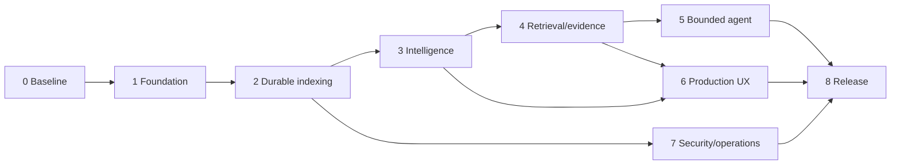

# Master Production Roadmap

Status: Approved active plan  
Authority: Delivery sequence and phase gates  
Owner: Project maintainer  
Dependencies: Accepted requirements, contracts and ADRs  
Last verified: 2026-07-12

## Release target

Deliver release level L3: a single-tenant, single-node self-hosted production system with safe ingestion, durable versioned indexing, deterministic code intelligence, evidence-backed assistance, production UX, and operational recovery.

## Delivery chain

Discovery may run ahead, but implementation cannot bypass the dependencies declared by a task. Evaluation fixtures and harness work begin early and mature with each phase.

## Phase outcomes

| Phase | Outcome | Canonical plan |
| --- | --- | --- |
| 0 | Reproducible verified baseline and executable governance | `phases/phase-0-verified-baseline.md` |
| 1 | Transactional production persistence and maintainable application boundaries | `phases/phase-1-production-foundation.md` |
| 2 | Recoverable jobs, immutable artifacts, and atomic index activation | `phases/phase-2-durable-indexing.md` |
| 3 | Canonical IR/resolution/graph pipeline with proven incremental equivalence | `phases/phase-3-code-intelligence.md` |
| 4 | Measured hybrid retrieval, evidence selection, citations, and context budgets | `phases/phase-4-retrieval-and-evidence.md` |
| 5 | Bounded typed assistant workflow with sufficiency, repair, and persistent trace | `phases/phase-5-bounded-agent.md` |
| 6 | Deep-linked accessible workspace with explicit capability and failure states | `phases/phase-6-production-ux.md` |
| 7 | Hardened import/access, telemetry, deployment, backup, recovery, and runbooks | `phases/phase-7-security-and-operations.md` |
| 8 | All L3 evidence collected, reviewed, and approved | `phases/phase-8-release-qualification.md` |

## Control rules

- `task-register.md` owns task IDs and dependency edges; phase files own outcomes and gates.
- `16-agent-tasks/` owns executable scope. A register row is not implementation authorization.
- Every phase updates `14-implementation-baseline/`, `project-status.md`, traceability, and required evidence.
- A phase ends on evidence, not task count.
- Technology candidates enter delivery only through the adoption process and accepted ADR.
- No task may claim production readiness while a required downstream phase is incomplete.
