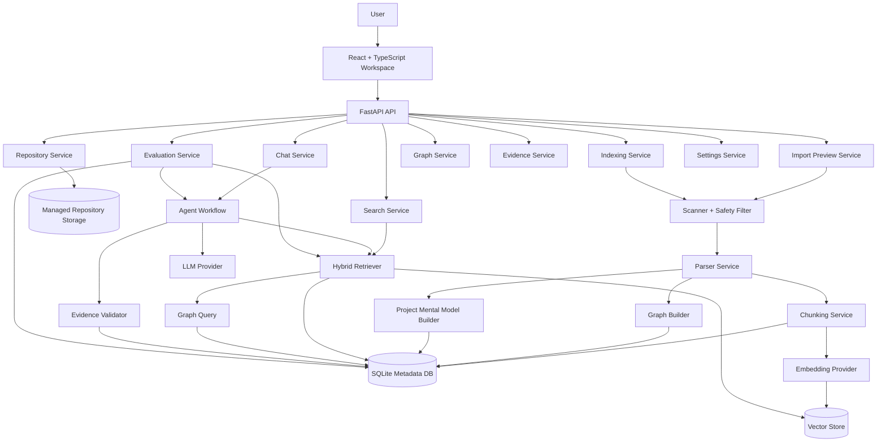
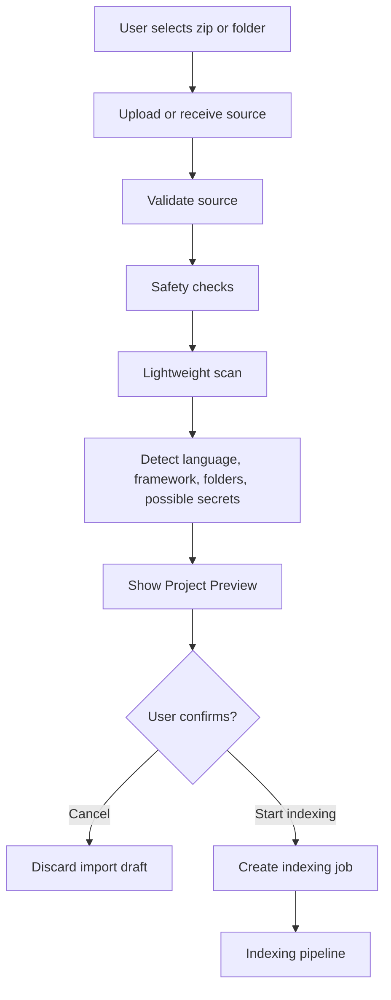
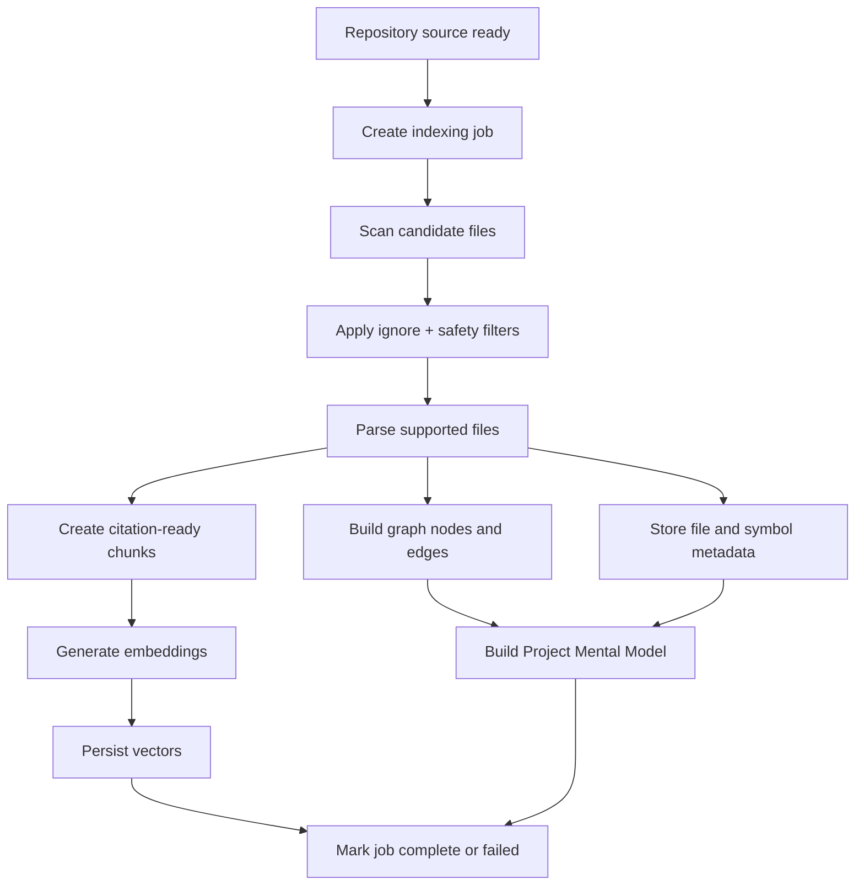
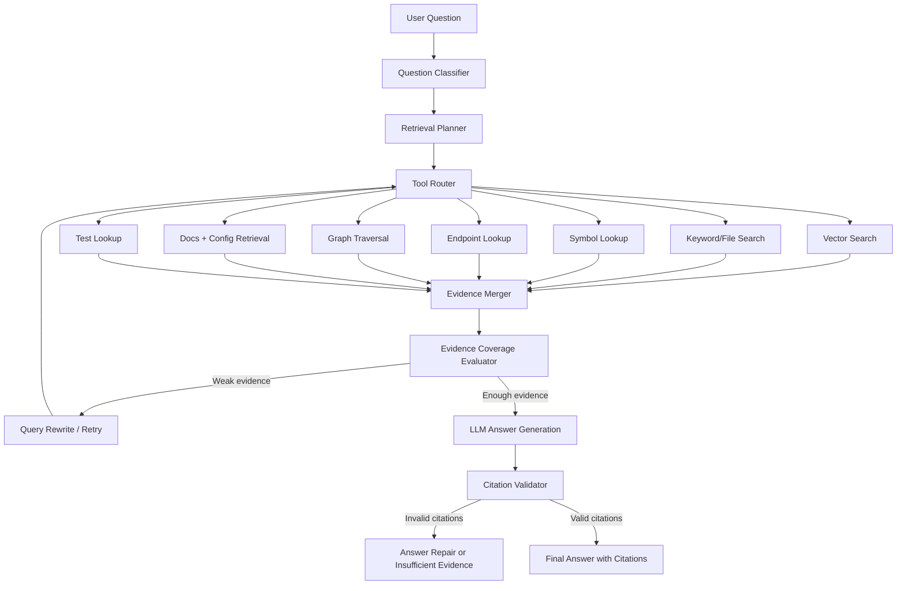
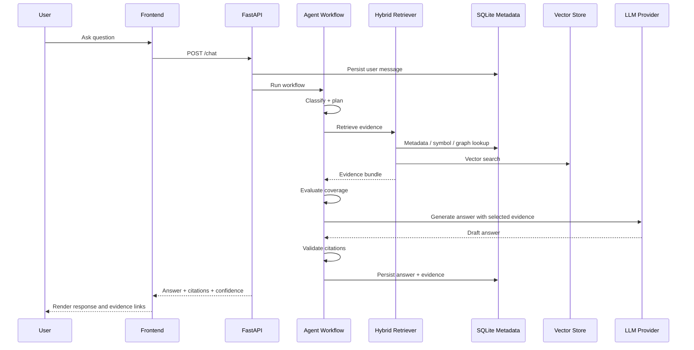
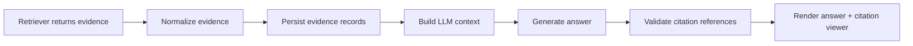

# System Architecture

## Document Purpose

This document describes the technical architecture of the AI Codebase Assistant. It expands the high-level proposal into concrete backend layers, frontend structure, persistence choices, indexing flow, retrieval flow, agent workflow, evidence flow, and replaceable components.

This file should answer the question: **how is the system built?**

For the project motivation, problem statement, and proposal-level overview, see `00_project_brief_proposal.md`. This document should avoid repeating the full product motivation and should focus on implementation structure.

## 1. Architecture Overview

The system is a local-first full-stack developer workspace.

Core components:

- **Frontend:** React + TypeScript workspace UI.
- **Backend:** FastAPI domain API.
- **Metadata store:** SQLite for local-first usage, with schema discipline for later PostgreSQL migration.
- **Vector store:** Persistent local vector database through a provider abstraction.
- **Graph store:** Graph records stored in SQL, with optional exported JSON for visualization and debugging.
- **Repository storage:** Managed local storage for uploaded, extracted, copied, or cloned repositories.
- **LLM provider:** Configurable service abstraction.
- **Embedding provider:** Configurable service abstraction.
- **Indexing worker:** Background job abstraction, initially in-process, later replaceable with Celery, RQ, or Arq.
- **Agent workflow:** Agentic retrieval and answer generation workflow, optionally implemented with LangGraph.

The architecture should separate deterministic code intelligence from LLM-based reasoning. Parsers, metadata extraction, graph construction, search, and evidence validation should not depend on the LLM. The LLM should only receive selected evidence and generate grounded answers.



## 2. Backend Layers

The backend should be organized into clear layers. Each layer has a strict responsibility so that the system remains maintainable and easy for an AI coding agent to extend.

### 2.1 API Routes

Responsibilities:

- Parse HTTP requests.
- Validate request bodies and query parameters through Pydantic schemas.
- Call service methods.
- Return response DTOs.
- Map domain errors to standard API error responses.
- Provide authentication and authorization hooks if multi-user support is added later.

Rules:

- No business logic in routes.
- No direct database queries in routes.
- No direct LLM calls in routes.
- No direct vector store calls in routes.
- No direct repository filesystem traversal in routes.

### 2.2 Services

Services contain the application logic. Routes should call services, and services may call repositories, providers, parsers, and utility modules.

Core services:

- `RepositoryService`: create, list, update, and delete repositories; manage repository records and source storage references.
- `ImportPreviewService`: validate incoming source, scan high-level structure, detect language/framework signals, estimate files, identify skipped files, detect possible secrets, and prepare preview data before indexing.
- `IndexingService`: orchestrate scanning, filtering, parsing, chunking, embedding, graph building, mental model generation, and re-indexing.
- `IndexingJobService`: create, update, cancel, and query indexing job status and job history.
- `ScannerService`: safely discover files and apply ignore rules.
- `SecurityFilterService`: block dependency folders, build outputs, binary files, path traversal, unsafe archives, and possible secret files.
- `ParserService`: dispatch files to language-specific parsers and document/config parsers.
- `ChunkingService`: create citation-ready chunks with file path, line range, symbol context, and content hash.
- `EmbeddingService`: generate embeddings through a provider-neutral interface.
- `VectorStoreService`: add, search, update, and delete vectors.
- `GraphService`: build and query graph nodes and edges.
- `SearchService`: expose keyword, file, symbol, endpoint, and hybrid search behavior.
- `RetrieverService`: combine vector, keyword, metadata, graph, docs, config, and file retrieval.
- `AgentWorkflowService`: classify questions, plan retrieval, route tools, evaluate evidence, retry when needed, generate answers, and verify citations.
- `EvidenceService`: normalize, persist, inspect, and validate evidence/citations.
- `ImpactAnalysisService`: analyze direct and inferred impact from file, symbol, endpoint, model, and test relationships.
- `EvaluationService`: run benchmark datasets and compute retrieval and answer quality metrics.
- `SettingsService`: manage provider settings, ignore patterns, storage settings, and security-related configuration.

### 2.3 Repository and Database Access Layer

The database access layer should contain all SQLAlchemy models, sessions, and query helpers.

Rules:

- Services should not construct raw SQL unless needed for performance.
- Database queries should be grouped by domain: repositories, files, symbols, chunks, graph, conversations, evidence, jobs, and evaluation.
- The schema should remain compatible with a later PostgreSQL migration.
- Write operations that affect indexing should be transaction-safe.
- Re-index should be idempotent at user level: running it multiple times should not create duplicate records.

### 2.4 Provider Layer

Provider abstractions isolate replaceable external or storage components.

Provider interfaces:

- `LLMProvider`: chat completion or structured generation.
- `EmbeddingProvider`: batch embedding generation.
- `VectorStoreProvider`: vector insert, search, delete, and collection management.
- `GitProvider`: public/private GitHub import and sync.
- `JobRunnerProvider`: in-process job runner first, later Celery/RQ/Arq.
- `FileStorageProvider`: local managed repository storage first, later object storage if needed.

## 3. Persistence Architecture

The system uses three main persistence areas: metadata database, vector store, and source storage.

### 3.1 SQLite Metadata Store

SQLite stores structured project data and application data:

- repositories
- import sessions or import previews
- indexing jobs
- indexing job events
- files
- skipped files
- parser warnings
- symbols
- endpoints
- frontend API calls
- config variables
- tests
- chunks
- graph nodes
- graph edges
- project mental models
- conversations
- messages
- evidence
- citation records
- evaluation datasets
- evaluation runs
- settings overrides

SQLite is the initial local-first option. The schema should avoid SQLite-only assumptions when possible so that PostgreSQL migration remains practical.

### 3.2 Vector Store

The vector store stores semantic retrieval data:

- chunk embedding vectors
- chunk IDs
- repository ID
- index job/version ID
- file path
- line range
- symbol context
- citation metadata needed for retrieval

The vector store should be behind `VectorStoreService` so that local storage can later be replaced by Chroma, Qdrant, LanceDB, FAISS, or another provider.

### 3.3 Source Storage

Source storage stores repository files managed by the application:

- uploaded zip files when retention is enabled
- extracted repositories
- uploaded folder copies
- cloned GitHub repositories
- optional exported graph JSON
- logs and debug artifacts when enabled

Rules:

- Never expose internal storage paths directly in the UI by default.
- Delete must not remove files outside the managed project storage boundary.
- Secret files should not be copied into derived indexes, snippets, vectors, or logs.

## 4. Repository Import and Preview Flow

Import preview is the step between receiving a source and indexing it. Its purpose is to let the user understand what the system is about to analyze.



Preview should include:

- project name
- import source type
- estimated file count
- detected languages and frameworks
- top-level folder structure
- ignored folders and files
- possible secret files that will be skipped
- unsupported or large files
- duplicate project warning if detected
- estimated indexing time when possible
- action buttons: cancel, back, start indexing

Preview should not expose internal IDs, internal storage paths, chunk counts, vector dimensions, or graph node counts by default.

## 5. Indexing Architecture

Indexing converts repository source code into structured data that can support search, graph exploration, citation, chat, and evaluation.

### 5.1 Indexing Data Flow



### 5.2 Indexing Steps

1. User imports a repository or confirms preview.
2. Backend creates a repository record if needed.
3. Source is copied, extracted, or cloned into managed storage.
4. Indexing job is created with status `queued` or `indexing`.
5. Scanner produces candidate files.
6. Filter removes unsafe, unsupported, dependency, build, cache, binary, and secret files.
7. Parser extracts structured output from supported files.
8. Chunker creates citation-ready chunks with line ranges.
9. Embedding service generates vectors.
10. Vector store persists embeddings.
11. Graph builder creates nodes and relations.
12. Project Mental Model is generated.
13. Repository and job status are marked `indexed`, `failed`, or `indexed_with_warnings`.

### 5.3 Indexing Job Status

Recommended statuses:

- `queued`
- `indexing`
- `indexed`
- `indexed_with_warnings`
- `failed`
- `cancelled`
- `stale`

Job events should record stage-level progress:

- scanning
- filtering
- parsing
- chunking
- embedding
- graph_building
- mental_model_generation
- completed
- failed

## 6. Parser and Code Intelligence Layer

The parser layer creates deterministic code intelligence. It should not depend on an LLM.

Supported extraction targets:

- file metadata
- language and file type
- imports and exports
- functions
- classes
- methods
- React components
- FastAPI endpoints
- frontend API calls
- SQLAlchemy models
- Pydantic schemas
- configuration variables
- tests
- Markdown sections
- Docker and compose services

Parser output should include:

- repository ID
- file path
- language
- symbol name
- symbol type
- start line
- end line
- signature when available
- docstring/comment when available
- parent symbol when available
- raw evidence snippet when safe
- confidence/source of extraction

This structured layer is used by search, graph, suggested reading path, API explorer, impact analysis, and agentic retrieval.

## 7. Graph Architecture

The graph represents relationships inside the codebase.

### 7.1 Node Types

Recommended node types:

- repository
- file
- folder
- module
- symbol
- function
- class
- method
- endpoint
- API call
- model
- schema
- config variable
- test
- document section
- chunk

### 7.2 Edge Types

Recommended edge types:

- contains
- defines
- imports
- imported_by
- calls
- called_by
- exposes_endpoint
- handled_by
- uses_model
- uses_schema
- reads_config
- tests
- documents
- related_to

### 7.3 Graph Usage

Graph queries support:

- dependency graph view
- file/symbol detail
- endpoint flow tracing
- impact analysis
- related tests lookup
- suggested reading path
- agentic retrieval for multi-step questions

Graph results should distinguish between direct evidence and inferred relationships.

## 8. Retrieval Architecture

The retrieval layer should not rely only on vector similarity. It should combine multiple retrieval strategies based on question type.

Retrieval sources:

- vector search over chunks
- keyword/text search
- file path search
- symbol lookup
- endpoint lookup
- graph traversal
- documentation retrieval
- config retrieval
- test retrieval
- project mental model retrieval

### 8.1 Retrieval Strategy by Question Type

| Question type | Recommended retrieval plan |
| --- | --- |
| Architecture overview | Project mental model + README/docs + module graph + important files |
| API location | Endpoint lookup + handler symbol + file evidence |
| Runtime/request flow | Endpoint lookup + graph traversal + service/model/config evidence |
| Debugging | Error keyword search + related files + config + graph context |
| Onboarding | Suggested reading path + README + entrypoints + important modules |
| Impact analysis | Symbol/file lookup + imported_by/called_by graph + related endpoints + tests |
| Database question | Model/schema lookup + database config + services using models |
| Frontend-backend connection | Frontend API calls + backend endpoint lookup + graph relations |
| Documentation gap | README/docs + public API/symbol coverage + missing docs signals |

### 8.2 Evidence Ranking

Evidence should be ranked using a combination of:

- semantic similarity
- exact file/symbol/endpoint match
- graph distance
- source reliability
- citation readiness
- recency/index version
- question-type relevance

The retriever should return evidence bundles, not just raw chunks.

## 9. Agent Workflow Architecture

The agentic AI layer coordinates retrieval and answer generation. It should not replace deterministic code intelligence. Its job is to decide what tools to call, gather evidence, check whether the evidence is enough, and produce a grounded answer.

The workflow can be implemented with LangGraph or a simpler internal state machine first.



### 9.1 Agent Nodes

Recommended agent nodes:

- `QuestionClassifier`: classify the user question into API, architecture, debugging, onboarding, impact, database, documentation, or general code question.
- `EntityExtractor`: extract file paths, symbols, endpoints, error messages, framework names, and user-selected context.
- `RetrievalPlanner`: decide which tools to call.
- `ToolRouter`: call retrieval tools.
- `EvidenceMerger`: deduplicate and combine evidence from multiple sources.
- `EvidenceCoverageEvaluator`: decide whether there is enough evidence to answer.
- `QueryRewriter`: rewrite the query and retry retrieval when evidence is weak.
- `AnswerGenerator`: call the LLM with selected evidence only.
- `CitationValidator`: verify that claims are supported by citations.
- `FallbackHandler`: return insufficient-evidence responses when needed.

### 9.2 Agent Rules

- The LLM must not receive the whole repository.
- The LLM should receive only selected evidence.
- Every technical claim should be backed by citation when possible.
- If evidence is weak, the system should retry retrieval or return insufficient evidence.
- Agent plans and tool calls should be logged for debugging and evaluation.
- The UI may show a simplified version of the agent plan when useful.

## 10. Chat Data Flow



Chat flow steps:

1. User asks a question in a repository workspace.
2. Backend persists the user message.
3. Agent classifies question type and extracts entities.
4. Retrieval planner creates a multi-source plan.
5. Retriever gathers vector, metadata, graph, docs, config, test, and file evidence.
6. Evidence evaluator scores coverage and relevance.
7. Query rewriter retries when evidence is weak.
8. LLM receives only the user question, system instructions, and selected evidence.
9. Citation validator checks the draft answer.
10. Backend persists assistant message and evidence.
11. Frontend renders answer, citations, confidence, and follow-up actions.

## 11. Evidence and Citation Flow

Evidence is a first-class system object, not just text inserted into an LLM prompt.

Evidence records should include:

- repository ID
- index job/version ID
- source type: file, symbol, endpoint, graph edge, doc, config, test, chunk
- file path
- start line
- end line
- snippet
- extraction method
- confidence score
- content hash or index version

Citation flow:



Rules:

- Do not invent line numbers.
- If line ranges are unknown, show file-level evidence instead of fake precision.
- If citation belongs to an old index version, mark it as possibly stale.
- If an answer cannot cite evidence, it must say the system does not have enough evidence.

## 12. Impact Analysis Architecture

Impact analysis uses graph relationships and metadata to estimate what may be affected by a change.

Inputs:

- selected file
- selected symbol
- selected endpoint
- selected model/schema
- user natural-language query

Outputs:

- directly affected files
- callers/callees
- importing/imported files
- related endpoints
- related models/schemas
- related tests
- evidence-based impacts
- inferred impacts

Impact analysis must distinguish:

- **Evidence-based impact:** direct imports, calls, endpoint handlers, test references.
- **Inferred impact:** likely dependency based on naming, folder convention, or graph proximity.

## 13. Project Mental Model

The Project Mental Model is a summarized structured view of the repository generated after indexing.

It may include:

- detected tech stack
- framework signals
- top-level modules
- entrypoints
- important files
- API summary
- database/model summary
- config summary
- docs coverage
- suggested reading path
- risk areas
- parser/indexing limitations

This model should be stored as structured metadata so that Workspace Overview, onboarding answers, evaluation, and agent retrieval can reuse it.

## 14. Frontend Architecture

Recommended frontend structure:

```text
frontend/src/
  api/
    client.ts
    repositories.ts
    imports.ts
    indexing.ts
    files.ts
    symbols.ts
    endpoints.ts
    graph.ts
    impact.ts
    chat.ts
    search.ts
    evidence.ts
    evaluation.ts
    settings.ts
  components/
    layout/
    repository/
    import/
    indexing/
    workspace/
    code/
    graph/
    api/
    impact/
    chat/
    search/
    evidence/
    evaluation/
    settings/
    common/
  pages/
    ProjectDashboard.tsx
    ImportRepository.tsx
    ImportPreview.tsx
    IndexingStatus.tsx
    WorkspaceOverview.tsx
    CodeExplorer.tsx
    GraphView.tsx
    ApiExplorer.tsx
    ImpactAnalysis.tsx
    SearchPage.tsx
    EvidenceViewer.tsx
    EvaluationPage.tsx
    SettingsPage.tsx
  state/
  types/
  utils/
```

UI rules:

- The app opens to the product workspace or project dashboard, not a marketing page.
- All pages must include loading, empty, error, and success states.
- Features not implemented yet must render a stable "In development" state and explain what data or API is required.
- User-facing labels should avoid internal terms unless explained.
- Do not show internal storage paths, graph node counts, chunk counts, or vector dimensions by default.
- Reference `docs/ui_ux_assets_v2/` for page composition and visual hierarchy.

## 15. Page-to-API Mapping

| Frontend page | Main backend APIs |
| --- | --- |
| ProjectDashboard | repositories list, repository delete, re-index action |
| ImportRepository | upload zip/folder, create import preview |
| ImportPreview | preview summary, duplicate decision, start indexing |
| IndexingStatus | indexing job detail, job events, parser warnings, skipped files |
| WorkspaceOverview | repository detail, project mental model, important files, suggested reading path |
| CodeExplorer | file tree, file detail, symbol detail |
| SearchPage | search text, file, symbol, endpoint, hybrid search |
| ApiExplorer | endpoints list, endpoint detail, request flow evidence |
| GraphView | graph nodes/edges, neighborhood query, graph export |
| ImpactAnalysis | file/symbol impact query, related tests, evidence list |
| AI Assistant Chat | chat message, agent workflow result, citations, follow-up actions |
| EvidenceViewer | evidence detail, citation snippet, stale citation warning |
| EvaluationPage | evaluation datasets, run benchmark, metric results |
| SettingsPage | ignore patterns, provider settings, storage settings |

## 16. Replaceable Components

Design these behind interfaces:

- LLM provider
- embedding provider
- vector store
- background job runner
- Git provider
- parser implementations
- graph layout/visualization library
- source storage provider
- evaluation metric calculators

This allows a local component to be replaced later without rewriting the entire app.

Examples:

- SQLite to PostgreSQL.
- Local vector store to Qdrant, Chroma, LanceDB, or FAISS.
- In-process job runner to Celery, RQ, or Arq.
- Regex/simple parser to Tree-sitter or language server integration.
- Local-only storage to object storage.
- Simple internal workflow to LangGraph.

## 17. Architecture Rules and Constraints

### 17.1 Security Rules

- Never index real `.env` files, private keys, credential files, or secret files.
- Never log secret content.
- Never expose secret snippets in the UI.
- Never extract unsafe nested archives without validation.
- Block path traversal in zip extraction.
- Ignore dependency folders, build outputs, cache folders, and binary files by default.

### 17.2 Evidence Rules

- Every technical answer should cite evidence when evidence exists.
- If evidence is not enough, return an insufficient-evidence answer.
- Citation references must point to existing evidence records.
- Do not invent file paths or line numbers.
- Mark stale citations after re-index when the index version changes.

### 17.3 Maintainability Rules

- Routes must remain thin.
- Services should own business logic.
- Providers should be replaceable.
- Parser implementations should be isolated.
- Retrieval and agent logic should be testable without the frontend.
- UI pages should be composed from reusable components.

### 17.4 Performance Rules

- Indexing should run as a job, not block the main UI indefinitely.
- Medium-sized repositories should show progress updates.
- Retrieval should use narrowed project-scoped queries.
- Re-index should clean old project-scoped derived data safely.
- Batch embedding should be used when possible.

## 18. Implementation Notes for AI Coding Agents

When using an AI coding agent to implement this architecture:

1. Start with repository management, import preview, indexing job records, and safe scanner.
2. Implement parsers and metadata extraction before advanced chat.
3. Implement search and evidence viewer before agentic answer generation.
4. Implement chat with citations using retrieved evidence only.
5. Add graph and impact analysis after file/symbol/endpoint metadata is stable.
6. Add LangGraph or agent workflow after deterministic tools are working.
7. Keep test reports, evaluation runs, release notes, or project tracking records accurate whenever a feature is completed, partial, or not implemented.

## 19. Production Architecture Update

The production direction is a deterministic index orchestrator with optional semantic and agentic layers. Agents may enrich, explain, and investigate, but deterministic services own file discovery, parsing, resolution, canonical IDs, graph normalization, validation, and index activation.

### 19.1 Index Orchestrator

Add an `IndexOrchestrator` as the coordinator for indexing state. It should not contain parser or graph business logic directly.

Recommended service boundary:

```text
IndexOrchestrator
├── PreflightService
├── RepositoryScanner
├── ParserCoordinator
├── SymbolResolver
├── GraphCandidateExtractor
├── GraphAssembler
├── GraphNormalizer
├── IndexValidator
├── ChunkSearchIndexBuilder
├── ArchitectureInferenceService
├── GuidedTourService
├── FingerprintService
└── IndexPublisher
```

Responsibilities:

- create and lock index version;
- call each phase with typed inputs and outputs;
- persist phase artifacts;
- update job progress;
- handle cancellation;
- compute capability readiness;
- publish the new index atomically.

### 19.2 Language Adapter Registry

Language support should be modeled as adapter capability, not only file extension support.

```text
LanguageAdapterRegistry
├── PythonAdapter
├── TypeScriptAdapter
├── JavaScriptAdapter
├── MarkdownAdapter
├── HtmlCssAdapter
├── YamlJsonTomlAdapter
└── DockerAdapter
```

Each adapter may provide:

- parser;
- import resolver;
- symbol resolver;
- framework detectors;
- node mappers;
- relation mappers;
- chunking rules;
- semantic context builder;
- fingerprint strategy.

Adding a new language should not require changes to unrelated parser, graph, retrieval, or frontend code.

### 19.3 Framework Knowledge Registry

Framework behavior should be explicit and versioned.

Examples:

```text
FrameworkKnowledgeRegistry
├── fastapi
│   ├── detection rules
│   ├── endpoint rules
│   ├── dependency injection rules
│   ├── architecture hints
│   └── resolver rules
├── react
├── sqlalchemy
├── pydantic
└── pytest
```

Framework rules can produce graph candidates, resolver hints, architecture layer hints, and guided tour signals.

### 19.4 Graph Provenance Boundary

Graph service should expose final normalized graph records, but preserve provenance from parser, resolver, framework rules, heuristics, and LLM enrichment.

Every edge should be explainable:

```text
source node
-> relation type
-> target node
-> origin
-> evidence refs
-> confidence
-> component/version
```

The UI and agent must distinguish:

- confirmed by parser;
- resolved by static resolver;
- produced by framework rule;
- inferred by heuristic;
- inferred by LLM.

### 19.5 Capability Readiness

Repository readiness is not a single boolean. Each index version should report capability readiness:

```json
{
  "code_explorer": "ready",
  "keyword_search": "ready",
  "graph": "ready_with_warnings",
  "semantic_search": "failed",
  "chat": "limited",
  "architecture": "ready",
  "guided_tours": "in_development"
}
```

Frontend pages should use capability readiness to show accurate states instead of assuming the entire repository is either indexed or failed.

### 19.6 Agent Placement Rule

Do not use autonomous agents for:

- file discovery;
- canonical ID generation;
- import resolution that static analysis can perform;
- graph deduplication;
- dangling edge removal;
- index activation.

Agents are appropriate for:

- query investigation;
- architecture explanation;
- guided tour narrative;
- optional semantic review;
- complex impact explanation;
- domain/business flow summaries when labeled as inferred.
