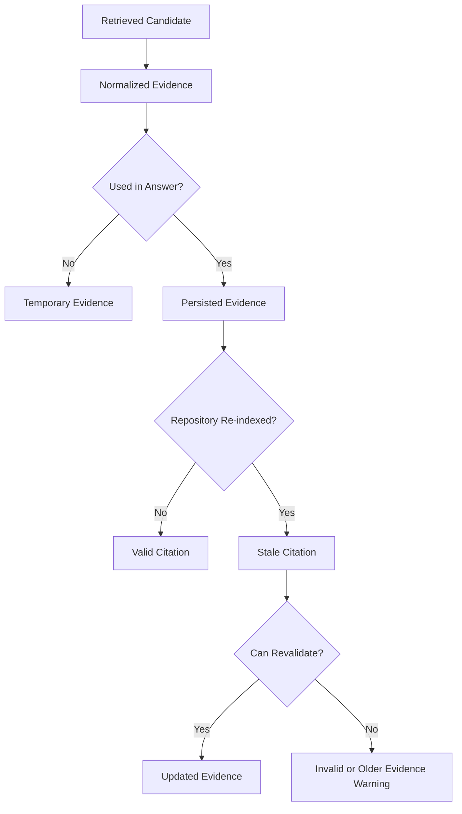
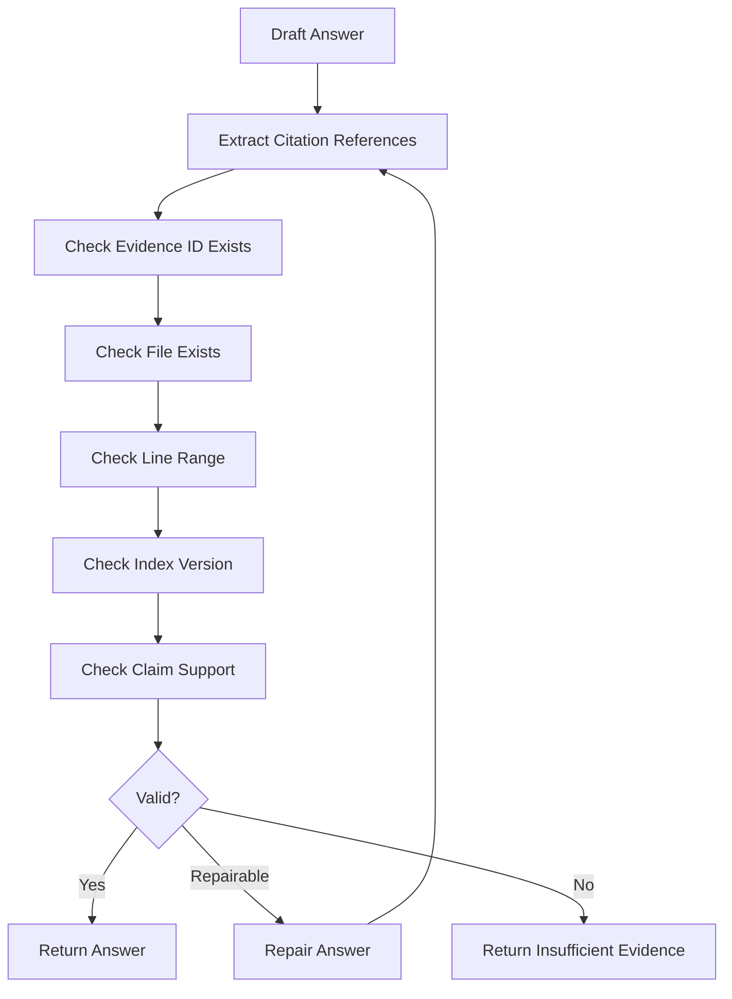

# Evidence and Citation

## Document Purpose

This document defines the evidence and citation rules used by retrieval, chat, graph reasoning, impact analysis, evaluation, and the evidence viewer. It expands the evidence-related architecture introduced in `02_system_architecture.md`.

Evidence and citations are the core safety mechanism of the product. Every technical answer must be traceable to exact repository content. Users must be able to click a citation, open the file, inspect the line range, and understand why the evidence supports the answer.

## Purpose

The product should not behave like a generic chatbot that sounds confident without proof. For technical answers, the system must either:

1. answer with citations, or
2. explicitly say that evidence is insufficient.

## Evidence Object

```json
{
  "evidence_id": "ev_123",
  "repository_id": "repo_123",
  "index_version": 3,
  "message_id": "msg_456",
  "source_type": "code",
  "file_id": "file_123",
  "file_path": "backend/app/auth/router.py",
  "symbol_id": "sym_123",
  "symbol_name": "login",
  "start_line": 21,
  "end_line": 45,
  "content_preview": "async def login(payload: LoginRequest): ...",
  "relevance_reason": "FastAPI handler for POST /login",
  "confidence_score": 0.91,
  "retrieval_source": "graph",
  "is_stale": false,
  "metadata": {
    "chunk_id": "chunk_123",
    "chunk_type": "endpoint",
    "language": "python",
    "relation_type": "exposes_endpoint",
    "endpoint_method": "POST",
    "endpoint_path": "/login"
  }
}
```

## Required Fields

- `evidence_id`
- `repository_id`
- `index_version`
- `source_type`
- `file_path`
- `start_line`
- `end_line`
- `content_preview`
- `confidence_score`
- `retrieval_source`
- `is_stale`

Optional but preferred:

- `message_id`
- `file_id`
- `symbol_id`
- `symbol_name`
- `relevance_reason`
- `chunk_id`
- `chunk_type`
- `language`
- `relation_type`
- `endpoint_method`
- `endpoint_path`
- `graph_path`

## Source Types

- `code`
- `document`
- `config`
- `graph`
- `metadata`
- `test`
- `project_mental_model`

## Retrieval Sources

- `vector`
- `keyword`
- `file_lookup`
- `symbol_lookup`
- `endpoint_lookup`
- `api_call_lookup`
- `graph`
- `docs`
- `config`
- `tests`
- `reading_path`

## Citation API Format

```json
{
  "evidence_id": "ev_123",
  "file_path": "backend/app/auth/router.py",
  "symbol_name": "login",
  "start_line": 21,
  "end_line": 45,
  "index_version": 3,
  "is_stale": false
}
```

## Citation Text Format

Preferred inline form:

```text
[backend/app/auth/router.py:21-45, login]
```

Without symbol:

```text
[README.md:10-32]
```

Stale citation indicator:

```text
[backend/app/auth/router.py:21-45, login, older index]
```

The frontend should render citations as clickable chips, not as plain text only.

## Citation Rules

- A citation must point to a real indexed file.
- A citation must include a valid line range.
- A cited symbol must exist in the index or be explicitly derived from the cited chunk.
- A graph citation must include at least one code, metadata, or relation evidence item.
- Answers may include high-level summaries only if they are supported by multiple pieces of evidence or the Project Mental Model.
- If citations cannot be generated, the answer must be marked `evidence_sufficient=false`.
- If evidence belongs to an older `index_version`, the citation must be marked stale.

## Evidence Lifecycle



### Temporary evidence

Search results may create temporary evidence records so the user can open evidence from search. Temporary evidence should remain retrievable during the current session.

### Persisted evidence

Chat answers must persist evidence so citations remain openable after page reload or backend restart.

### Stale evidence

Evidence becomes stale when:

- repository index version changes
- cited file no longer exists
- cited line range no longer maps to the same content
- cited symbol was deleted or moved

Stale evidence may still be shown, but the UI must warn the user.

## Citation Validation Flow



Validation checks:

- Evidence ID exists.
- Repository ID matches the current workspace.
- File path exists in the indexed repository.
- Line range is valid.
- Citation is not from a blocked secret file.
- Citation index version is current or marked stale.
- Technical claim is supported by the cited evidence.

## Anti-Hallucination Rules

The assistant must not:

- Mention files not present in evidence.
- Mention functions/classes/endpoints not present in symbols, chunks, endpoints, or graph evidence.
- Claim a dependency exists from semantic similarity alone.
- Claim a module is tested without test evidence.
- Infer business rules from names only.
- Invent database tables, config keys, or environment variables.
- Pretend a dynamic API route is exact when it was extracted with low confidence.
- Hide the fact that evidence is stale or partial.

If evidence is partial, the answer must clearly say what is known and what is missing.

## Evidence Score

Suggested scoring:

| Score | Meaning |
| --- | --- |
| `0.90 - 1.00` | exact symbol/endpoint plus code and graph evidence |
| `0.75 - 0.89` | strong code or docs evidence with matching metadata |
| `0.60 - 0.74` | useful evidence but missing one desired source |
| `0.40 - 0.59` | weak evidence, retrieve more or answer with caveat |
| `< 0.40` | insufficient for technical claims |

## Evidence Sufficiency by Question Type

| Question type | Required evidence |
| --- | --- |
| Architecture | modules, entrypoints, important files, docs, or Project Mental Model |
| Flow tracing | at least one entrypoint/endpoint/symbol and at least one relation path or related code citation |
| API question | endpoint metadata and handler file |
| Database question | model/schema file and at least one usage if question asks behavior |
| Debugging | related code and, if config is involved, config evidence |
| Impact | target evidence and direct graph neighbors |
| Onboarding | README/docs, important file evidence, or reading path signals |
| Reading path | entrypoint/docs/important file signals with reasons |
| Testing | test file evidence or explicit statement that no related tests were found |
| Configuration | safe config evidence, `.env.example`, docs, or settings files |

## Graph Evidence Rules

Graph evidence is useful but must be grounded.

Rules:

- A graph edge must have a source node and target node.
- A graph edge should include `relation_type`, `confidence`, and source evidence when available.
- A graph relation should point back to at least one file, symbol, endpoint, parser output, or line range.
- Semantic similarity alone is not enough to create a graph relation.
- Low-confidence graph relations must be described as possible or best-effort, not as certain facts.

Example:

```json
{
  "source_type": "graph",
  "relation_type": "calls",
  "file_path": "backend/app/services/auth_service.py",
  "start_line": 40,
  "end_line": 52,
  "relevance_reason": "Function authenticate_user calls verify_password based on parser-extracted call expression."
}
```

## Citation Claim Types

Different claims require different evidence strength.

| Claim type | Required support |
| --- | --- |
| File exists | FileRecord or file evidence |
| Function/class exists | SymbolRecord or code chunk |
| Endpoint exists | EndpointRecord and route/handler evidence |
| Function calls another function | Graph edge or parser call relation |
| Frontend calls backend endpoint | ApiCallRecord plus endpoint match when available |
| Model is used by endpoint | graph relation or code usage evidence |
| Test covers module | test relation or test file evidence |
| Architecture summary | multiple files/modules/docs or Project Mental Model |
| Risk/impact | target evidence plus graph neighbors; inferred impact must be labeled |

## Evidence Viewer Requirements

The evidence viewer must display:

- repository name
- file path
- source type
- symbol name if available
- line range
- content preview with line numbers
- relevance reason
- confidence score
- retrieval source
- index version
- stale status
- metadata
- action to open full file in Code Explorer
- action to copy path or citation

If evidence is stale, the viewer must show:

- current repository index version
- evidence index version
- warning that line ranges may have changed
- action to re-run retrieval if available

## Storage Requirements

Evidence must be persisted so citations remain openable after page reload or backend restart.

Evidence may be attached to a message, but search results can also create temporary evidence records. If temporary evidence is used, it must still be retrievable by ID during the current session.

Evidence must not store full contents of blocked files or secret-like files.

## Evaluation Linkage

Evaluation should measure citation quality, not only answer quality.

Recommended citation metrics:

- citation accuracy: citation points to expected file/symbol/line range
- citation relevance: citation supports the claim it is attached to
- groundedness: answer claims are supported by evidence
- stale citation rate: citations from older index versions
- hallucination rate: answer mentions unsupported files/symbols/endpoints/relations

A benchmark answer should be considered weak if it is correct-sounding but lacks valid citations.

## Notes for AI Coding Agents

- Treat evidence as a first-class domain object, not just text passed to the LLM.
- Never let the LLM invent citation IDs.
- Generate citations from selected evidence records, not from model output alone.
- Keep line ranges accurate and stable.
- Always preserve repository scope and index version.
- If evidence validation fails, repair the answer or return insufficient evidence.

## Production Evidence Extensions

### Graph Edge Evidence

Graph relations must be evidence-aware, not only visual edges.

Relation evidence shape:

```json
{
  "source_node_key": "endpoint:POST:/login",
  "target_node_key": "function:auth/service.py:login",
  "relation_type": "handled_by",
  "relation_confidence": 0.91,
  "relation_origin": "resolver_exact",
  "supporting_evidence_ids": ["ev_1", "ev_2"],
  "provenance": [
    {
      "component": "fastapi_resolver",
      "version": "2.0",
      "artifact": "resolution-result.json"
    }
  ]
}
```

The UI and agent must distinguish:

- direct parser evidence;
- resolved reference evidence;
- framework-rule evidence;
- graph proximity;
- LLM-inferred relation.

### Claim-Level Citation

Long answers should be decomposable into claims.

Claim citation shape:

```json
{
  "claim": "The login endpoint delegates authentication to AuthService.",
  "citation_ids": ["ev_1", "ev_2"],
  "support_level": "direct"
}
```

Support levels:

- `direct`
- `multi_hop`
- `inferred`
- `insufficient`

Rules:

- direct claims require code, symbol, endpoint, or graph-edge evidence;
- multi-hop claims require a validated graph path or multiple linked citations;
- inferred claims must be labeled and should not be used as sole support for critical answers;
- insufficient claims should trigger answer repair or insufficient evidence response.

### Provenance UI Labels

Evidence viewer and graph detail should map provenance into user-facing labels:

| Origin | UI label |
| --- | --- |
| `parser_exact` | Confirmed from parser |
| `resolver_exact` | Resolved from static analysis |
| `framework_rule` | Matched by framework rule |
| `heuristic` | Inferred from project structure |
| `llm_inferred` | AI-inferred from cited context |
| `user_confirmed` | Confirmed by user |

Do not collapse these into only one confidence score.

### Graph Path Evidence

For flow tracing and impact analysis, the system should return paths:

```json
{
  "path_id": "path_123",
  "nodes": [],
  "edges": [],
  "path_confidence": 0.87,
  "unsupported_hops": [],
  "evidence_ids": []
}
```

Each hop must classify support as deterministic, heuristic, or LLM-inferred.
